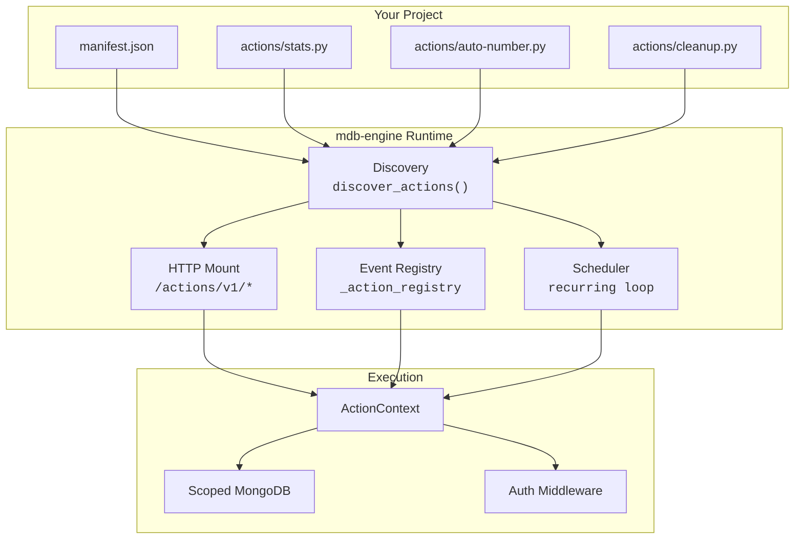
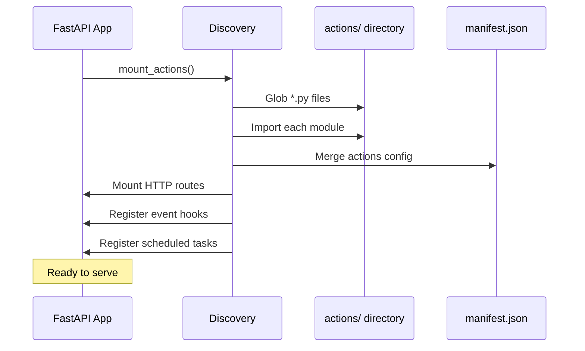
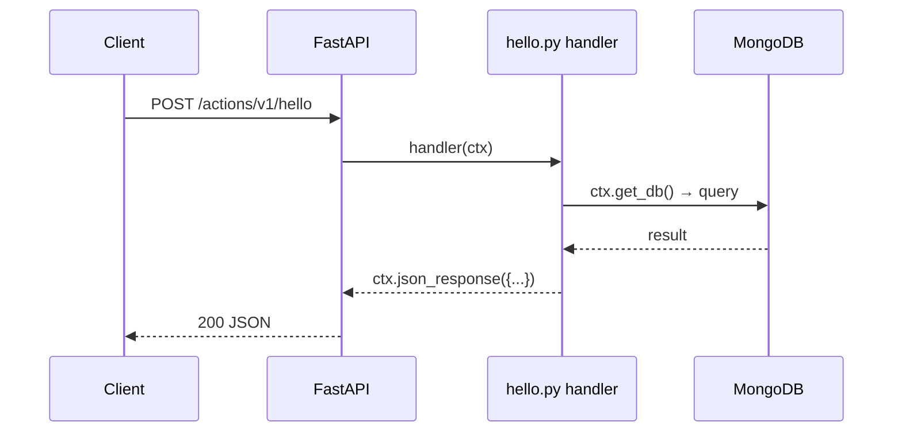
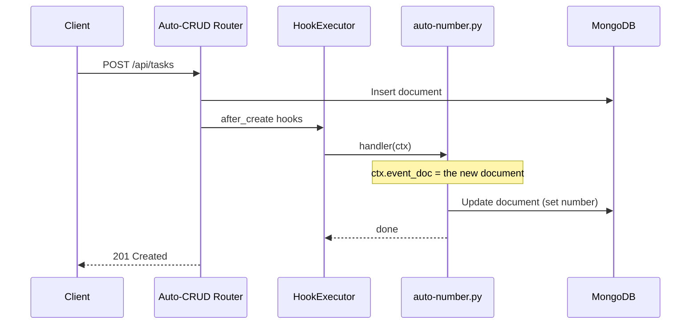
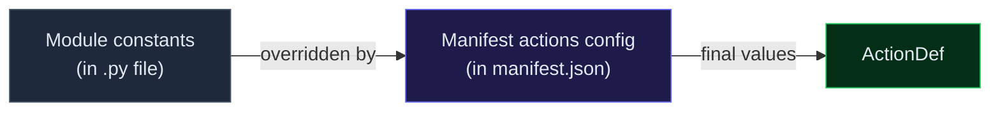
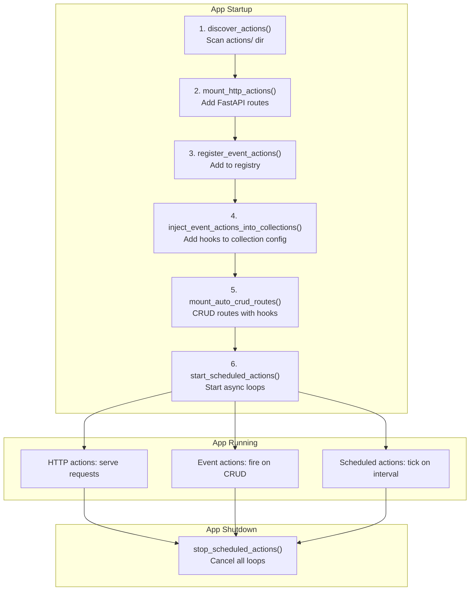

# Actions (Functions) Reference

> **mdb-engine v0.9.0+** — Manifest-driven, single-file Python handlers that run as HTTP endpoints, on schedules, or in response to database events.

Actions are the mdb-engine equivalent of serverless functions — except they run inside your process, have direct access to the scoped database, and integrate with the manifest's declarative configuration. No cold starts, no deployment pipeline. Drop a `.py` file in `actions/`, declare it in the manifest, and it works.

---

## Architecture



## How It Works



---

## Quick Start

### 1. Create an action file

```
my-app/
├── manifest.json
└── actions/
    └── hello.py        ← this file
```

```python
from mdb_engine.actions import ActionContext

async def handler(ctx: ActionContext):
    return ctx.json_response({"message": "Hello from an action!"})
```

### 2. Declare it in the manifest (optional — sensible defaults apply)

```json
{
  "actions": {
    "hello": { "trigger": "http", "method": "GET" }
  }
}
```

### 3. It's live

```
GET /actions/v1/hello  →  {"message": "Hello from an action!"}
```

---

## Trigger Types

### HTTP Triggers

Mounted as FastAPI routes at `/actions/v1/<name>`. Default method is `POST`.



**Example: API stats endpoint**

```python
"""Return live task counts grouped by status."""

__trigger__ = "http"
__method__ = "GET"

from mdb_engine.actions import ActionContext

async def handler(ctx: ActionContext):
    db = await ctx.get_db()
    col = db[f"{ctx.slug}_tasks"]

    todo = await col.count_documents({"status": "todo"})
    done = await col.count_documents({"status": "done"})

    return ctx.json_response({"todo": todo, "done": done})
```

```bash
curl http://localhost:8000/actions/v1/stats
# {"todo": 5, "done": 12}
```

**Example: Protected action with role check**

```python
from mdb_engine.actions import ActionContext

async def handler(ctx: ActionContext):
    ctx.require_role("admin")
    db = await ctx.get_db()
    result = await db[f"{ctx.slug}_users"].delete_many({"inactive": True})
    return ctx.json_response({"deleted": result.deleted_count})
```

Manifest config:

```json
{
  "actions": {
    "purge-inactive": {
      "trigger": "http",
      "method": "POST",
      "auth": { "required": true, "roles": ["admin"] },
      "timeout": 60
    }
  }
}
```

---

### Event Triggers

Fire automatically after CRUD operations on a collection. Supported events: `after_create`, `after_update`, `after_delete`.



**Example: Auto-assign sequential number on create**

```python
"""Assign a sequential task number on create."""

__trigger__ = "event"
__event__ = "after_create"
__collection__ = "tasks"

from mdb_engine.actions import ActionContext

async def handler(ctx: ActionContext):
    doc = ctx.event_doc
    if not doc:
        return

    db = await ctx.get_db()
    count = await db[f"{ctx.slug}_tasks"].count_documents({})
    await db[f"{ctx.slug}_tasks"].update_one(
        {"_id": doc["_id"]},
        {"$set": {"number": count}},
    )
```

**Example: Log changes on update**

```python
"""Write an audit trail entry whenever a task is updated."""

__trigger__ = "event"
__event__ = "after_update"
__collection__ = "tasks"

from mdb_engine.actions import ActionContext

async def handler(ctx: ActionContext):
    db = await ctx.get_db()
    await db[f"{ctx.slug}_audit_log"].insert_one({
        "entity": "tasks",
        "entity_id": str(ctx.event_doc["_id"]),
        "event": ctx.event_name,
        "previous": ctx.event_prev,
        "current": ctx.event_doc,
        "user": ctx.user.get("email") if ctx.user else None,
    })
```

---

### Schedule Triggers

Run on a recurring interval. Managed by the engine's async task loop with exponential backoff on failure.

```mermaid
sequenceDiagram
    participant Loop as Scheduler Loop
    participant Action as archive-done.py
    participant DB as MongoDB

    loop Every interval_seconds
        Loop->>Action: handler(ctx)
        Action->>DB: Find done tasks
        Action->>DB: Insert into archive
        Action->>DB: Delete from tasks
        Action-->>Loop: success (reset backoff)
    end

    Note over Loop: On failure: exponential backoff<br/>up to max_backoff (300s)
```

**Example: Archive completed tasks daily**

```python
"""Move completed tasks to the archive collection daily."""

__trigger__ = "schedule"
__interval_seconds__ = 86400

from datetime import datetime, timezone
from mdb_engine.actions import ActionContext

async def handler(ctx: ActionContext):
    db = await ctx.get_db()
    tasks = db[f"{ctx.slug}_tasks"]
    archive = db[f"{ctx.slug}_archive"]

    done = await tasks.find({"status": "done"}).to_list(length=500)
    if not done:
        return

    ids = [t["_id"] for t in done]
    now = datetime.now(tz=timezone.utc).isoformat()
    for t in done:
        t.pop("_id", None)
        t["archived_at"] = now

    await archive.insert_many(done)
    await tasks.delete_many({"_id": {"$in": ids}})
```

**Example: Cron-based schedule (requires `croniter`)**

```python
"""Run every 6 hours using a cron expression."""

__trigger__ = "schedule"
__schedule__ = "0 */6 * * *"

from mdb_engine.actions import ActionContext

async def handler(ctx: ActionContext):
    db = await ctx.get_db()
    result = await db[f"{ctx.slug}_sessions"].delete_many({"expired": True})
```

---

## ActionContext API

Every handler receives a single `ActionContext` instance. It provides lazy, cached access to all engine services.

### Request Helpers (HTTP triggers only)

| Method / Property | Returns | Description |
|---|---|---|
| `ctx.request` | `Request \| None` | Raw Starlette request object |
| `await ctx.json()` | `Any` | Parse request body as JSON |
| `await ctx.text()` | `str` | Read request body as text |
| `ctx.method` | `str` | HTTP method (`GET`, `POST`, etc.) |
| `ctx.headers` | `dict[str, str]` | Request headers |
| `ctx.query_params` | `dict[str, str]` | Query string parameters |

### Event Helpers (event triggers only)

| Property | Returns | Description |
|---|---|---|
| `ctx.event_doc` | `dict \| None` | The document that triggered the event |
| `ctx.event_prev` | `dict \| None` | Previous state (before update) |
| `ctx.event_name` | `str \| None` | Event name (`after_create`, etc.) |

### Authentication

| Method / Property | Returns | Description |
|---|---|---|
| `ctx.user` | `dict \| None` | Current authenticated user |
| `ctx.require_user()` | `dict` | Require auth; raises 401 if absent |
| `ctx.require_role("admin")` | `dict` | Require role; raises 403 if missing |

### Database

| Method / Property | Returns | Description |
|---|---|---|
| `ctx.engine` | `MongoDBEngine` | The engine instance |
| `ctx.slug` | `str` | Current app slug |
| `await ctx.get_db()` | `ScopedMongoWrapper` | Scoped MongoDB wrapper (cached) |
| `await ctx.get_uow()` | `UnitOfWork` | Repository-style Unit of Work (cached) |

### AI Services (None when not configured)

| Property | Returns | Description |
|---|---|---|
| `ctx.memory` | `BaseMemoryService \| None` | Memory service |
| `ctx.llm` | `LLMService \| None` | LLM service |
| `ctx.embedding` | `EmbeddingService \| None` | Embedding service |

### Response Helpers (HTTP triggers)

| Method | Returns | Description |
|---|---|---|
| `ctx.json_response(data, status=200)` | `JSONResponse` | Build a JSON response |
| `ctx.text_response(text, status=200)` | `Response` | Build a plain-text response |
| `ctx.error(status, detail)` | `HTTPException` | Create an exception (raise the return value) |

---

## Module-Level Metadata

Action files can declare configuration via module-level constants. These serve as defaults that the manifest can override.

| Constant | Type | Default | Description |
|---|---|---|---|
| `__trigger__` | `str` | `"http"` | Trigger type: `http`, `schedule`, or `event` |
| `__method__` | `str` | `"POST"` | HTTP method (http triggers) |
| `__timeout__` | `float` | `10` | Max execution seconds (1–300) |
| `__schedule__` | `str` | `""` | Cron expression (schedule triggers) |
| `__interval_seconds__` | `float` | `0` | Fixed interval in seconds (schedule triggers) |
| `__event__` | `str` | `""` | Hook event name (event triggers) |
| `__collection__` | `str` | `""` | Target collection (event triggers) |
| `__auth__` | `dict` | `{}` | Auth config: `{"required": True, "roles": [...]}` |

### Precedence



The manifest always wins. This lets you:
- Keep sensible defaults in the action file (self-documenting)
- Override trigger type, auth, timeout, etc. without touching the code

---

## Manifest Configuration

The `actions` block in `manifest.json` maps action names to their configuration. Each key must match a `*.py` filename (without extension) in the `actions/` directory.

```json
{
  "schema_version": "2.0",
  "slug": "my_app",
  "name": "My App",
  "collections": { ... },
  "actions": {
    "hello": {
      "trigger": "http",
      "method": "GET",
      "timeout": 30
    },
    "auto-number": {
      "trigger": "event",
      "event": "after_create",
      "collection": "tasks"
    },
    "cleanup": {
      "trigger": "schedule",
      "interval_seconds": 3600
    },
    "admin-reset": {
      "trigger": "http",
      "method": "POST",
      "auth": { "required": true, "roles": ["admin"] },
      "timeout": 120
    }
  }
}
```

### Schema Reference

| Property | Type | Applies to | Description |
|---|---|---|---|
| `trigger` | `"http" \| "schedule" \| "event"` | All | How the action is invoked |
| `method` | `"GET" \| "POST" \| "PUT" \| "PATCH" \| "DELETE"` | http | HTTP method |
| `auth.required` | `boolean` | http | Require authentication |
| `auth.roles` | `string[]` | http | Require one of these roles |
| `timeout` | `number` (1–300) | http | Max execution time in seconds |
| `schedule` | `string` | schedule | Cron expression (requires `croniter`) |
| `interval_seconds` | `number` | schedule | Simple fixed interval in seconds |
| `event` | `"after_create" \| "after_update" \| "after_delete"` | event | Hook event name |
| `collection` | `string` | event | Target collection name |

---

## Lifecycle



Key ordering: event actions are injected into collection configs **before** auto-CRUD routes are mounted, ensuring hooks are wired correctly.

---

## CLI

### Scaffold a new action

```bash
# HTTP action (default)
mdb-engine actions new send-report

# Scheduled action
mdb-engine actions new cleanup --trigger schedule --interval 3600

# Event action
mdb-engine actions new on-signup --trigger event --event after_create --collection users
```

### List discovered actions

```bash
mdb-engine actions list manifest.json
```

Output:

```
Found 3 action(s):

  auto-number
    Trigger:  EVENT
    Event:    after_create on 'tasks'
    Timeout:  10s
    Source:   /app/actions/auto-number.py

  archive-done
    Trigger:  SCHEDULE
    Interval: 86400.0s
    Timeout:  10s
    Source:   /app/actions/archive-done.py

  stats
    Trigger:  HTTP
    Method:   GET
    Endpoint: /actions/v1/stats
    Timeout:  10s
    Source:   /app/actions/stats.py
```

---

## Full Example: Task Board

See [`examples/basic/task_board/`](examples/basic/task_board/) for a complete working example with all three trigger types and a Tailwind CSS UI.

```
task_board/
├── manifest.json          # 2 collections + 3 actions
├── public/index.html      # Dark-theme Tailwind UI
├── actions/
│   ├── auto-number.py     # Event: sequential numbering
│   ├── archive-done.py    # Schedule: daily archive
│   └── stats.py           # HTTP: GET /actions/v1/stats
└── docker-compose.yml     # docker compose up
```

```bash
cd examples/basic/task_board
docker compose up
# Open http://localhost:8000
```

---

## Error Handling & Resilience

### HTTP actions

- Timeout enforcement: each HTTP action has a configurable timeout (default 10s, max 300s). Exceeding it returns `504 Gateway Timeout`.
- Returning `None` from a handler produces `{"ok": true}`.
- Returning a `dict` is automatically wrapped in `JSONResponse`.
- Raising `ctx.error(status, detail)` returns a proper HTTP error.

### Scheduled actions

- Exponential backoff on failure (doubles interval up to 300s max).
- Errors are logged but never crash the process.
- Graceful cancellation on shutdown.

### Event actions

- Failures are caught and logged — they never break the CRUD response.
- Uses the same error boundary as other hook actions (`_HOOK_ACTION_ERRORS`).

---

## Imports Cheatsheet

```python
from mdb_engine.actions import ActionContext, ActionResponse

from mdb_engine.actions.discovery import (
    discover_actions,
    mount_actions,
    mount_http_actions,
    register_event_actions,
    inject_event_actions_into_collections,
)

from mdb_engine.actions.scheduler import (
    start_scheduled_actions,
    stop_scheduled_actions,
    get_scheduled_action_statuses,
)
```
