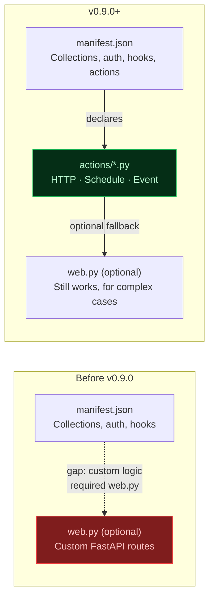
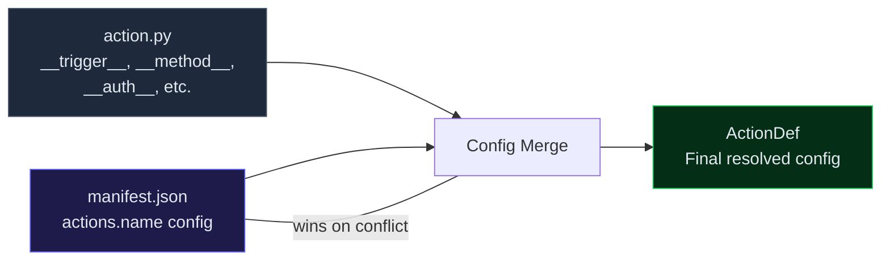
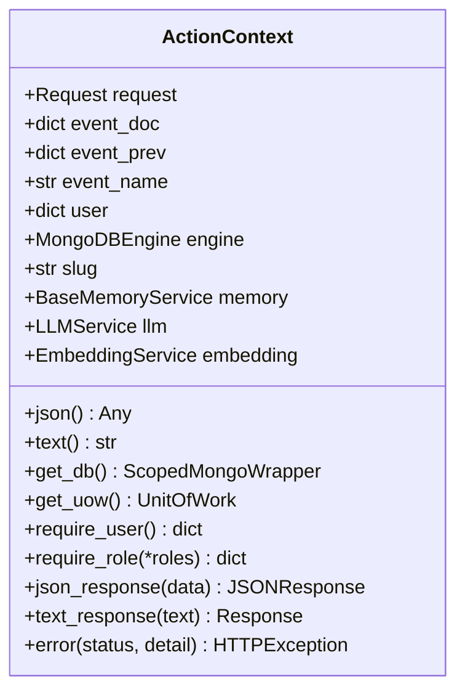
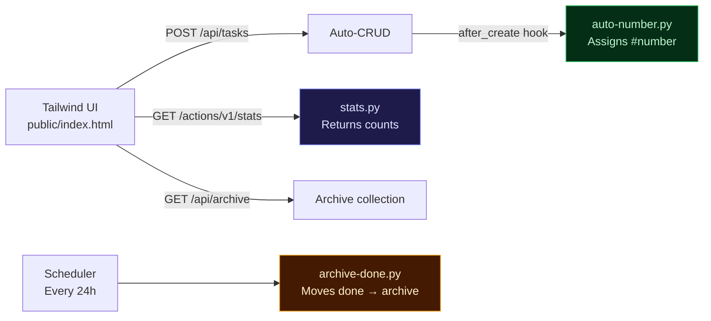
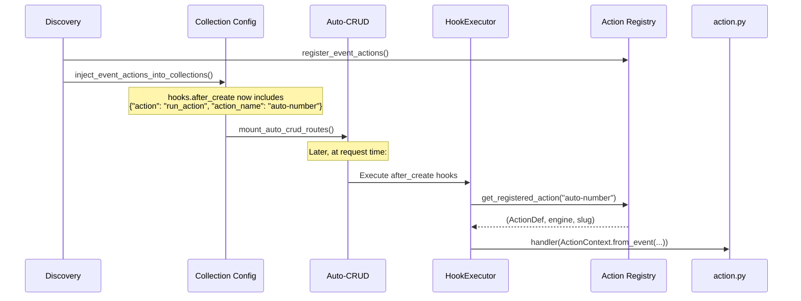
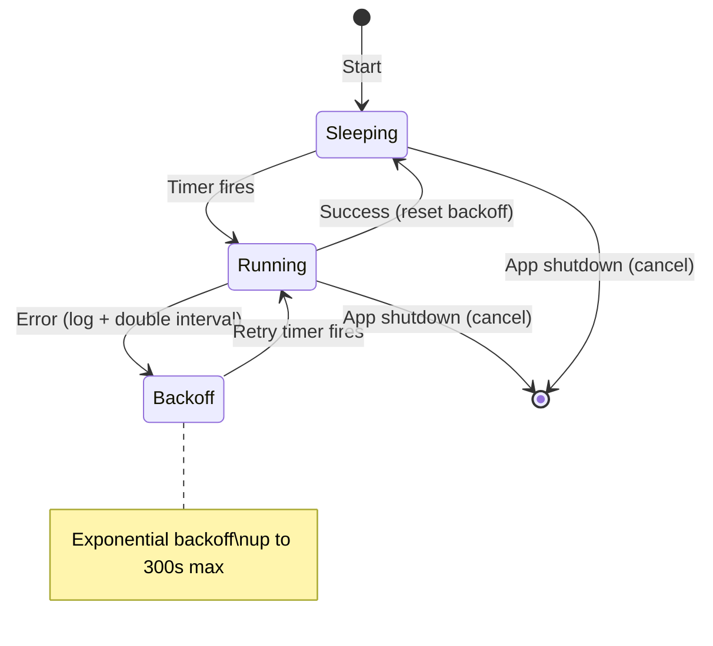

# What's New in mdb-engine v0.9.0

**Release theme: Actions** — Drop-in Python handlers that turn your manifest-driven app into a full platform, without leaving the mdb-engine paradigm.

---

## The Big Feature: Actions

Actions are single-file async Python handlers, auto-discovered from an `actions/` directory, that plug directly into the engine runtime. Three trigger types, one consistent API.



### Why Actions?

Before v0.9.0, if you needed any server-side logic beyond what hooks and pipelines could express, you had to write a `web.py` with manual FastAPI routing, dependency injection, and database wiring. Actions eliminate that boilerplate:

| What you needed | Before | After |
|---|---|---|
| Custom HTTP endpoint | `web.py` + manual route | Drop a `.py` in `actions/` |
| React to DB changes | Hooks only (declarative JSON) | Hooks + Python handlers |
| Background job | External scheduler (cron, Celery) | `__trigger__ = "schedule"` |
| Auth on custom endpoint | Manual `Depends(require_user)` | `"auth": {"roles": ["admin"]}` in manifest |

### The Three Trigger Types

```mermaid
graph TB
    subgraph "HTTP Trigger"
        H1["Client request"] --> H2["FastAPI route<br/>/actions/v1/name"]
        H2 --> H3["handler(ctx)"]
        H3 --> H4["JSON response"]
    end

    subgraph "Event Trigger"
        E1["CRUD operation"] --> E2["HookExecutor<br/>after_create / update / delete"]
        E2 --> E3["handler(ctx)"]
        E3 --> E4["Side effect<br/>(update doc, write log, etc.)"]
    end

    subgraph "Schedule Trigger"
        S1["Timer tick"] --> S2["Async loop<br/>every N seconds"]
        S2 --> S3["handler(ctx)"]
        S3 --> S4["Background work<br/>(cleanup, archive, sync)"]
    end

    style H1 fill:#1e1b4b,stroke:#818cf8,color:#e0e7ff
    style E1 fill:#052e16,stroke:#22c55e,color:#bbf7d0
    style S1 fill:#451a03,stroke:#f59e0b,color:#fef3c7
```



---

## Quick Examples

### HTTP: Live stats endpoint

```python
# actions/stats.py
__trigger__ = "http"
__method__ = "GET"

from mdb_engine.actions import ActionContext

async def handler(ctx: ActionContext):
    db = await ctx.get_db()
    col = db[f"{ctx.slug}_tasks"]
    return ctx.json_response({
        "todo": await col.count_documents({"status": "todo"}),
        "done": await col.count_documents({"status": "done"}),
    })
```

```bash
curl http://localhost:8000/actions/v1/stats
# {"todo": 5, "done": 12}
```

### Event: Auto-number on create

```python
# actions/auto-number.py
__trigger__ = "event"
__event__ = "after_create"
__collection__ = "tasks"

from mdb_engine.actions import ActionContext

async def handler(ctx: ActionContext):
    doc = ctx.event_doc
    db = await ctx.get_db()
    count = await db[f"{ctx.slug}_tasks"].count_documents({})
    await db[f"{ctx.slug}_tasks"].update_one(
        {"_id": doc["_id"]},
        {"$set": {"number": count}},
    )
```

Every new task automatically gets `number: 1`, `number: 2`, etc.

### Schedule: Daily archive

```python
# actions/archive-done.py
__trigger__ = "schedule"
__interval_seconds__ = 86400

from datetime import datetime, timezone
from mdb_engine.actions import ActionContext

async def handler(ctx: ActionContext):
    db = await ctx.get_db()
    tasks = db[f"{ctx.slug}_tasks"]
    archive = db[f"{ctx.slug}_archive"]

    done = await tasks.find({"status": "done"}).to_list(length=500)
    if not done:
        return

    ids = [t["_id"] for t in done]
    now = datetime.now(tz=timezone.utc).isoformat()
    for t in done:
        t.pop("_id", None)
        t["archived_at"] = now

    await archive.insert_many(done)
    await tasks.delete_many({"_id": {"$in": ids}})
```

Completed tasks are moved to the `archive` collection every 24 hours.

---

## Manifest Integration

Actions are declared alongside collections, auth, and other config:

```json
{
  "schema_version": "2.0",
  "slug": "my_app",
  "collections": { ... },
  "actions": {
    "stats":        { "trigger": "http", "method": "GET" },
    "auto-number":  { "trigger": "event", "event": "after_create", "collection": "tasks" },
    "archive-done": { "trigger": "schedule", "interval_seconds": 86400 }
  }
}
```

### How Config Flows



Module-level constants in the `.py` file set defaults. The manifest overrides them. This means action files are self-documenting, but the manifest is always the source of truth.

---

## ActionContext — The Universal Interface

Every handler, regardless of trigger type, receives the same `ActionContext`:



| Trigger | `ctx.request` | `ctx.event_doc` | `ctx.user` |
|---|---|---|---|
| HTTP | Full Starlette Request | `None` | From auth middleware |
| Event | `None` | The triggering document | From CRUD context |
| Schedule | `None` | `None` | `None` |

---

## CLI Additions

### Scaffold actions instantly

```bash
# HTTP (default)
mdb-engine actions new send-report

# Scheduled
mdb-engine actions new cleanup --trigger schedule --interval 3600

# Event-driven
mdb-engine actions new on-signup --trigger event \
    --event after_create --collection users
```

### Inspect what's discovered

```bash
mdb-engine actions list manifest.json
```

```
Found 3 action(s):

  stats
    Trigger:  HTTP
    Method:   GET
    Endpoint: /actions/v1/stats

  auto-number
    Trigger:  EVENT
    Event:    after_create on 'tasks'

  archive-done
    Trigger:  SCHEDULE
    Interval: 86400.0s
```

---

## New Example: Task Board

A complete, runnable example at [`examples/basic/task_board/`](examples/basic/task_board/) demonstrates all three trigger types with a Tailwind CSS dark-theme UI.

```
task_board/
├── manifest.json          # 2 collections + 3 actions
├── public/index.html      # Tailwind CSS UI
├── actions/
│   ├── auto-number.py     # Event → sequential numbering
│   ├── archive-done.py    # Schedule → daily archive
│   └── stats.py           # HTTP → GET /actions/v1/stats
└── docker-compose.yml
```

```bash
cd examples/basic/task_board
docker compose up
# Open http://localhost:8000
```

No `web.py`. No auth setup. No external services. Just a manifest, three action files, and a UI.



---

## Under the Hood

### Event Action Wiring

Event actions don't use a separate event bus. They're injected as `run_action` hooks into collection configurations before auto-CRUD routes are mounted, reusing the existing `HookExecutor` infrastructure:



### Scheduled Action Resilience



---

## Migration Guide

### You don't need to change anything

Actions are additive. All existing manifests, `web.py` files, hooks, and pipelines continue to work exactly as before. Actions are opt-in.

### When to use Actions vs. web.py

| Use case | Actions | web.py |
|---|---|---|
| Simple HTTP endpoint | Yes | Overkill |
| React to CRUD events | Yes | Can't |
| Background job | Yes | Can't |
| Complex multi-route API | Possible, but... | Better fit |
| WebSocket endpoints | No | Yes |
| Custom middleware | No | Yes |

### When to use Actions vs. Declarative Hooks

| Use case | Actions | Hooks |
|---|---|---|
| Insert into another collection | Either works | `{"action": "insert", ...}` |
| Complex Python logic | Yes | Can't |
| Conditional side effects | Yes (if/else in Python) | Limited |
| External API calls | Yes | Can't |

---

## Full Reference

See [FUNCTIONS.md](FUNCTIONS.md) for the complete API reference including all `ActionContext` methods, manifest schema, module-level metadata constants, and lifecycle details.
