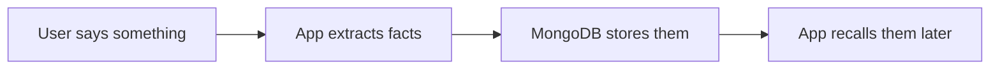
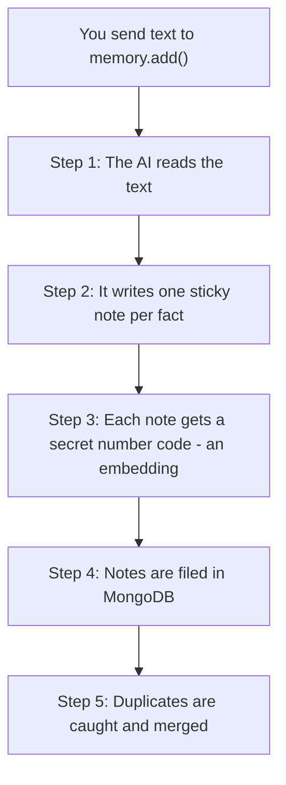
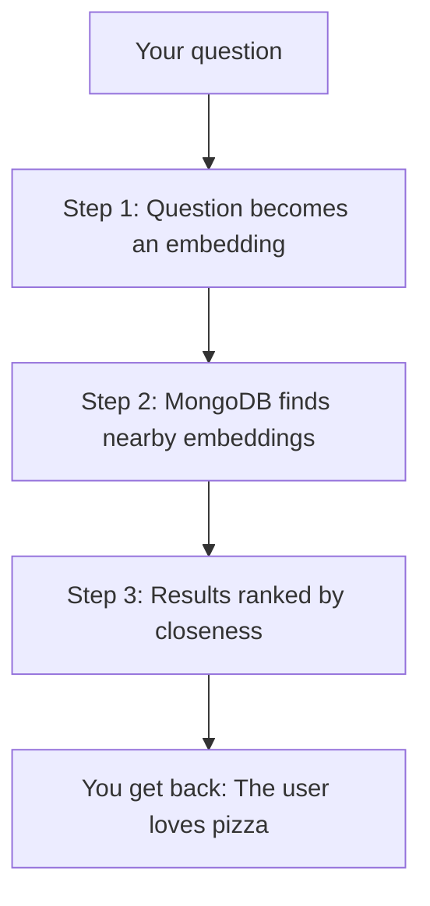
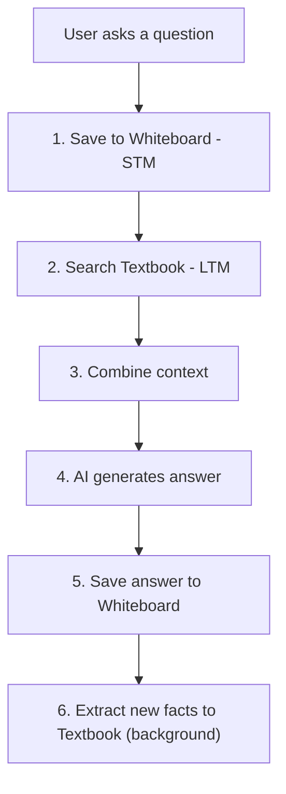
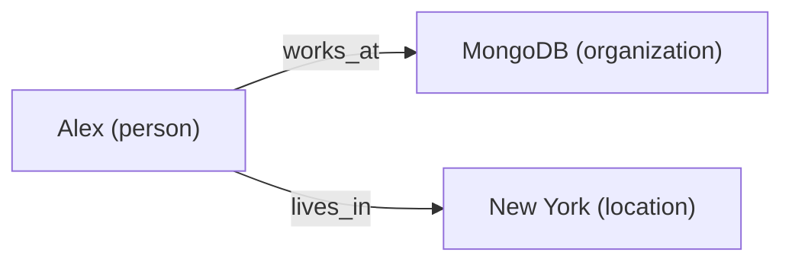
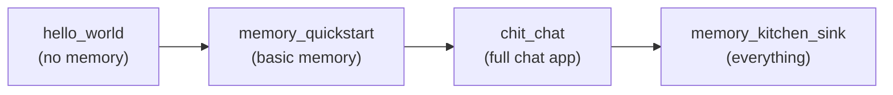

# Memory System -- Beginner's Guide

> **If you can use a notebook and a pencil, you can use MDB-Engine Memory.**
>
> This guide walks you through the Memory system one small piece at a time.
> Every section starts with a real-world analogy, then shows you the code.
> No experience required.

---

## Table of Contents

1. [What Is Memory?](#1-what-is-memory)
2. [Prerequisites](#2-prerequisites)
3. [Unit 1 -- Your First Memory App (The Notebook)](#unit-1--your-first-memory-app-the-notebook)
4. [Unit 2 -- How Memory Works Under the Hood (The Librarian)](#unit-2--how-memory-works-under-the-hood-the-librarian)
5. [Unit 3 -- The Core API: 8 Things You Can Do (The Toolbox)](#unit-3--the-core-api-8-things-you-can-do-the-toolbox)
6. [Unit 4 -- Short-Term vs Long-Term Memory (The Classroom)](#unit-4--short-term-vs-long-term-memory-the-classroom)
7. [Unit 5 -- The manifest.json Explained (The Recipe Card)](#unit-5--the-manifestjson-explained-the-recipe-card)
8. [Unit 6 -- Cognitive Features (The Smart Notebook)](#unit-6--cognitive-features-the-smart-notebook)
9. [Unit 7 -- Knowledge Graphs (The Spider Web)](#unit-7--knowledge-graphs-the-spider-web)
10. [Unit 8 -- Advanced Features (The Treasure Map)](#unit-8--advanced-features-the-treasure-map)
11. [Cheat Sheet](#cheat-sheet)
12. [What's Next?](#whats-next)

---

## 1. What Is Memory?

**Analogy: Your brain remembers things so nobody has to tell you twice.**

Imagine you meet a new friend. They tell you their name is Alex, they love
pizza, and they have a dog named Biscuit. The next time you see Alex you
don't ask "What's your name?" -- you already *remember*.

MDB-Engine Memory gives your app that same superpower. Instead of
forgetting everything every time a user closes the page, your app:

1. **Listens** to what the user says.
2. **Extracts** the important facts (like a teacher underlining key words).
3. **Stores** those facts in MongoDB.
4. **Recalls** them later -- not by exact words, but by *meaning*.



> **Key idea:** Memory search is *semantic* -- it finds things by meaning.
> If you stored "I love hiking in the mountains" you can find it by asking
> "What outdoor activities does the user enjoy?" even though the words are
> completely different.

---

## 2. Prerequisites

You only need three things:

| What | Why |
|------|-----|
| **Python 3.8+** | The programming language we use |
| **MongoDB** | The database where memories are stored (running on `localhost:27017` or [Atlas](https://www.mongodb.com/atlas)) |
| **An OpenAI API key** | The AI that reads text and extracts facts (you can swap this for other providers later) |

Install the packages:

```bash
pip install mdb-engine fastapi uvicorn
```

Set your API key:

```bash
export OPENAI_API_KEY=sk-...
```

That's it. You're ready.

---

## Unit 1 -- Your First Memory App (The Notebook)

**Analogy: A notebook where you write down facts and flip through pages to
find them.**

We are going to build an app with three buttons:

| Button | What it does |
|--------|-------------|
| `/remember` | Write a fact in the notebook |
| `/recall` | Search the notebook by meaning |
| `/memories` | Show every page in the notebook |

### Step 1: The Recipe Card (`manifest.json`)

Create a file called `manifest.json`. This tells MDB-Engine what
features to turn on -- think of it as a recipe card for your app.

```json
{
  "schema_version": "2.0",
  "slug": "my_bot",
  "name": "Memory Quickstart Bot",

  "llm_config": {
    "enabled": true,
    "default_model": "openai/gpt-4o-mini"
  },

  "embedding_config": {
    "enabled": true,
    "default_embedding_model": "text-embedding-3-small"
  },

  "memory_config": {
    "enabled": true,
    "provider": "cognitive",
    "collection_name": "memories",
    "embedding_model_dims": 1536,
    "infer": true
  }
}
```

Here is what each piece means:

| Field | Plain English |
|-------|--------------|
| `slug` | Your app's nickname (like a username) |
| `llm_config` | Which AI brain to use for reading text |
| `embedding_config` | How to turn words into numbers (so we can compare meanings) |
| `memory_config.enabled` | Flip the memory switch ON |
| `memory_config.infer` | Let the AI automatically pull out facts from text |
| `memory_config.collection_name` | The name of the MongoDB collection that holds memories |

### Step 2: The App (`web.py`)

```python
from pathlib import Path

from fastapi import Depends
from mdb_engine import MongoDBEngine
from mdb_engine.dependencies import get_memory_service

# 1. Create the engine and the app
engine = MongoDBEngine()
app = engine.create_app(slug="my_bot", manifest=Path("manifest.json"))


# 2. /remember -- write a fact in the notebook
@app.post("/remember")
async def remember(text: str, memory=Depends(get_memory_service)):
    result = await memory.add(messages=text, user_id="user1")
    return {"stored": len(result), "memories": result}


# 3. /recall -- search the notebook by meaning
@app.get("/recall")
async def recall(q: str, memory=Depends(get_memory_service)):
    results = await memory.search(query=q, user_id="user1", limit=5)
    return {"results": results}


# 4. /memories -- show every page in the notebook
@app.get("/memories")
async def list_all(memory=Depends(get_memory_service)):
    results = await memory.get_all(user_id="user1")
    return {"memories": results}
```

Let's break it down line by line:

| Line(s) | What it does |
|----------|-------------|
| `engine = MongoDBEngine()` | Start the engine (connects to MongoDB) |
| `engine.create_app(...)` | Create a FastAPI app with memory features |
| `Depends(get_memory_service)` | Ask the engine to hand us the memory service |
| `memory.add(messages=text, ...)` | Give text to the AI -- it extracts facts and stores them |
| `memory.search(query=q, ...)` | Search stored facts by meaning |
| `memory.get_all(...)` | Retrieve every stored memory |

### Step 3: Run It

```bash
uvicorn web:app --reload
```

### Step 4: Try It Yourself

Open another terminal and run these commands:

```bash
# Tell the app something
curl -X POST "http://localhost:8000/remember?text=My+name+is+Alex+and+I+love+pizza"

# Ask about it (notice -- different words, same meaning!)
curl "http://localhost:8000/recall?q=What+food+does+the+user+like"

# See everything stored
curl http://localhost:8000/memories
```

Congratulations -- you just gave your app a memory!

---

## Unit 2 -- How Memory Works Under the Hood (The Librarian)

**Analogy: A librarian who reads your diary, writes a sticky note for each
fact, files them in a special cabinet, and finds them when you ask a
question.**

When you call `memory.add(...)`, here is what happens behind the scenes:



### Step 1 -- The AI Reads the Text (Fact Extraction)

You say: *"My name is Alex, I'm 10 years old, and I love pizza."*

The AI (your librarian) pulls out three sticky notes:

- "The user's name is Alex"
- "The user is 10 years old"
- "The user loves pizza"

Each sticky note is one **atomic fact** -- the smallest useful piece of
information.

### Step 2 -- Each Fact Gets a Number Code (Embedding)

Computers don't understand words the way we do. So each fact is turned
into a long list of numbers called an **embedding**.

Think of it like GPS coordinates for meaning:

| Fact | "GPS coordinates" (simplified) |
|------|-------------------------------|
| "The user loves pizza" | `[0.8, 0.1, 0.9, ...]` |
| "The user enjoys Italian food" | `[0.79, 0.12, 0.88, ...]` -- very close! |
| "The user has a dog" | `[0.2, 0.7, 0.3, ...]` -- far away |

Facts with similar meanings get coordinates that are close together.
Facts with different meanings get coordinates that are far apart.

### Step 3 -- Facts Are Filed in MongoDB

Each fact is saved as a document in your MongoDB collection with:

- The text of the fact
- The embedding (list of numbers)
- The `user_id` (whose memory is this?)
- A timestamp (when was it stored?)
- An importance score (how important is this fact?)

### Step 4 -- Duplicates Are Caught

If you already told the app "I love pizza" last week, the librarian
notices the new note is almost identical and skips it instead of filing
a duplicate.

---

### What Happens When You Search

When you call `memory.search(query="What food does the user like?")`:



1. Your question is turned into the same kind of number list (embedding).
2. MongoDB Atlas Vector Search compares that list against every stored
   fact's list and finds the closest matches.
3. The closest matches are returned, ranked by how similar they are.

> **Key insight:** This is why you can ask "What food does the user like?"
> and find "The user loves pizza" -- the *meanings* are close even though
> the *words* are different.

---

## Unit 3 -- The Core API: 8 Things You Can Do (The Toolbox)

**Analogy: A toolbox with 8 tools -- each one does one job.**

Every memory service in MDB-Engine supports these 8 operations. Think
of them as 8 tools in a toolbox:

### 1. `add()` -- Write in the notebook (the librarian summarizes for you)

Give the AI some text. It reads it, pulls out facts, and stores them.

```python
memories = await memory.add(
    messages="I'm learning Python and I love building games",
    user_id="user1",
)
# Returns: [{"memory": "The user is learning Python", ...},
#           {"memory": "The user loves building games", ...}]
```

You can also pass a list of chat messages:

```python
memories = await memory.add(
    messages=[
        {"role": "user", "content": "I just got a new puppy!"},
        {"role": "assistant", "content": "That's exciting! What's the name?"},
        {"role": "user", "content": "Her name is Luna"},
    ],
    user_id="user1",
)
```

---

### 2. `inject()` -- Paste a sticky note directly (no librarian needed)

Sometimes you already know the exact fact you want to store. Skip the AI
and insert it directly.

```python
result = await memory.inject(
    memory="The user's favorite color is blue",
    user_id="user1",
)
```

> **When to use `inject` vs `add`:**
> - Use `add` when you have raw conversation text and want the AI to
>   figure out the facts.
> - Use `inject` when you already have the fact written out.

---

### 3. `search()` -- Ask the librarian a question

Find memories by meaning. The most important tool in the box.

```python
results = await memory.search(
    query="What pets does the user have?",
    user_id="user1",
    limit=5,  # return at most 5 results
)
```

---

### 4. `get()` -- Look up one specific sticky note by its number

Every memory gets a unique ID when it's created. Use `get` to look up
one specific memory.

```python
one_memory = await memory.get(
    memory_id="abc123",
    user_id="user1",
)
```

---

### 5. `get_all()` -- Dump out all your sticky notes

Get every memory for a user. Useful for debugging or showing a "Memory
Dashboard."

```python
all_memories = await memory.get_all(
    user_id="user1",
    limit=100,
)
```

---

### 6. `update()` -- Erase and rewrite a sticky note

Change what a memory says. The embedding is regenerated automatically.

```python
updated = await memory.update(
    memory_id="abc123",
    user_id="user1",
    data="The user's favorite color is green",  # was blue, now green
)
```

---

### 7. `delete()` -- Throw away one sticky note

Remove a single memory by its ID.

```python
success = await memory.delete(
    memory_id="abc123",
    user_id="user1",
)
# Returns: True if deleted, False if not found
```

---

### 8. `delete_all()` -- Throw away the whole notebook

Delete every memory for a user. You **must** pass `hard_delete=True` to
confirm -- this is a safety check so you don't do it by accident.

```python
success = await memory.delete_all(
    user_id="user1",
    hard_delete=True,  # required -- no default on purpose!
)
```

---

## Unit 4 -- Short-Term vs Long-Term Memory (The Classroom)

**Analogy: A classroom has a whiteboard and a textbook. The whiteboard shows
today's lesson (it gets erased at the end of the day). The textbook keeps
everything forever.**

MDB-Engine has two kinds of memory:

| | Short-Term Memory (STM) | Long-Term Memory (LTM) |
|---|---|---|
| **What is it?** | The last few messages in a conversation | Permanent facts extracted from conversations |
| **Analogy** | Whiteboard | Textbook |
| **How long does it last?** | Current conversation (auto-expires) | Forever (until you delete it) |
| **What's stored?** | Raw messages ("Hi!", "How are you?") | Facts ("The user likes pizza") |
| **Class** | `ChatHistoryService` | `MemoryService` |

### The Teacher: `ChatEngine`

The `ChatEngine` (also called `CognitiveEngine`) is like a teacher who
uses *both* the whiteboard and the textbook to answer questions.

When a student asks something, the teacher:

1. Writes the question on the **whiteboard** (STM).
2. Flips through the **textbook** to find relevant facts (LTM).
3. Combines both to give a great answer.
4. Writes the answer on the whiteboard too.
5. Later, extracts any new facts and adds them to the textbook.



### Using the ChatEngine

The `ChatEngine` is typically set up by the engine and used in the
`chit_chat` example. Here is the simplified flow:

```python
from mdb_engine.memory import ChatEngine

chat_engine = ChatEngine(
    app_slug="my_bot",
    memory_service=memory_service,           # the textbook (LTM)
    chat_history_collection=chat_collection,  # the whiteboard (STM)
    llm_service=llm_service,                         # the AI brain
)

# One call does everything: STM + LTM + AI response
result = chat_engine.chat(
    user_id="user1",
    session_id="conversation:42",
    user_query="What's my dog's name?",
)

print(result["response"])
# "Your dog's name is Luna!"
```

The `ChatEngine` handles the entire flow automatically:
- Saves the user's message to STM
- Searches LTM for relevant facts (like "The user's dog is named Luna")
- Retrieves recent STM messages for conversational context
- Generates a response using the AI
- Saves the response to STM
- Extracts any new facts to LTM in the background

> **You don't need the ChatEngine to use memory.** The 8 API methods from
> Unit 3 work on their own. The ChatEngine just wraps them into a
> convenient chat pipeline.

---

## Unit 5 -- The manifest.json Explained (The Recipe Card)

**Analogy: A recipe card tells the kitchen what ingredients to use and how
to cook the dish. The manifest tells MDB-Engine what services to turn on
and how to configure them.**

### The Minimal Recipe (Just Memory)

This is the smallest manifest that gives you a working memory service:

```json
{
  "schema_version": "2.0",
  "slug": "my_bot",

  "llm_config": {
    "enabled": true,
    "default_model": "openai/gpt-4o-mini"
  },

  "embedding_config": {
    "enabled": true,
    "default_embedding_model": "text-embedding-3-small"
  },

  "memory_config": {
    "enabled": true
  }
}
```

That's it! Everything else has sensible defaults.

### The Recipe, Ingredient by Ingredient

| Ingredient | What it does | Required? |
|-----------|-------------|-----------|
| `schema_version` | Tells MDB-Engine which format this file uses | Yes |
| `slug` | Your app's nickname -- used to keep data separate between apps | Yes |
| `llm_config.enabled` | Turn on the AI brain | Yes (for memory) |
| `llm_config.default_model` | Which AI model to use (e.g. `openai/gpt-4o-mini`) | Yes |
| `embedding_config.enabled` | Turn on the embedding service | Yes (for memory) |
| `embedding_config.default_embedding_model` | Which embedding model to use | Yes |
| `memory_config.enabled` | Turn on memory | Yes |

### Adding Extra Ingredients

Want fancier memory? Add more fields:

```json
{
  "schema_version": "2.0",
  "slug": "my_bot",

  "llm_config": {
    "enabled": true,
    "default_model": "openai/gpt-4o-mini"
  },

  "embedding_config": {
    "enabled": true,
    "default_embedding_model": "text-embedding-3-small"
  },

  "memory_config": {
    "enabled": true,
    "provider": "cognitive",
    "collection_name": "memories",
    "embedding_model_dims": 1536,
    "infer": true,
    "enable_cognitive": true,
    "similarity_threshold": 0.7,

    "categories": {
      "enabled": true
    }
  }
}
```

| Extra Ingredient | What it adds |
|-----------------|-------------|
| `provider` | Which memory engine to use (`"cognitive"` is the default and only option) |
| `collection_name` | MongoDB collection name for storing memories |
| `embedding_model_dims` | Size of the embedding vectors (must match your embedding model) |
| `infer` | `true` = AI extracts facts automatically; `false` = you provide facts manually |
| `enable_cognitive` | Turn on smart features (importance scoring, merging, etc.) |
| `similarity_threshold` | How similar two facts must be to count as "related" (0.0 to 1.0) |
| `categories.enabled` | Automatically tag memories as "biographical", "preferences", etc. |

---

## Unit 6 -- Cognitive Features (The Smart Notebook)

**Analogy: Imagine a notebook that automatically highlights important notes
in yellow, merges similar notes together, and lets old unimportant notes
fade to gray.**

When you set `"enable_cognitive": true` in your manifest, the memory
service becomes much smarter. Here's what it does:

### Importance Scoring -- "Some facts matter more"

Every fact gets an importance score from 0.1 (not very important) to 1.0
(very important).

| Fact | Score | Why |
|------|-------|-----|
| "The user's name is Alex" | 0.9 | Names are important! |
| "The user mentioned it's raining" | 0.2 | Weather is temporary |
| "The user is allergic to peanuts" | 1.0 | Health and safety -- critical! |

The AI decides the score automatically. When you search, high-importance
facts rank higher.

### Reinforcement -- "Hearing something twice makes it stronger"

If a user says "I love pizza" on Monday and "Pizza is my favorite food"
on Wednesday, the memory service notices these are about the same thing.
Instead of creating a duplicate, it **reinforces** the existing memory --
making it stronger and harder to forget.

Think of it like highlighting a note you already wrote. The more you
highlight it, the brighter it gets.

### Merging -- "Combining related notes"

Sometimes two memories are related but not identical:

- Memory A: "The user likes cats"
- Memory B: "The user adopted a kitten named Whiskers"

The memory service can **merge** these into one richer memory:

- Merged: "The user likes cats and adopted a kitten named Whiskers"

This keeps the notebook tidy and the information connected.

### Duplicate Detection -- "Won't write the same thing twice"

If the user says "I love pizza" ten times, the memory service stores it
once. It compares new facts against existing ones and skips exact
duplicates (similarity >= 0.90).

### How Similarity Bands Work

The memory service uses similarity scores to decide what to do:

```
0.0 ──────── 0.70 ──────── 0.85 ──────── 0.90 ──────── 1.0
    NEW FACT     MERGE ZONE      REINFORCE     DUPLICATE
   (store it)  (combine them)   (strengthen)   (skip it)
```

| Similarity | Action | Analogy |
|-----------|--------|---------|
| Below 0.70 | Store as new | "This is a brand new fact" |
| 0.70 -- 0.85 | Merge the memories | "These are related -- combine them" |
| 0.85 -- 0.90 | Reinforce existing | "I already know this -- highlight it" |
| Above 0.90 | Skip (duplicate) | "I already wrote this exact thing" |

### Enabling Cognitive Features

Add this to your `manifest.json`:

```json
{
  "memory_config": {
    "enabled": true,
    "enable_cognitive": true,
    "similarity_threshold": 0.7,
    "merge_threshold_low": 0.7,
    "merge_threshold_high": 0.85
  }
}
```

---

## Unit 7 -- Knowledge Graphs (The Spider Web)

**Analogy: A spider web connecting people, places, and things. Each
intersection is an entity (a person, a place, a concept), and each thread
is a relationship between them.**

Memory stores facts as individual sticky notes. But sometimes you want
to see how facts *connect* to each other. That's what the Knowledge Graph
does.

### What It Looks Like

When the user says: *"Alex works at MongoDB and lives in New York"*

The memory service stores the fact. The graph service also extracts:



Now when you search for "Alex", the graph can follow the threads and tell
you about MongoDB and New York too -- even if those weren't in the
original search results.

### Enabling the Knowledge Graph

Add `graph_config` and `memory_config.graph` to your manifest:

```json
{
  "memory_config": {
    "enabled": true,
    "infer": true,
    "graph": {
      "enabled": true,
      "auto_extract": true
    }
  },

  "graph_config": {
    "enabled": true,
    "collection_name": "kg",
    "auto_extract": true,
    "default_max_depth": 2,
    "node_types": [
      "person", "organization", "location",
      "event", "interest", "concept"
    ]
  }
}
```

| Field | What it does |
|-------|-------------|
| `graph.enabled` | Turn on graph extraction when memories are added |
| `graph.auto_extract` | Automatically extract entities and relationships |
| `graph_config.collection_name` | MongoDB collection for the graph |
| `graph_config.default_max_depth` | How many hops to follow (2 = friends of friends) |
| `graph_config.node_types` | What kinds of entities to look for |

### How Search Gets Richer

Without a graph, searching for "Alex" returns only facts that mention
Alex directly.

With a graph, the `ChatEngine` can also traverse relationships:

- Alex **works at** MongoDB --> include relevant MongoDB facts
- Alex **lives in** New York --> include relevant New York facts

This is called **GraphRAG** -- Retrieval Augmented Generation using graph
traversal. It makes your AI much smarter about connections between things.

---

## Unit 8 -- Advanced Features (The Treasure Map)

**Analogy: You've learned the basics. Now here's a treasure map showing
all the hidden features you can unlock.**

Each of these is a separate module you can use when you're ready. You
don't need any of them to get started -- they're all optional.

---

### Memory Analytics -- "Report card for your memory"

See how healthy your memory system is: how many memories exist, how
often they're accessed, and how they're growing over time.

```python
analytics = await memory.get_memory_analytics(user_id="user1")
# Returns: {"total_memories": 42, "categories": {...}, "growth": {...}, ...}
```

---

### Conflict Detection -- "Catching when facts disagree"

What if a user says "I live in New York" today and "I live in London"
next week? The conflict detector catches this.

```python
conflict = await memory.detect_knowledge_conflict(
    user_id="user1",
    new_fact="The user lives in London",
)
# Returns: "Conflicts with existing memory: 'The user lives in New York'"
# Or None if there's no conflict
```

---

### Persona -- "Giving your AI a personality"

Set a persona so the memory service knows *who* the AI is supposed to be.

```json
{
  "memory_config": {
    "persona": {
      "name": "Buddy",
      "role": "A friendly study helper",
      "traits": ["patient", "encouraging", "clear"],
      "communication_style": "warm and simple"
    }
  }
}
```

---

### Reflection -- "Thinking about what you've learned"

The Reflection Service periodically reviews recent memories and creates
summary insights, like a student reviewing their notes at the end of
the week.

```json
{
  "memory_config": {
    "reflection": {
      "enabled": true,
      "interval_hours": 24,
      "message_threshold": 50
    }
  }
}
```

---

### Prospective Memory -- "Setting reminders"

Set a trigger so the AI remembers to do something when a condition is
met: "Next time the user mentions homework, remind them about the math
test."

```python
from mdb_engine.memory.prospective import ProspectiveMemory

prospective = ProspectiveMemory(collection=db.triggers)

# Set a trigger
prospective.set_trigger(
    user_id="user1",
    trigger_condition="user mentions homework",
    action="Remind them about the math test on Friday",
)

# Later, check if any triggers match
triggered = prospective.check_triggers(
    user_id="user1",
    context="I need to finish my homework tonight",
)
```

---

### Memory Veto -- "Secrets you never share"

Let users mark certain memories as private. A vetoed memory is never
returned in search results.

```python
from mdb_engine.memory.veto import MemoryVeto

veto = MemoryVeto(collection=db.vetoes)

# User says: "Never share my salary information"
veto.add_veto(
    user_id="user1",
    memory_id="abc123",
    reason="User requested privacy",
)
```

---

### Memory Versioning -- "Time travel for facts"

Track how a belief changes over time. Did the user's favorite color
change from blue to green? Versioning records the full history.

```python
from mdb_engine.memory.versioning import MemoryVersioning

versioning = MemoryVersioning(collection=db.versions)

# Get the complete history of a memory
history = versioning.get_version_history(memory_id="abc123")
# Returns: [{"version": 1, "text": "Favorite color is blue", ...},
#           {"version": 2, "text": "Favorite color is green", ...}]
```

---

### Shared Memory -- "Group knowledge"

Promote a fact to be shared across a group (e.g., a team or classroom),
with privacy controls built in.

```python
from mdb_engine.memory.shared import SharedMemory

shared = SharedMemory(collection=db.shared)

shared_facts = shared.get_shared_memory(group_id="classroom_5b")
```

---

## Cheat Sheet

### All 8 Memory Methods at a Glance

| Method | What it does | Returns |
|--------|-------------|---------|
| `add(messages, user_id)` | AI extracts facts and stores them | List of memories |
| `inject(memory, user_id)` | Store a fact directly (no AI) | One memory |
| `search(query, user_id)` | Find memories by meaning | List of matches |
| `get(memory_id, user_id)` | Get one memory by ID | One memory or None |
| `get_all(user_id)` | Get all memories | List of memories |
| `update(memory_id, user_id, data)` | Change a memory's text | Updated memory or None |
| `delete(memory_id, user_id)` | Remove one memory | True or False |
| `delete_all(user_id, hard_delete)` | Remove all memories | True or False |

### Minimal Copy-Paste Manifest

```json
{
  "schema_version": "2.0",
  "slug": "my_app",
  "llm_config": {
    "enabled": true,
    "default_model": "openai/gpt-4o-mini"
  },
  "embedding_config": {
    "enabled": true,
    "default_embedding_model": "text-embedding-3-small"
  },
  "memory_config": {
    "enabled": true,
    "infer": true
  }
}
```

### Common curl Commands

```bash
# Store a memory
curl -X POST "http://localhost:8000/remember?text=I+love+hiking"

# Search by meaning
curl "http://localhost:8000/recall?q=outdoor+activities"

# List all memories
curl http://localhost:8000/memories
```

### Common Python Patterns

```python
from fastapi import Depends
from mdb_engine.dependencies import get_memory_service

# All memory methods are async -- just use await
@app.post("/remember")
async def remember(text: str, memory=Depends(get_memory_service)):
    result = await memory.add(messages=text, user_id="user1")
    return {"stored": result}
```

---

## What's Next?

You've learned the building blocks. Here's where to go from here:

| Ready for... | Go to |
|-------------|-------|
| A full chat app with login, conversations, and memory | [examples/basic/chit_chat/](../examples/basic/chit_chat/) |
| Every feature turned on (the "kitchen sink") | [examples/basic/memory_kitchen_sink/](../examples/basic/memory_kitchen_sink/) |
| The complete API reference | [docs/MEMORY_SERVICE.md](MEMORY_SERVICE.md) |
| The full architecture deep-dive | [docs/MEMORY_SYSTEM_COMPLETE.md](MEMORY_SYSTEM_COMPLETE.md) |
| Knowledge graph details | [docs/GRAPH_SERVICE.md](GRAPH_SERVICE.md) |

### The Learning Path



1. **hello_world** -- A simple app with no memory (just MongoDB).
2. **memory_quickstart** -- Add memory with three endpoints.
3. **chit_chat** -- A real chat app with STM + LTM, auth, and conversations.
4. **memory_kitchen_sink** -- Every feature turned on for exploration.

---

*Happy building! If something doesn't make sense, re-read the analogy at
the top of each unit -- it's always the simplest explanation.*
