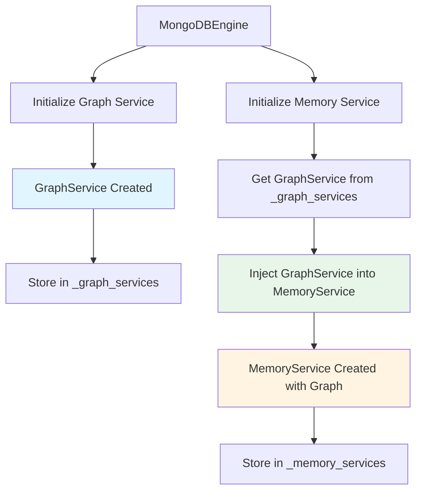
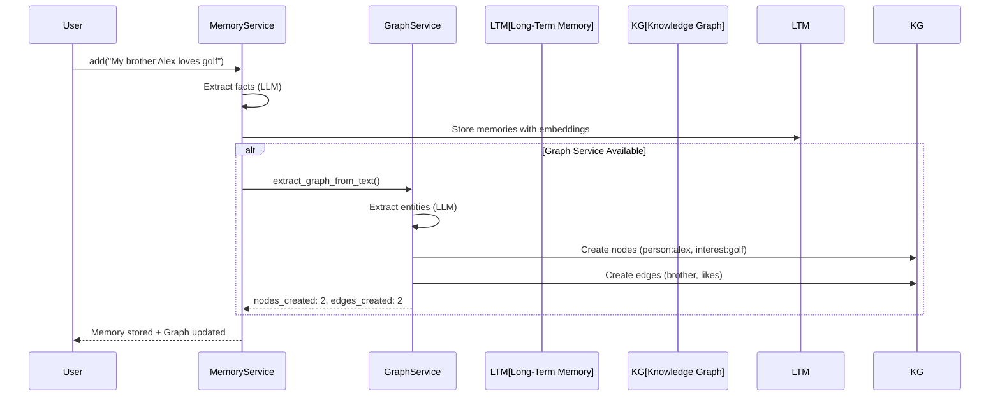
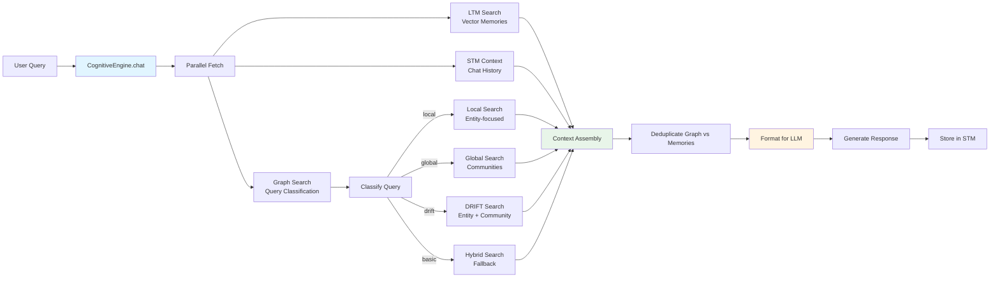

# GraphRAG: Knowledge Graph-Powered Memory

GraphRAG combines **Vector Search** (semantic similarity) with **Graph Traversal** (structural relationships) to enable multi-hop reasoning queries that standard RAG cannot handle.

> **Note**: The Graph Service is **enabled by default** for all MDB-Engine apps. This brings GraphRAG capabilities automatically without explicit configuration. To disable, set `graph_config.enabled: false` in your manifest. See [GRAPH_SERVICE.md](./GRAPH_SERVICE.md) for detailed API documentation.

## What is GraphRAG? (Simple Explanation)

**GraphRAG** is like giving your AI assistant a map of relationships, not just a list of facts.

### The Problem with Regular RAG

Imagine you have a notebook with facts:
- "Bob visited Sector 7 Cafe"
- "Sector 7 Cafe is owned by Rival Tech Inc"
- "Rival Tech Inc competes with Shadow Corp"

If someone asks: **"Is there a security risk involving Bob?"**

**Regular RAG** would search for "Bob" and find: "Bob visited Sector 7 Cafe" - that's it. It can't connect the dots.

**GraphRAG** sees the connections:
- Bob → visited → Sector 7 Cafe
- Sector 7 Cafe → owned_by → Rival Tech Inc
- Rival Tech Inc → competes_with → Shadow Corp

So it can answer: **"Yes! Bob visited a cafe owned by Rival Tech, which competes with Shadow Corp. This could be a security risk."**

### The Magic: Multi-Hop Reasoning

GraphRAG doesn't just find facts - it **follows relationships** to discover hidden connections:

```
Query: "Is there a security risk involving Bob?"

Step 1: Find "Bob" (vector search)
Step 2: Follow Bob's connections (1 hop)
        → Finds: Sector 7 Cafe
Step 3: Follow Sector 7 Cafe's connections (2 hops)
        → Finds: Rival Tech Inc
Step 4: Connect the dots → Security risk detected!
```

This is called **"multi-hop reasoning"** - following relationships across multiple steps to find answers that aren't directly stated.

## A Real Example: The Corporate Espionage Case

Let's see GraphRAG in action with a concrete scenario:

### The Setup

You store these memories:
1. "Alice leads Project Chimera"
2. "Bob reports to Alice"
3. "Project Chimera uses Quantum Encryption"
4. "Bob visited Sector 7 Cafe last week"
5. "Sector 7 Cafe is owned by Rival Tech Inc"
6. "Rival Tech Inc competes with Shadow Corp"

### Regular RAG (Limited)

**Query**: "Is there a security risk involving Bob?"

**What Regular RAG finds:**
- "Bob reports to Alice"
- "Bob visited Sector 7 Cafe"

**Answer**: "Bob works under Alice and visited a cafe." ❌ **Misses the security risk!**

### GraphRAG (Powerful)

**Query**: "Is there a security risk involving Bob?"

**What GraphRAG finds:**
1. **Entry point**: Finds "Bob" via vector search
2. **1-hop traversal**: Follows Bob's connections
   - Finds: "Sector 7 Cafe" (Bob visited it)
3. **2-hop traversal**: Follows Sector 7 Cafe's connections
   - Finds: "Rival Tech Inc" (owns the cafe)
   - Finds: "Shadow Corp" (competes with Rival Tech)
4. **Connects the dots**: 
   - Bob works on Project Chimera (Quantum Encryption)
   - Bob visited a cafe owned by competitor Rival Tech
   - This is a potential security risk!

**Answer**: "Yes! Bob works on Project Chimera (Quantum Encryption) and visited Sector 7 Cafe, which is owned by Rival Tech Inc - a competitor to Shadow Corp. This suggests a potential conflict of interest and security risk." ✅

### Visual: How GraphRAG Traverses

```
Starting Point: "Bob"
    │
    ├─[visited]──► Sector 7 Cafe
    │                  │
    │                  └─[owned_by]──► Rival Tech Inc
    │                                      │
    │                                      └─[competes_with]──► Shadow Corp
    │
    └─[reports_to]──► Alice
                          │
                          └─[leads]──► Project Chimera
                                          │
                                          └─[uses]──► Quantum Encryption

Query: "Is there a security risk involving Bob?"

GraphRAG follows the path:
Bob → visited → Sector 7 Cafe → owned_by → Rival Tech Inc → competes_with → Shadow Corp

Result: Security risk detected! Bob visited a competitor's cafe.
```

### Why This Matters

Without GraphRAG, you'd never discover this connection. The relationship between Bob and Rival Tech isn't directly stated - it's **hidden** in the graph structure:

```
Bob → visited → Sector 7 Cafe → owned_by → Rival Tech Inc
```

GraphRAG automatically follows these paths to reveal hidden insights.

## Why GraphRAG Matters

### 1. Discovers Hidden Connections

GraphRAG finds relationships that aren't explicitly stated. Regular RAG can only find what's directly mentioned.

**Example:**
- **Regular RAG**: "Who likes golf?" → Finds people who directly mentioned golf
- **GraphRAG**: "Who likes golf?" → Finds people who like golf AND people connected to golf enthusiasts

### 2. Answers Complex Questions

GraphRAG can answer questions that require following multiple relationships:

- "What should I get for my brother's favorite hobby?" (brother → person → likes → hobby)
- "Who knows someone at Google?" (you → knows → person → works_at → Google)
- "What events did people from Seattle attended?" (location → lives_in → person → attended → event)

### 3. Understands Context

GraphRAG understands **why** things are related, not just **that** they're related.

**Example:**
- Regular RAG: "Alex and golf are both mentioned in memories"
- GraphRAG: "Alex **likes** golf (strong relationship), so golf-related suggestions are highly relevant"

### 4. Scales to Complex Knowledge

As your knowledge graph grows, GraphRAG gets smarter. More relationships = more insights.

**Example:**
- 10 nodes: Basic connections
- 100 nodes: Rich relationship networks
- 1000+ nodes: Deep insights across entire knowledge domains

## Overview

Traditional RAG finds memories by **semantic similarity** (finding similar meanings): "Tell me about Dad" retrieves memories containing "Dad". But it can't answer **relational queries** - questions that require following connections between different concepts - like:

- "What should I get for my brother's favorite hobby?" (requires: brother → person → likes → hobby)
- "Who knows someone that works at Google?" (requires: you → knows → person → works_at → Google)
- "What events did people from Seattle attend?" (requires: location → lives_in → person → attended → event)

GraphRAG solves this by:

1. **Vector Search**: Finds similar meanings to locate entry points ("my brother" → finds `person:alex`)
2. **Graph Traversal**: Follows relationships step-by-step (`alex` → `likes` → `golf`)
3. **Context Assembly**: Combines graph relationships with memory facts for the LLM

```
Query: "What should I get for my brother's favorite hobby?"
         │
         ▼
    ┌─────────────────┐
    │  Vector Search  │  Finds "my brother" → person:alex (similarity: 0.92)
    │  (Find similar  │  This is the entry point - where we start exploring
    │   meanings)     │
    └────────┬────────┘
             │
             ▼
    ┌─────────────────┐
    │ Graph Traversal │  Follows relationships from alex:
    │ (Follow         │  person:alex ──likes──► interest:golf
    │  connections)   │                         │
    └────────┬────────┘                         ▼
             │                            ┌──────────────┐
             │                            │ product:clubs│
             │                            └──────────────┘
             ▼
    ┌─────────────────┐
    │ Context for LLM │  Combines everything:
    │                 │  "Alex likes golf. Golf products include clubs..."
    └─────────────────┘
```

**In simple terms**: Vector search finds where to start, graph traversal follows the connections, and the LLM gets the full picture.

## Memory-Graph Cohesion: How They Work Together

MDB-Engine's GraphRAG is **tightly integrated** with the Memory Service. They are not separate systems - they form a cohesive cognitive architecture that works seamlessly together.

### The Cohesive Flow

The integration happens at multiple levels:

1. **Service Initialization**: Graph service is initialized first, then automatically injected into Memory Service
2. **Memory Storage**: When memories are added, graph extraction happens automatically
3. **Graph Building**: Entities and relationships extracted from memories build the knowledge graph
4. **Community Detection**: Graph entities are grouped into hierarchical communities with summaries
5. **Query Time**: CognitiveEngine orchestrates both memory and graph context together

### Architecture: Service Initialization



**Key Point**: Graph service must be initialized before memory service so it can be injected. This happens automatically when both are enabled in your manifest.

### Architecture: Memory Storage → Graph Extraction



**Automatic Integration**: When you add a memory, graph extraction happens automatically if `graph_config.auto_extract` is enabled (default: true). No additional code needed!

### Architecture: Query Processing Flow



**Cohesive Context**: CognitiveEngine combines:
- **LTM Context**: Semantic memories from vector search (finding similar meanings)
- **STM Context**: Recent conversation history
- **Graph Context**: Related entities, relationships, and community summaries (following connections)

All three sources are deduplicated and intelligently combined before being sent to the LLM.

### Why This Cohesion Matters

**Without Cohesion** (separate systems):
- Memories stored independently of graph
- Manual synchronization required
- Risk of inconsistencies
- More complex integration code

**With Cohesion** (integrated architecture):
- Automatic graph extraction from memories
- Single source of truth
- Consistent entity representation
- Seamless query-time integration
- Zero additional code for basic usage

## Service Initialization and Integration

### How Services Are Initialized

MDB-Engine ensures proper initialization order for cohesive integration:

1. **Graph Service** initialized first (enabled by default)
   - Creates GraphService instance
   - Stores in `_graph_services` dictionary
   - Available for injection into other services

2. **Memory Service** initialized second (if enabled)
   - Retrieves GraphService from `_graph_services`
   - GraphService automatically injected via dependency injection
   - MemoryService stores reference as `_graph_service`

3. **Automatic Integration**
   - When memory is stored, `_graph_service.extract_graph_from_text()` is called automatically
   - No manual integration code needed
   - Both services share the same LLM and embedding services

### Verification

Check that integration is working:

```python
# Get services from engine
memory_service = engine.get_memory_service("my_app")
graph_service = engine.get_graph_service("my_app")

# Verify graph service is injected into memory service
if hasattr(memory_service, "_graph_service"):
    print(f"Graph service injected: {memory_service._graph_service is not None}")

# Check graph stats
if graph_service:
    stats = await graph_service.get_stats()
    print(f"Graph nodes: {stats['total_nodes']}, edges: {stats['total_edges']}")
```

### Shared Services

Both memory and graph services use the same underlying services:

- **LLM Service**: Shared for fact extraction (memory) and entity extraction (graph)
- **Embedding Service**: Shared for vector search (memory) and hybrid search (graph)
- **Database Connection**: Both use MDB-Engine's connection pool

This ensures consistency and efficiency across the system.

## When to Use GraphRAG

GraphRAG adds some overhead (it uses an LLM to extract entities and relationships from each memory), so choose wisely:

| Use Case | GraphRAG? | Why |
|----------|-----------|-----|
| Personal assistant with relationships | ✅ Yes | Need to traverse "my brother likes X" |
| Document Q&A / RAG chatbot | ❌ No | Relationships aren't the focus |
| CRM with contact relationships | ✅ Yes | "Who knows someone at Google?" |
| Simple chat memory | ❌ No | Basic fact storage is sufficient |
| Enterprise knowledge base | ✅ Yes | Complex entity relationships |

### Example Configurations

**Default** (GraphRAG enabled automatically - no config needed):
```json
{
  "schema_version": "2.0",
  "slug": "my_app",
  "name": "My App"
}
```

**Custom node types** (GraphRAG with custom configuration):
```json
{
  "graph_config": {
    "node_types": ["person", "organization", "project", "document"]
  }
}
```

**Disabled** (opt-out for simple memory without graph overhead):
```json
{
  "graph_config": {
    "enabled": false
  }
}
```

## Quick Start

### 1. GraphRAG is Enabled by Default

The Graph Service is enabled automatically with sensible defaults. A minimal manifest already has GraphRAG:

```json
{
  "schema_version": "2.0",
  "slug": "my_app",
  "name": "My App"
}
```

**Both services work together automatically**: When memory service is enabled, it automatically receives the graph service via dependency injection. No additional configuration needed!

### 2. Enable Memory Service for Full Integration

To get the complete cohesive experience, enable both services:

```json
{
  "schema_version": "2.0",
  "slug": "my_app",
  "name": "My App",
  "memory_config": {
    "enabled": true
  }
}
```

**That's it!** Graph service is already enabled by default, and memory service will automatically use it for GraphRAG.

### 3. Automatic Graph Extraction from Memories

When you add memories, entities and relationships are **automatically extracted** and added to the knowledge graph:

```python
from mdb_engine.memory import get_memory_service

# Get memory service (graph service automatically injected)
memory_service = engine.get_memory_service("my_app")

# Add a memory - graph extraction happens automatically!
memory_service.add(
    messages="My brother Alex loves playing golf on weekends",
    user_id="user123"
)

# Behind the scenes:
# 1. Memory stored in LTM (vector search)
# 2. Graph extraction triggered automatically:
#    - person:user123 ──brother──► person:alex
#    - person:alex ──likes──► interest:golf
#    - interest:golf ──has_property──► concept:weekends
# 3. Graph nodes and edges created
# 4. Communities detected (if GraphRAG features enabled)
```

**No additional code needed!** The integration is automatic and seamless.

### 4. Query with Cohesive Context

CognitiveEngine automatically uses both memory and graph context:

```python
from mdb_engine.memory import CognitiveEngine

# Create engine (gets both memory and graph services automatically)
cognitive_engine = CognitiveEngine(
    app_slug="my_app",
    memory_service=memory_service,
    chat_history_collection=chat_collection,
    llm_provider=llm_provider,
    # graph_service is automatically obtained from memory_service
)

# Query automatically uses both LTM and Graph context
result = await cognitive_engine.chat(
    user_id="user123",
    session_id="session1",
    user_query="What gift should I get for Alex?"
)

# Behind the scenes:
# 1. Query classified: "local" (entity-focused)
# 2. Parallel fetch:
#    - LTM: Vector search finds memories about "Alex" and "gifts"
#    - STM: Recent conversation context
#    - Graph: Local search finds person:alex → likes → interest:golf
# 3. Context assembly:
#    - Combines LTM memories + Graph relationships
#    - Deduplicates overlapping information
#    - Formats for LLM
# 4. LLM receives cohesive context:
#    - MEMORY CONTEXT: "Alex mentioned golf last week"
#    - GRAPH CONTEXT: "Alex likes golf (strong relationship)"
#    - STM CONTEXT: "Previous conversation about birthdays"
# 5. Response generated with full context
```

**The LLM receives a cohesive view** combining semantic memories (LTM), structural relationships (Graph), and conversation history (STM).

## Schema

### Node Document

Nodes are stored in the `kg` collection:

```json
{
  "_id": "person:alex",
  "type": "person",
  "name": "Alex",
  "properties": {
    "occupation": "Software Engineer",
    "location": "Seattle"
  },
  "edges": [
    {
      "relation": "likes",
      "target": "interest:golf",
      "properties": {"since": "2020"},
      "weight": 0.9,
      "active": true,
      "created_at": "2024-01-15T10:30:00Z"
    },
    {
      "relation": "works_at",
      "target": "organization:tech_corp",
      "weight": 1.0,
      "active": true
    }
  ],
  "embedding": [0.1, 0.2, ...],
  "app_slug": "myapp",
  "user_id": "user123",
  "created_at": "2024-01-15T10:30:00Z",
  "updated_at": "2024-01-15T10:30:00Z"
}
```

### Node Types

| Type | Description | Examples |
|------|-------------|----------|
| `person` | People, users, individuals | "Alex", "Mom", "Dr. Smith" |
| `interest` | Hobbies, topics, activities | "Golf", "Cooking", "Python" |
| `event` | Meetings, occasions | "Birthday Party", "Conference" |
| `location` | Places, cities, addresses | "Seattle", "Office", "Home" |
| `organization` | Companies, teams, groups | "Google", "Book Club" |
| `product` | Items, goods, services | "Golf Clubs", "iPhone" |
| `concept` | Abstract ideas, skills | "Efficiency", "Leadership" |

### Relationship Types

Common relationships extracted by the LLM:

| Category | Relationships |
|----------|--------------|
| Social | `knows`, `friend_of`, `colleague` |
| Family | `parent_of`, `child_of`, `sibling_of`, `spouse_of` |
| Preference | `likes`, `dislikes`, `loves`, `hates`, `interested_in` |
| Professional | `works_at`, `manages`, `reports_to`, `skilled_at` |
| Location | `lives_in`, `located_in`, `visited` |
| Membership | `member_of`, `part_of`, `belongs_to` |
| Action | `created`, `owns`, `attended`, `participated_in` |

## API Reference

### GraphService Methods

The Graph Service (`mdb_engine.graph.GraphService`) provides all graph operations:

```python
from mdb_engine.graph import GraphService, get_graph_service

# Get service from engine
graph_service = engine.get_graph_service("my_app")

# Or create directly
graph_service = get_graph_service(
    app_slug="my_app",
    collection=collection,
    config={"enabled": True},
    llm_service=llm_service,
    embedding_service=embedding_service,
)
```

#### Node Operations

```python
# Upsert a node
graph_service.upsert_node(
    node_id="person:alex",
    node_type="person",
    name="Alex",
    properties={"occupation": "Engineer"},
    user_id="user123"
)

# Get a node
node = graph_service.get_node("person:alex")

# List nodes
nodes = graph_service.list_nodes(node_type="person", user_id="user123", limit=50)

# Delete a node (and all edges pointing to it)
graph_service.delete_node("person:alex")
```

#### Edge Operations

```python
# Add an edge
graph_service.add_edge(
    source_id="person:alex",
    relation="likes",
    target_id="interest:golf",
    properties={"since": "2020"},
    weight=0.9
)

# Update an edge
graph_service.update_edge(
    source_id="person:alex",
    relation="likes",
    target_id="interest:golf",
    updates={"weight": 0.95, "properties": {"intensity": "high"}}
)

# Deactivate an edge (soft delete for temporal relationships)
graph_service.deactivate_edge(
    source_id="person:alex",
    relation="works_at",
    target_id="organization:old_company"
)

# Remove an edge (hard delete)
graph_service.remove_edge(
    source_id="person:alex",
    relation="likes",
    target_id="interest:golf"
)
```

#### Graph Traversal

```python
# Traverse from a node (uses $graphLookup)
results = graph_service.traverse(
    start_id="person:alex",
    max_depth=2,
    relation_filter=["likes", "knows"],  # Optional: only follow these relations
    include_inactive=False
)

# Returns:
# [
#   {"node": {...}, "hop_distance": 0},  # Alex
#   {"node": {...}, "hop_distance": 1},  # Golf (alex likes golf)
#   {"node": {...}, "hop_distance": 2},  # Golf Club (golf related_to clubs)
# ]

# Get immediate neighbors
neighbors = graph_service.get_neighbors("person:alex", relation="likes")

# Find path between nodes (returns full path reconstruction)
path = await graph_service.find_path("person:alex", "organization:google", max_depth=5)
# Returns: ["person:alex", "person:alex_works_at", "organization:google"] or None
# Uses BFS with parent tracking to reconstruct the complete path
```

#### Hybrid Search

```python
# Combine vector search with graph traversal
results = graph_service.hybrid_search(
    query="What does Alex like?",
    user_id="user123",
    max_depth=2,
    vector_limit=5
)

# Returns:
# {
#   "entry_nodes": [...],     # Nodes found via vector similarity
#   "graph_context": [...],   # Nodes found via traversal
#   "total_nodes": 12
# }

# Format for LLM prompt
context_str = graph_service.format_graph_context(results, max_nodes=10)
```

#### GraphRAG Search Methods (Recommended)

GraphRAG provides specialized search methods with automatic query classification:

**Query Classification:**
```python
query_type = graph_service.classify_query("What does Alex like?")
# Returns: "local", "global", "drift", or "basic"
```

**Local Search** - Entity-focused queries:
```python
results = await graph_service.local_search(
    query="What does Alex like?",
    user_id="user123",
    max_depth=2,
)

# Returns:
# {
#   "query_type": "local",
#   "entry_nodes": [...],           # Vector search results
#   "graph_context": [...],         # Traversed nodes
#   "community_summaries": [...],   # Community summaries
#   "total_nodes": 8
# }
```

**Global Search** - Thematic queries:
```python
results = await graph_service.global_search(
    query="What are common interests?",
    user_id="user123",
    max_communities=10,
)

# Returns:
# {
#   "query_type": "global",
#   "communities": [...],
#   "partial_responses": [...],
#   "synthesized_answer": "...",
#   "total_communities": 5
# }
```

**DRIFT Search** - Entity queries with community context:
```python
results = await graph_service.drift_search(
    query="What is the context around Project X?",
    user_id="user123",
    max_depth=2,
)
```

**Automatic Routing:**
CognitiveEngine automatically uses these methods based on query classification. You typically don't need to call them directly - use `CognitiveEngine.chat()` instead.

#### Advanced Graph Search (Legacy)

Microsoft Research-style GraphRAG with query decomposition and pathfinding. **Note**: For new code, use `local_search()`, `global_search()`, or `drift_search()` instead.

```python
# Advanced search with entity extraction and pathfinding
results = await graph_service.advanced_graph_search(
    query="How is Alex related to Project Hades?",
    user_id="user123",
    max_depth=2,
)
```

**Advanced Features:**
- **Query Decomposition**: LLM extracts entities from queries for precise entry points
- **Pathfinding**: Finds connections between multiple entities (e.g., "Alex → works_at → Google → owns → Project Hades")
- **Neighborhood Exploration**: Weighted traversal prioritizing family/work relationships

#### Auto-Extraction (Async)

```python
# Extract graph from text (async method)
result = await graph_service.extract_graph_from_text(
    text="My colleague Sarah works at Google and loves hiking",
    user_id="user123"
)

# Sync wrapper (for memory service integration)
result = graph_service.extract_graph_from_memory(
    memory_text="My colleague Sarah works at Google and loves hiking",
    user_id="user123"
)

# Returns:
# {
#   "nodes_created": 3,  # person:sarah, organization:google, interest:hiking
#   "edges_created": 2,  # works_at, likes
#   "extracted": {...}   # Raw extraction
# }
```

## Configuration Reference

Graph configuration is now a **top-level** manifest section:

```json
{
  "graph_config": {
    "enabled": true,
    "collection_name": "kg",
    "auto_extract": true,
    "llm_model": "openai/gpt-4o",
    "temperature": 0.0,
    "default_max_depth": 2,
    "vector_index_name": "graph_vector_index",
    "embedding_dims": 1536,
    "node_types": [
      "person",
      "interest",
      "event",
      "location",
      "organization",
      "product",
      "concept"
    ]
  }
}
```

| Option | Type | Default | Description |
|--------|------|---------|-------------|
| `enabled` | boolean | `true` | Enable Graph Service (enabled by default) |
| `collection_name` | string | `"kg"` | MongoDB collection for graph nodes (prefixed with app slug) |
| `auto_extract` | boolean | `true` | Auto-extract entities/relationships from text |
| `llm_model` | string | (from llm_config) | LLM model for graph extraction |
| `temperature` | number | `0.0` | Temperature for LLM extraction |
| `default_max_depth` | integer | `2` | Default traversal depth for $graphLookup |
| `vector_index_name` | string | `"graph_vector_index"` | Name of MongoDB Atlas Vector Search index |
| `embedding_dims` | integer | `1536` | Embedding dimensions for vector index |
| `node_types` | array | (see above) | Allowed node types for extraction |

## Use Cases

### Family Assistant

```
User: "What should I get for my brother's birthday?"

Graph traversal:
user → brother → person:alex → likes → interest:golf
                              → born_in → month:march

Response: "Based on Alex's love of golf and his March birthday, 
          consider golf accessories or a round at a new course!"
```

### Professional Network

```
User: "Who might know someone at Google?"

Graph traversal:
user → knows → person:sarah → works_at → organization:google
user → knows → person:mike → knows → person:jane → works_at → organization:google

Response: "Sarah works at Google directly. Mike knows Jane who also works there."
```

### Event Planning

```
User: "What activities would work for our book club?"

Graph traversal:
organization:book_club → member_of → [person:alice, person:bob, person:carol]
person:alice → likes → interest:wine
person:bob → likes → interest:hiking  
person:carol → likes → interest:wine, interest:reading

Response: "Wine tasting would appeal to most members (Alice, Carol). 
          Consider a nature walk with reading for variety."
```

## $graphLookup Explained

The core of GraphRAG is MongoDB's `$graphLookup` aggregation stage:

```javascript
{
  "$graphLookup": {
    "from": "kg",                      // Collection to search
    "startWith": "$edges.target",       // Start from direct edges
    "connectFromField": "edges.target", // Field containing next targets
    "connectToField": "_id",           // Field to match against
    "as": "network",                   // Output array name
    "maxDepth": 2,                     // How many hops
    "depthField": "hop_distance",      // Track distance
    "restrictSearchWithMatch": {       // Filter during traversal
      "app_slug": "myapp"
    }
  }
}
```

This performs a recursive graph traversal (following connections step-by-step) in a single database operation, following edges from node to node up to `maxDepth` hops.

## Common Questions

### Q: Do I need to manually create the graph?

**A:** No! GraphRAG automatically extracts entities and relationships from your memories. When you store a memory like "My brother Alex loves golf", it automatically creates:
- Node: `person:alex`
- Node: `interest:golf`
- Edge: `person:you --brother--> person:alex`
- Edge: `person:alex --likes--> interest:golf`

### Q: How is this different from regular search?

**A:** Regular search finds documents containing keywords. GraphRAG finds **relationships** between concepts. It can answer "Who knows someone at Google?" even if no document directly states that connection.

### Q: Does GraphRAG replace regular memory search?

**A:** No! GraphRAG **enhances** memory search. It combines:
- **Memory search**: Finds relevant facts (semantic similarity - finding similar meanings)
- **Graph traversal**: Finds relationships (structural connections - following links)
- **Together**: Comprehensive context for better answers

### Q: How many "hops" should I use?

**A:** 
- **1 hop**: Direct connections only (fast, limited)
- **2 hops**: Direct + indirect connections (recommended default)
- **3+ hops**: Deep exploration (slower, may include noise)

Most queries work well with 2 hops - it finds indirect connections without too much noise.

### Q: What's the difference between Local, Global, and DRIFT search?

**A:**
- **Local Search**: Entity-focused queries (e.g., "What does Alex like?") - follows relationships from specific entities
- **Global Search**: Thematic queries (e.g., "What are common interests?") - searches community summaries
- **DRIFT Search**: Entity queries with community context - combines both approaches

GraphRAG automatically classifies your query and uses the right method.

### Q: Does GraphRAG work without the Memory Service?

**A:** Yes! Graph Service can work standalone. However, the full power comes from combining both:
- Memory Service: Stores facts and retrieves them semantically
- Graph Service: Stores relationships and traverses them structurally
- Together: Complete context for intelligent responses

## Best Practices

### 1. Enable Both Services for Cohesive Experience

**Recommended**: Enable both memory and graph services together:

```json
{
  "schema_version": "2.0",
  "slug": "my_app",
  "name": "My App",
  "memory_config": {
    "enabled": true
  }
}
```

Graph service is enabled by default, so enabling memory automatically gives you full GraphRAG capabilities.

**Why**: Memory storage automatically builds the graph, and queries use both semantic memories and structural relationships for comprehensive context.

### 2. Configure Services Together

When configuring both services, ensure they share the same LLM and embedding services:

```json
{
  "llm_config": {
    "enabled": true,
    "default_model": "openai/gpt-4o"
  },
  "memory_config": {
    "enabled": true,
    "embedding_model": "text-embedding-3-small"
  },
  "graph_config": {
    "enabled": true,
    "auto_extract": true
  }
}
```

**Why**: Shared services ensure consistent entity extraction and embeddings across both systems.

### 3. Node ID Convention

Use `type:identifier` format for clear, collision-free IDs:

```
person:alex          (not just "alex")
interest:golf        (not just "golf")
organization:google  (not just "google")
```

**Why**: Type prefixes prevent collisions and make graph queries more efficient.

### 4. Temporal Relationships

Use the `active` flag for relationships that change over time:

```python
# Alex no longer works at OldCorp
graph_service.deactivate_edge("person:alex", "works_at", "organization:oldcorp")

# Add new job
graph_service.add_edge("person:alex", "works_at", "organization:newcorp")
```

**Why**: Preserves historical relationships while marking current state.

### 5. Weight Relationships

Use `weight` (0.0-1.0) to indicate relationship strength:

```python
# Strong preference
graph_service.add_edge("person:alex", "loves", "interest:golf", weight=0.95)

# Mild interest
graph_service.add_edge("person:alex", "likes", "interest:tennis", weight=0.6)
```

**Why**: Helps prioritize relationships during graph traversal and community detection.

### 6. Depth Limits

- Depth 1: Direct relationships only
- Depth 2: One hop away (most common, default)
- Depth 3+: Use sparingly (exponential growth)

**Why**: Prevents context explosion while maintaining useful multi-hop reasoning.

### 7. Use CognitiveEngine for Automatic Integration

**Recommended**: Use CognitiveEngine instead of manually combining services:

```python
# ✅ Good: CognitiveEngine handles everything
cognitive_engine = CognitiveEngine(
    app_slug="my_app",
    memory_service=memory_service,  # Contains graph service
    chat_history_collection=chat_collection,
    llm_provider=llm_provider,
)

result = await cognitive_engine.chat(
    user_id="user123",
    session_id="session1",
    user_query="What should I get for Alex?"
)

# ❌ Avoid: Manual integration is complex
memories = await memory_service.search(...)
graph_results = await graph_service.local_search(...)
# Manual deduplication, context assembly, etc.
```

**Why**: CognitiveEngine automatically handles query classification, parallel fetching, deduplication, and context assembly.

### 8. Monitor Graph Extraction

Check that graph extraction is working:

```python
# Add memory and check graph extraction
result = memory_service.add(
    messages="My brother Alex loves golf",
    user_id="user123"
)

# Check graph service stats
graph_service = engine.get_graph_service("my_app")
stats = await graph_service.get_stats()
print(f"Nodes: {stats['total_nodes']}, Edges: {stats['total_edges']}")
```

**Why**: Ensures automatic graph extraction is functioning correctly.

### 9. Performance Considerations

**Memory + Graph Together**:
- Graph extraction adds ~100-500ms per memory (LLM call)
- Use async methods (`add_async()`) for better performance
- Community detection can be expensive - runs in background
- Query time: Parallel fetching keeps latency low

**When to Disable Graph Extraction**:
- Simple Q&A applications without relationships
- High-volume, low-value conversations
- Cost-sensitive applications (each extraction = LLM call)

**Configuration**:
```json
{
  "graph_config": {
    "enabled": true,
    "auto_extract": false  // Disable automatic extraction
  }
}
```

Then manually extract when needed:
```python
await graph_service.extract_graph_from_text(text, user_id)
```

### 10. Troubleshooting Integration Issues

**Graph extraction not happening**:
1. Check `graph_config.auto_extract` is `true` (default)
2. Verify graph service is injected into memory service
3. Check logs for extraction errors
4. Ensure LLM service is configured

**Graph context not appearing in queries**:
1. Verify graph service is available to CognitiveEngine
2. Check query classification (may be routing to "basic" search)
3. Verify graph has sufficient nodes/edges
4. Check `graph_min_nodes` threshold in CognitiveEngine

**Performance issues**:
1. Use `add_async()` for memory storage
2. Disable graph extraction for low-value conversations
3. Reduce `default_max_depth` for graph traversal
4. Use community summaries for global queries (more efficient)

## Performance Considerations

1. **Index on `edges.target`**: Automatically created for efficient traversal
2. **App-scoped queries**: Always filter by `app_slug` for multi-tenant isolation
3. **Depth limits**: Keep `max_depth` ≤ 3 for production workloads
4. **Vector index**: Enable for hybrid search entry point efficiency

## Troubleshooting

### Graph extraction returns no nodes

Check that:
1. `auto_extract` is `true` in `graph_config`
2. LLM service is configured (check `llm_config` or LLM API keys)
3. LLM API key is set (OPENAI_API_KEY, AZURE_OPENAI_API_KEY, etc.)
4. Text contains extractable entities

### Traversal returns empty results

Verify:
1. Start node exists: `graph_service.get_node("person:alex")`
2. Edges exist: Check `node["edges"]` array
3. App slug matches: `graph_service.app_slug`
4. Edges are active: `edge["active"] == True`

### Hybrid search not finding nodes

Ensure:
1. Embedding service is configured (Graph Service requires EmbeddingService)
2. Vector index exists in MongoDB Atlas
3. Query is semantically related to node names/properties

### Graph Service not initialized

Check that:
1. Graph is enabled by default - ensure `graph_config.enabled` is not explicitly set to `false`
2. LLM service is configured if using auto_extract (gracefully degrades if unavailable)
3. Embedding service is configured for hybrid search (gracefully degrades if unavailable)
4. Check logs for initialization errors

---

## Advanced GraphRAG Features

MDB-Engine now implements full Microsoft Research-style GraphRAG with hierarchical community detection and intelligent query routing.

### Community Detection

GraphRAG automatically detects hierarchical communities in your knowledge graph:

- **Local Communities**: Densely connected groups of entities
- **Regional Communities**: Broader groupings of local communities  
- **Global Communities**: Highest-level themes across the entire graph

Communities are detected using MongoDB aggregation pipelines (no external dependencies) and stored with LLM-generated summaries.

### Query Classification

Queries are automatically classified and routed to the appropriate search method:

- **Local Search**: Entity-focused queries (e.g., "What does Alex like?")
- **Global Search**: Thematic queries (e.g., "What are the main themes?")
- **DRIFT Search**: Entity queries needing community context
- **Basic Search**: Simple lookups (fallback)

### Configuration

Enable full GraphRAG features in your manifest:

```json
{
  "graphrag_config": {
    "enabled": true,
    "community_detection": {
      "enabled": true,
      "rebuild_threshold": 100,
      "rebuild_interval_hours": 24,
      "min_community_size": 2,
      "max_community_size": 1000
    },
    "community_summaries": {
      "enabled": true,
      "generate_on_detection": true,
      "regenerate_on_rebuild": true
    },
    "query_classification": {
      "enabled": true,
      "use_llm": true,
      "cache_results": true
    },
    "search_methods": {
      "local_enabled": true,
      "global_enabled": true,
      "drift_enabled": true,
      "basic_fallback": true
    }
  }
}
```

### Usage

GraphRAG is automatically used by `CognitiveEngine` - no code changes needed! Queries are automatically classified and routed to the best search method.

For programmatic access:

```python
from mdb_engine.graph import GraphService

graph_service = get_graph_service(...)

# Query classification
query_type = graph_service.classify_query("What are the main themes?")
# Returns: "global"

# Local Search
results = await graph_service.local_search(
    query="What does Alex like?",
    user_id="user123",
)

# Global Search  
results = await graph_service.global_search(
    query="What are the main themes?",
    user_id="user123",
    max_communities=10,
)

# DRIFT Search
results = await graph_service.drift_search(
    query="What is the context around Project X?",
    user_id="user123",
)
```

## Integration Best Practices

### Service Initialization Order

**Critical**: Graph service must be initialized before memory service:

1. **Graph Service**: Initialized first (enabled by default)
2. **Memory Service**: Initialized second, receives graph service via injection

This happens automatically when both are enabled in your manifest. The engine handles initialization order.

### Configuration Cohesion

Configure both services to work together:

```json
{
  "llm_config": {
    "enabled": true,
    "default_model": "openai/gpt-4o"
  },
  "memory_config": {
    "enabled": true,
    "embedding_model": "text-embedding-3-small"
  },
  "graph_config": {
    "enabled": true,
    "auto_extract": true,
    "default_max_depth": 2
  },
  "graphrag_config": {
    "enabled": true,
    "community_detection": {
      "enabled": true,
      "rebuild_threshold": 100
    },
    "query_classification": {
      "enabled": true,
      "use_llm": true
    }
  }
}
```

**Key Points**:
- Both services share the same LLM model (from `llm_config.default_model`)
- Both services use the same embedding model
- Graph extraction happens automatically when memories are stored
- Query classification routes queries intelligently

### Performance Optimization

**For High-Volume Applications**:

1. **Use async methods**: `memory_service.add_async()` for parallel processing
2. **Batch graph extraction**: Extract graph periodically instead of per-memory
3. **Community detection**: Run in background, not synchronously
4. **Query caching**: Enable `query_classification.cache_results`

**Configuration**:
```json
{
  "graph_config": {
    "auto_extract": false  // Disable per-memory extraction
  },
  "graphrag_config": {
    "query_classification": {
      "cache_results": true  // Cache classification results
    }
  }
}
```

**Manual batch extraction**:
```python
# Extract graph from multiple memories at once
texts = [mem["text"] for mem in recent_memories]
for text in texts:
    await graph_service.extract_graph_from_text(text, user_id)
```

### Troubleshooting Integration

**Graph extraction not happening**:
- Check `graph_config.auto_extract` is `true`
- Verify graph service is injected: `memory_service._graph_service is not None`
- Check LLM service is configured
- Review logs for extraction errors

**Graph context missing in queries**:
- Verify CognitiveEngine has graph service: `cognitive_engine.has_graph_service`
- Check query classification: May be routing to "basic" (no graph)
- Verify graph has nodes: `await graph_service.get_stats()`
- Check `graph_min_nodes` threshold in CognitiveEngine

**Performance issues**:
- Use `add_async()` instead of `add()`
- Disable `auto_extract` for low-value conversations
- Reduce `default_max_depth` for faster traversal
- Use community summaries for global queries (more efficient than node traversal)
