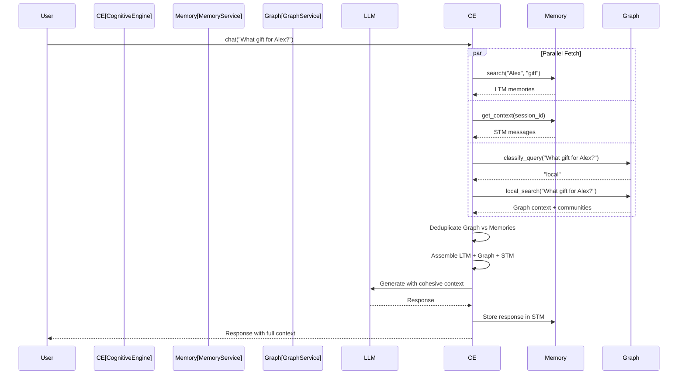

# Memory Service - Complete Guide

> **Naming note:** The primary memory class is available as `MemoryService` (preferred)
> or `CognitiveMemoryService` (legacy). The chat orchestrator is available as `ChatEngine`
> (preferred) or `CognitiveEngine` (legacy). Both old and new names work — they are aliases
> for the same classes.
>
> ```python
> from mdb_engine import MemoryService, ChatEngine  # preferred
> from mdb_engine.memory import CognitiveMemoryService, CognitiveEngine  # also works
> ```

## Overview

The **Memory Service** is MDB-Engine's intelligent memory management system for AI applications. It provides persistent, semantic memory storage and retrieval using MongoDB Atlas Vector Search, enabling your AI applications to remember user preferences, facts, and conversation context across sessions.

What makes MDB-Engine's memory service unique is its **Cognitive Architecture** - a biologically-inspired system that implements:

- **Perfect Recall**: All memories are permanently accessible via semantic search, ranked by importance + access frequency
- **Importance Scoring**: AI evaluates memory significance (0.1-1.0 scale)
- **Access Tracking**: Frequently accessed memories rank higher in search results
- **Conflict Resolution**: Prevents storing contradictory facts
- **Memory Reinforcement**: Similar memories strengthen existing memories (no duplicates created)
- **Memory Merging**: Related memories are combined intelligently
- **Duplicate Detection**: Prevents semantically identical memories (similarity ≥ 0.90)

## Why Cognitive Memory?

### The Problem with Standard RAG

Traditional RAG (Retrieval-Augmented Generation) systems have a critical flaw: they treat all memories equally. A casual comment from three weeks ago has the same weight as a core fact mentioned yesterday. This leads to:

- **Context pollution**: LLMs distracted by irrelevant old memories
- **Contradictions**: AI confidently holds two conflicting facts as equally true
- **Memory bloat**: Unlimited growth without intelligent pruning
- **No emotional intelligence**: Can't distinguish significant life events from trivial facts

### The Cognitive Solution

MDB-Engine's memory service implements a **Silicon Hippocampus** - a dynamic cognitive system that:

1. **Perfect Recall**: All memories are permanently accessible, never deleted
2. **Rewards Rehearsal**: Frequently accessed memories rank higher in search results
3. **Importance-Based Ranking**: AI-assessed importance determines memory priority
4. **Maintains Consistency**: Detects and flags contradictions
5. **Intelligent Merging**: Related memories are combined to prevent duplication
6. **Access Tracking**: Memories accessed more frequently are prioritized

## Architecture

The `MemoryService` (class name: `CognitiveMemoryService`) is composed from six specialized mixins, each handling a distinct part of the memory pipeline:

- **StorageMixin** (`mdb_engine.memory.storage`) -- CRUD operations, graph link management, timeline operations
- **ExtractionMixin** (`mdb_engine.memory.extraction`) -- LLM-powered fact extraction and categorization
- **ScoringMixin** (`mdb_engine.memory.scoring`) -- Importance scoring (0.1-1.0)
- **ReinforcementMixin** (`mdb_engine.memory.reinforcement`) -- Memory reinforcement and boost logic
- **MergingMixin** (`mdb_engine.memory.merging`) -- LLM-powered memory merging
- **EmbeddingMixin** (`mdb_engine.memory.embedding`) -- Embedding generation (single/batch)

The `get_memory_service()` factory uses a `CognitiveMemoryServiceBuilder` internally to wire dependencies (graph service, embedding service, LLM service) before constructing the service.

> **All methods are async.** Use `await` when calling any memory service method from FastAPI routes.

## Key Features

### Core Features (Always Available)
- **Automatic Fact Extraction**: LLM-powered extraction of key facts from conversations
- **Semantic Search**: Find relevant memories using vector similarity search
- **User Isolation**: All memories are scoped per user for privacy and security
- **Metadata Support**: Rich metadata filtering and custom fields
- **Bucket Awareness**: Full memory isolation between categories (work vs personal)
- **Zero-Configuration Setup**: Automatic index management
- **Memory Categories**: Every memory is automatically categorized as biographical, preferences, temporal, or relational (never "general")

### Cognitive Features (Enabled by Default)
- **Perfect Recall**: All memories are permanently accessible, ranked by importance + access frequency
- **Importance Scoring**: AI evaluates memory significance (0.1-1.0 scale)
- **Access Tracking**: Frequently accessed memories rank higher in search results
- **Memory Reinforcement**: Similar memories strengthen existing memories (no duplicates created)
- **Memory Merging**: Related memories are combined intelligently
- **Conflict Detection**: LLM-based logical consistency checking
- **Memory Analytics**: Track memory health and patterns
- **Duplicate Detection**: Prevents semantically identical memories (similarity ≥ 0.90)

### GraphRAG Integration (Automatic When Enabled)
- **Tightly Integrated**: Graph service is automatically injected into memory service
- **Automatic Extraction**: Entities and relationships extracted from every memory stored
- **Knowledge Graph**: Builds entity-relationship graphs automatically as memories are added
- **$graphLookup Traversal**: Multi-hop reasoning ("What does my brother like?")
- **Hybrid Search**: Combines vector similarity (LTM) with graph structure
- **Query Classification**: Automatically routes queries to Local/Global/DRIFT search
- **Community Detection**: Hierarchical communities with LLM-generated summaries
- **Cohesive Context**: CognitiveEngine combines LTM + Graph + STM for comprehensive responses
- **See**: [GRAPHRAG.md](GRAPHRAG.md) for full documentation

**Integration Flow**: When you enable memory service, it automatically receives the graph service (if enabled). Every memory you store triggers automatic graph extraction. At query time, CognitiveEngine uses both memory and graph context together seamlessly.

### Bucket Awareness (Enterprise Feature)
- **Category Isolation**: Memories in "work" bucket won't appear when using "personal"
- **File Memory Integration**: Uploaded documents linked to their category bucket
- **Cross-Reference Support**: `associated_bucket_id` links related memories
- **CognitiveEngine Support**: Pass `bucket_id` to filter LTM search and storage
- **Shared Memory Buckets**: Group memories can be filtered by bucket (e.g., "team CODE bucket")

### Perfect Brain Features (Advanced)
- **Multi-Tier Memory Architecture**: Working, Episodic, Semantic, Reflective, Predictive layers
- **Memory Consolidator**: Reflection loop that distills episodic memories into semantic facts
- **Reflective Memory**: Meta-cognitive insights about system behavior and patterns
- **Predictive Memory**: Counterfactuals, simulations, and future scenarios with validation
- **Shared/Group Memory**: Privacy-safe promotion of facts within groups (families, teams, organizations)
- **Memory Vetoes**: User-controlled "never share" flags for sensitive memories
- **Query-Aware Recall**: Policy-driven memory retrieval based on task type, risk tolerance, and latency budget
- **Memory Versioning**: Track belief evolution and historical states over time
- **Timeline Service**: Multiverse support for counterfactual reasoning and parallel timelines
- **Multi-Scope Support**: User-scoped, shared/group-scoped, and system-scoped memories
- **Bucket Filtering**: All memory types support bucket filtering for contextual isolation

## Memory Categories vs Bucket Types

**Important Distinction:**

- **Memory Categories** (semantic classification): `biographical`, `preferences`, `temporal`, `relational`
  - Every memory MUST have one of these four categories
  - Automatically assigned during fact extraction
  - Used for semantic organization and retrieval
  - "general" is NOT a memory category

- **Bucket Types** (organizational filtering): `general`, `work`, `coding`, `file`, `conversation`, etc.
  - Used for memory isolation and filtering
  - Set via `bucket_type` parameter
  - "general" is a valid bucket_type for default/unfiltered memories
  - Examples: `bucket_type="work"` filters to work-related memories

**Example:**
```python
# Memory category: "relational" (about family relationships)
# Bucket type: "general" (default bucket, no filtering)
await memory_service.add(
    messages="My sister Emily is a doctor",
    user_id="user123",
    bucket_type="general"  # This is bucket_type, NOT memory category
)
# Result: category="relational", metadata.bucket_type="general"
```

## LLM Model Inheritance

**Important**: The Memory Service automatically inherits the LLM model from your app's `llm_config.default_model`. If `memory_config.memory_llm_model` is not explicitly set, it will use the app's default LLM model. This ensures consistent LLM usage across all services (memory, graph, reflection, etc.).

**Service-Specific Override**: You can override the model for memory operations only by setting `memory_config.memory_llm_model` explicitly.

**Temperature Configuration**: The memory service uses temperature `0` by default for deterministic fact extraction. You can configure this via:
- **Manifest**: `"temperature": 0` in `memory_config`
- **Environment Variable**: `MEMORY_LLM_TEMPERATURE=0`

```json
{
  "memory_config": {
    "enabled": true,
    "temperature": 0  // Deterministic fact extraction (default)
  }
}
```

## GraphRAG Integration

**GraphRAG is automatically integrated** with the Memory Service. When both services are enabled, they work together seamlessly:

### Automatic Integration Flow

1. **Service Initialization**: Graph service is initialized first, then automatically injected into Memory Service
2. **Memory Storage**: Every memory you store automatically triggers graph extraction (if `graph_config.auto_extract` is enabled)
3. **Graph Building**: Entities and relationships extracted from memories build the knowledge graph
4. **Query Time**: CognitiveEngine uses both memory (LTM) and graph context together

### Example: Automatic Graph Extraction

```python
from mdb_engine.memory import get_memory_service

# Get memory service (graph service automatically injected)
memory_service = engine.get_memory_service("my_app")

# Add a memory - graph extraction happens automatically!
result = memory_service.add(
    messages="My brother Alex loves playing golf on weekends",
    user_id="user123"
)

# Behind the scenes:
# 1. Memory stored in LTM (vector search)
# 2. Graph extraction triggered automatically:
#    - Creates nodes: person:alex, interest:golf, concept:weekends
#    - Creates edges: person:user123 --brother--> person:alex
#                     person:alex --likes--> interest:golf
# 3. Graph updated with new entities and relationships
# 4. Communities detected (if GraphRAG features enabled)

# No additional code needed - it's automatic!
```

### Using CognitiveEngine for Cohesive Queries

CognitiveEngine automatically combines memory and graph context:

```python
from mdb_engine.memory import CognitiveEngine

# Create engine (automatically uses both memory and graph services)
cognitive_engine = CognitiveEngine(
    app_slug="my_app",
    memory_service=memory_service,  # Contains graph service
    chat_history_collection=chat_collection,
    llm_provider=llm_provider,
)

# Query automatically uses both LTM and Graph context
result = await cognitive_engine.chat(
    user_id="user123",
    session_id="session1",
    user_query="What gift should I get for Alex?"
)

# CognitiveEngine:
# 1. Searches LTM for memories about "Alex" and "gifts"
# 2. Classifies query: "local" (entity-focused)
# 3. Performs graph search: finds person:alex → likes → interest:golf
# 4. Combines LTM + Graph + STM context
# 5. Deduplicates overlapping information
# 6. Generates response with full cohesive context
```

**See [GRAPHRAG.md](GRAPHRAG.md) for complete GraphRAG documentation.**

## Quick Start

### 1. Enable Memory Service (GraphRAG Included)

Add to your `manifest.json`:

```json
{
  "llm_config": {
    "enabled": true,
    "default_model": "gemini/gemini-3-flash-preview"
  },
  "memory_config": {
    "enabled": true,
    "collection_name": "user_memories",
    "embedding_model": "text-embedding-3-small",
    "memory_llm_model": "gemini/gemini-3-flash-preview",
    "temperature": 0,
    "cognitive": {
      "enabled": true,
      "conflict_resolution": {
        "enabled": true
      },
      "categories": {
        "enabled": true
      }
    }
  }
}
```

**Note**: Graph service is enabled by default. When you enable memory service, it automatically receives the graph service for GraphRAG capabilities.

### 2. Use in Your Application

```python
from mdb_engine.dependencies import get_memory_service

@app.post("/chat")
async def chat(message: str, user_id: str, memory=Depends(get_memory_service)):
    # Check for conflicts before storing
    conflict = await memory.detect_knowledge_conflict(user_id, message)
    if conflict:
        logger.warning(f"Conflict detected: {conflict}")
    
    # Search for relevant memories (Perfect Recall ranking)
    memories = await memory.search(
        query=message,
        user_id=user_id,
        limit=5
    )
    
    # Add new memory from conversation
    # Graph extraction happens automatically if graph service is available
    memory.add(
        messages=[
            {"role": "user", "content": message},
            {"role": "assistant", "content": response}
        ],
        user_id=user_id
    )
    
    return {"response": response, "memories_used": len(memories)}
```

### 3. Use CognitiveEngine for Full Integration

For the complete cohesive experience with automatic graph integration:

```python
from mdb_engine.memory import CognitiveEngine

cognitive_engine = CognitiveEngine(
    app_slug="my_app",
    memory_service=memory_service,  # Automatically includes graph service
    chat_history_collection=chat_collection,
    llm_provider=llm_provider,
)

# Single call handles everything:
# - Stores user message in STM
# - Searches LTM for relevant memories
# - Searches Graph for related entities
# - Combines all context
# - Generates response
# - Stores response in STM
result = await cognitive_engine.chat(
    user_id="user123",
    session_id="session1",
    user_query="What should I get for my brother's birthday?"
)
```

## Protecting Sensitive Data with CSFLE Encryption

**Important**: For applications handling sensitive data (PII, SSN, credit cards, passwords, API keys, health information), you **must** enable Client-Side Field Level Encryption (CSFLE). This provides database-level encryption that protects sensitive data even if the database is compromised.

### Why CSFLE Instead of Text Redaction?

- **Database-level protection**: Data is encrypted before it reaches the database
- **Transparent operation**: Application code works normally; encryption/decryption is automatic
- **Defense in depth**: Protects against database breaches, not just text processing
- **Compliance ready**: Meets GDPR, HIPAA, and other data protection requirements

### Enable Encryption

Add `"encrypted": true` to your memory configuration:

```json
{
  "memory_config": {
    "enabled": true,
    "encrypted": true
  }
}
```

This automatically encrypts the `content` and `text` fields of your memories. Metadata fields (`user_id`, `created_at`, `embedding`) remain unencrypted to allow for querying and vector search.

**For sensitive data applications, encryption is mandatory.** See the [CSFLE Setup Guide](./guides/CSFLE_SETUP.md) for complete setup instructions including KMS provider configuration (local, AWS, Azure, GCP).

## Perfect Recall Ranking

The Memory Service uses **Perfect Recall** - all memories are permanently accessible and ranked by:

### Ranking Formula

```
effective_importance = importance × (1 + ln(access_count + 1)) × emotion_factor × type_boost
score = similarity × effective_importance
```

Where:
- **similarity**: Vector search similarity from MongoDB Atlas `$vectorSearch` (0.0 to 1.0)
- **importance**: AI-assessed importance (0.1 to 1.0)
- **access_count**: How many times this memory has been retrieved (affects ranking logarithmically)
- **emotion_factor**: `1 + emotion_weight × emotion` (default `emotion_weight` is 0.0 unless overridden by neuroplasticity)
- **type_boost**: Emotion-type-aware multiplier based on three biochemical pathways:
  - `novelty`: Surprising, pattern-breaking facts (default boost: +0.1 × emotion)
  - `stakes`: Urgent, safety-critical facts (default boost: +0.15 × emotion)
  - `resonance`: Identity-connected, values-aligned facts (default boost: +0.1 × emotion)
  - `neutral`: No additional boost (type_boost = 1.0)

### Key Principles

1. **Perfect Recall**: All memories are permanently accessible, never deleted
2. **Importance-Based**: Higher importance memories rank higher
3. **Access Tracking**: Frequently accessed memories get a logarithmic boost
4. **No Temporal Decay**: Time doesn't affect ranking - only importance and access frequency
5. **Emotion-Aware**: High-stakes or identity-connected memories get a subtle ranking boost

**Example**: A memory with importance 0.8, similarity 0.85, 5 accesses, emotion 0.7 (type: stakes):
- base_importance = 0.8 × (1 + ln(6)) ≈ 0.8 × 2.79 ≈ 2.23
- type_boost = 1 + 0.15 × 0.7 = 1.105
- emotion_factor = 1.0 (default emotion_weight is 0.0)
- effective_importance = 2.23 × 1.0 × 1.105 ≈ 2.46
- score = 0.85 × 2.46 ≈ 2.09

### Memory Reinforcement

When similar memories are found (similarity ≥ 0.85):
- Existing memory importance is boosted by `reinforcement_factor` (default: 1.1)
- `access_count` is incremented
- `mention_count` is incremented
- No duplicate is created

### Memory Merging

When related memories are found (similarity 0.70-0.85):
- Memories are merged using LLM
- Combined information is preserved
- Higher importance is used (boosted by 10%)
- Access counts are combined

## The Memory Schema

Each memory document contains:

```python
{
    "user_id": "u123",
    "text": "User just got promoted to Senior Architect.",
    "embedding": [0.012, -0.04, ...],  # Vector for semantic search
    
    # Cognitive Fields
    "importance": 0.9,      # AI-assessed importance (0.1 to 1.0)
    "access_count": 5,      # How many times retrieved (affects ranking)
    "mention_count": 2,     # How many times mentioned (for reinforcement)
    "last_accessed": ISODate("2026-02-03T10:00:00Z"),
    "memory_type": "semantic",  # semantic, episodic, or procedural
    
    # Organization
    "category": "biographical",
    "metadata": {
        "bucket_id": "conversation:123",
        "source": "chat"
    },
    
    "created_at": ISODate("2026-02-01T14:30:00Z"),
    "updated_at": ISODate("2026-02-03T10:00:00Z")
}
```

## Configuration Reference

### Full Configuration Example

```json
{
  "memory_config": {
    "enabled": true,
    "provider": "cognitive",
    "collection_name": "user_memories",
    "embedding_model": "text-embedding-3-small",
    "chat_model": "gpt-4o",
    "memory_llm_model": "gemini/gemini-3-flash-preview",  // Inherits from llm_config.default_model if not set
    "temperature": 0,  // LLM temperature for fact extraction (default: 0 for deterministic)
    "embedding_model_dims": 1536,
    "infer": true,
    "async_mode": true,
    "enable_cognitive": true,
    "similarity_threshold": 0.7,
    "reinforcement_factor": 1.1,
    "merge_threshold_low": 0.7,
    "merge_threshold_high": 0.85,
    "duplicate_threshold": 0.90,
    
    "cognitive": {
      "enabled": true,
      
      "conflict_resolution": {
        "enabled": true,
        "similarity_threshold": 0.85,
        "llm_model": null
      },
      
      "categories": {
        "enabled": true,
        "custom_categories": ["work", "health", "finance", "travel"]
      },
      
      "memory_types": {
        "enabled": true,
        "auto_detect": true,
        "default_type": "semantic",
        "episodic_retention_days": 730,
        "working_ttl_hours": 24
      }
    },
    
    "categories": {
      "enabled": true,
      "custom_categories": ["work", "health", "finance", "travel"]
    },

    "encryption": {
      "enabled": true,
      "encrypted": true,
      "kms_provider": "local" 
    },
    
    "reflection": {
      "enabled": true,
      "interval_hours": 24,
      "message_threshold": 50,
      "min_salience_to_keep": 0.3,
      "store_reflections": true
    }
  }
}
```

### Configuration Fields

| Field | Type | Default | Description |
|-------|------|---------|-------------|
| `enabled` | `boolean` | `false` | Enable memory service |
| `provider` | `string` | `"cognitive"` | Memory provider (`"cognitive"` or `"custom"`) |
| `collection_name` | `string` | `"{slug}_memories"` | Collection name |
| `embedding_model` | `string` | `"text-embedding-3-small"` | Embedding model name |
| `memory_llm_model` | `string` | (inherits from `llm_config.default_model`) | LLM for memory operations. If not set, automatically uses the app's default LLM model from `llm_config.default_model` |
| `temperature` | `number` | `0` | LLM temperature for fact extraction (0 = deterministic, can be set via `MEMORY_LLM_TEMPERATURE` env var) |
| `enable_cognitive` | `boolean` | `true` | Enable cognitive features |
| `similarity_threshold` | `number` | `0.7` | General similarity threshold |
| `reinforcement_factor` | `number` | `1.1` | Importance boost factor when memory is reinforced |
| `merge_threshold_low` | `number` | `0.7` | Lower bound for memory merging (similarity between low and high) |
| `merge_threshold_high` | `number` | `0.85` | Upper bound for memory merging (similarity between high and duplicate) |
| `duplicate_threshold` | `number` | `0.90` | Threshold for duplicate detection - memories with similarity ≥ this are boosted instead of creating duplicates |

### Cognitive Configuration

| Field | Type | Default | Description |
|-------|------|---------|-------------|
| `cognitive.enabled` | `boolean` | `true` | Enable cognitive features |
| `cognitive.conflict_resolution.enabled` | `boolean` | `true` | Enable conflict detection |
| `cognitive.conflict_resolution.similarity_threshold` | `number` | `0.85` | Minimum similarity to check for conflicts |
| `cognitive.categories.enabled` | `boolean` | `true` | Enable automatic memory categorization |
| `cognitive.categories.custom_categories` | `array` | `[]` | Additional custom categories beyond the four standard ones |
| `cognitive.memory_types.enabled` | `boolean` | `true` | Enable memory type detection (semantic, episodic, procedural) |
| `cognitive.memory_types.auto_detect` | `boolean` | `true` | Automatically detect memory type using LLM |
| `cognitive.memory_types.default_type` | `string` | `"semantic"` | Default memory type if auto-detection fails |
| `cognitive.memory_types.episodic_retention_days` | `integer` | `730` | Days to retain episodic memories |
| `cognitive.memory_types.working_ttl_hours` | `integer` | `24` | TTL for working memory (hours) |

## API Reference

### Adding Memories

#### `add()` - Add with Cognitive Extraction

```python
# Async method - extracts facts via LLM, embeds, deduplicates, and stores
memories = await memory_service.add(
    messages=[
        {"role": "user", "content": "I just got promoted to Senior Engineer!"}
    ],
    user_id="user123"
)

# Can also pass raw string
memories = memory_service.add(
    messages="I just got promoted to Senior Engineer!",
    user_id="user123"
)

# With metadata and bucket
memories = memory_service.add(
    messages=[{"role": "user", "content": "I love Python"}],
    user_id="user123",
    bucket_id="category:work:user123",
    bucket_type="category",
    metadata={"source": "chat"}
)

# Returns:
[{
    "id": "507f1f77bcf86cd799439011",
    "memory": "User got promoted to Senior Engineer",
    "category": "biographical",
    "importance": 0.85,
    "access_count": 0,
    "action": "created"
}]
```

#### `inject()` - Direct Injection

```python
# Async method - bypasses LLM fact extraction, stores directly
memory = await memory_service.inject(
    memory="User prefers dark mode interfaces",
    user_id="user123",
    importance=0.7,
    metadata={"category": "preferences"}
)

# Can pass dict with memory content
memory = memory_service.inject(
    memory={"text": "User prefers dark mode", "category": "preferences"},
    user_id="user123",
    importance=0.7
)

# With bucket filtering
memory = memory_service.inject(
    memory="User works at Google",
    user_id="user123",
    importance=0.8,
    bucket_id="category:work:user123",
    bucket_type="category"
)
```

### Searching Memories

#### `search()` - Semantic Search with Perfect Recall

```python
# Async method - performs vector search with Perfect Recall ranking
results = await memory_service.search(
    query="What does the user like?",
    user_id="user123",
    limit=5
)

# With metadata filters
results = await memory_service.search(
    query="work meetings",
    user_id="user123",
    limit=10,
    filters={"metadata.bucket_id": "category:work:user123"}
)

# Filter by category
results = await memory_service.search(
    query="user preferences",
    user_id="user123",
    limit=5,
    filters={"category": "preferences"}
)

# Results ranked by importance + access frequency
[{
    "id": "507f...",
    "memory": "User loves chocolate",
    "score": 0.72,       # Combined score (similarity + importance)
    "similarity": 0.85,  # Vector similarity
    "importance": 0.7,   # AI-assessed importance
    "access_count": 5,   # Times accessed (affects ranking)
    "last_accessed": "2026-02-03T10:00:00Z"
}]
```

### Conflict Detection

#### `detect_knowledge_conflict()` - Check for Contradictions

```python
conflict = await memory_service.detect_knowledge_conflict(
    user_id="user123",
    new_fact="User is allergic to shellfish",
    similarity_threshold=0.85,
    llm_model=None,  # Uses default model
)

if conflict:
    print(f"Conflict detected: {conflict}")
    # Handle conflict (ask for clarification, update old memory, etc.)
```

### Additional Methods

#### `get()` - Get Single Memory

```python
memory = memory_service.get(
    memory_id="507f1f77bcf86cd799439011",
    user_id="user123"
)
```

#### `get_all()` - Get All Memories

```python
# Async method - returns all memories with optional filtering
all_memories = await memory_service.get_all(
    user_id="user123",
    limit=100,
    filters={"category": "preferences"}  # Filter by memory category
)

# Filter by metadata
all_memories = await memory_service.get_all(
    user_id="user123",
    limit=100,
    filters={"metadata.bucket_id": "category:work:user123"}
)
```

#### `update()` - Update Memory

```python
# Async method - automatically re-embeds if content changes
updated = await memory_service.update(
    memory_id="507f1f77bcf86cd799439011",
    user_id="user123",
    memory="Updated memory content",
    metadata={"updated": True}
)

# Update with messages (triggers fact extraction)
updated = memory_service.update(
    memory_id="507f1f77bcf86cd799439011",
    user_id="user123",
    messages=[{"role": "user", "content": "I now prefer TypeScript"}]
)

# Returns None if memory not found
if updated is None:
    print("Memory not found")
```

#### `delete()` - Delete Memory

```python
success = memory_service.delete(
    memory_id="507f1f77bcf86cd799439011",
    user_id="user123"
)
```

#### `delete_all()` - Delete All Memories

```python
success = memory_service.delete_all(
    user_id="user123",
    hard_delete=False  # REQUIRED: soft-delete for compliance
)
```

### Analytics

#### `get_memory_analytics()` - Memory Health Dashboard

```python
analytics = await memory_service.get_memory_analytics(user_id="user123")

# Returns:
{
    "user_id": "user123",
    "total_memories": 600,
    "average_importance": 0.62,
    "average_access_count": 3.2,
    "high_importance_memories": 120,  # importance > 0.7
    "low_importance_memories": 45,    # importance < 0.3
    "categories": {
        "biographical": 80,
        "preferences": 150,
        "temporal": 100,
        "relational": 60
        // Note: "general" may appear in analytics for backward compatibility with old memories,
        // but new memories will never have "general" as a category
    },
    "memory_types": {
        "semantic": 550,
        "episodic": 40,
        "procedural": 10
    }
}
```

## Bucket Awareness

Bucket Awareness ensures complete memory isolation between different contexts. Memories stored in the "work" bucket will never appear when searching from the "personal" bucket.

### How It Works

1. **Conversation memories** are stored with `bucket_id` and `associated_bucket_id`
2. **File memories** (uploaded documents) use `associated_bucket_id` to link to their category
3. **Search** filters by `associated_bucket_id` to find BOTH conversation and file memories

### Using CognitiveEngine with Bucket Awareness

```python
from mdb_engine.memory import CognitiveEngine

# Chat with "work" context - only work memories retrieved
result = await cognitive_engine.chat(
    user_id="user123",
    session_id="conversation:456",
    user_query="What meetings do I have?",
    bucket_id="category:work:user123",     # Bucket filter
    bucket_type="category",                 # Bucket type
    extract_facts=True
)

# Chat with "personal" context - work memories are invisible
result = await cognitive_engine.chat(
    user_id="user123",
    session_id="conversation:789",
    user_query="What did I plan for this weekend?",
    bucket_id="category:personal:user123",
    bucket_type="category",
    extract_facts=True
)
```

### File Memory Integration

When files are uploaded to a bucket, their extracted facts are automatically linked:

```python
# File uploaded to "work" bucket
# bucket_id = "file:quarterly_report.pdf:user123"
# associated_bucket_id = "category:work:user123"  (links to category)

# Later searches find BOTH:
# - Conversation memories where associated_bucket_id = "category:work:user123"
# - File memories where associated_bucket_id = "category:work:user123"
```

### Bucket ID Patterns

| Pattern | Description | Example |
|---------|-------------|---------|
| `category:{name}:{user_id}` | Category bucket | `category:work:user123` |
| `session:{id}` | Session-scoped (default) | `session:conv456` |
| `file:{filename}:{user_id}` | File bucket | `file:report.pdf:user123` |

### API Endpoints with Bucket Awareness

```python
# Search memories in a specific bucket
GET /api/memories/search?query=meetings&context_id=category:work:user123

# Get all memories in a bucket
GET /api/memories/by-context?bucket_id=category:work:user123
```

## CognitiveEngine: Orchestrating Memory + Graph

**CognitiveEngine** is the orchestrator that combines Long-Term Memory (LTM), Short-Term Memory (STM), and Graph context into a cohesive RAG pipeline. It automatically uses both memory and graph services when available.

### How CognitiveEngine Works

CognitiveEngine orchestrates three parallel context sources:

1. **LTM (Long-Term Memory)**: Vector search over semantic memories
2. **STM (Short-Term Memory)**: Recent conversation history
3. **Graph Context**: Knowledge graph traversal with query classification

### Architecture: Cohesive Query Processing



### Key Features

**Automatic Graph Integration**:
- If graph service is available, CognitiveEngine automatically uses it
- Query classification routes to appropriate search method (Local/Global/DRIFT)
- Graph context is deduplicated against memory context
- Only meaningful graph context is included (configurable thresholds)

**Cohesive Context Assembly**:
- Combines semantic memories (LTM) with structural relationships (Graph)
- Includes conversation history (STM) for continuity
- Intelligent deduplication prevents redundancy
- Formatted for optimal LLM consumption

### Usage Example

```python
from mdb_engine.memory import CognitiveEngine

# Create engine - automatically uses graph service if available
cognitive_engine = CognitiveEngine(
    app_slug="my_app",
    memory_service=memory_service,  # Contains graph service
    chat_history_collection=chat_collection,
    llm_provider=llm_provider,
)

# Single call handles everything:
result = await cognitive_engine.chat(
    user_id="user123",
    session_id="session1",
    user_query="What should I get for my brother's birthday?"
)

# Behind the scenes:
# 1. Stores user message in STM
# 2. Searches LTM for memories about "brother" and "birthday"
# 3. Classifies query: "local" (entity-focused)
# 4. Performs graph local_search:
#    - Finds person:brother → person:alex
#    - Traverses: alex → likes → interest:golf
#    - Retrieves community summaries
# 5. Combines LTM + Graph + STM context
# 6. Deduplicates overlapping information
# 7. Generates response with cohesive context
# 8. Stores response in STM
```

### Configuration

CognitiveEngine respects graph service configuration:

```python
cognitive_engine = CognitiveEngine(
    app_slug="my_app",
    memory_service=memory_service,
    chat_history_collection=chat_collection,
    llm_provider=llm_provider,
    # Graph integration parameters
    graph_min_hop_distance=2,  # Only include nodes 2+ hops away
    graph_min_edges=1,         # Only include nodes with relationships
    graph_deduplication_threshold=0.70,  # Dedupe threshold
    graph_min_nodes=2,         # Minimum nodes to include graph context
)
```

### When Graph Context is Used

Graph context is automatically included when:
- Graph service is available (injected into memory service)
- Query classification determines graph search is appropriate
- Graph search returns meaningful results (meets minimum thresholds)
- Graph nodes don't duplicate memory content (deduplication passes)

Graph context is excluded when:
- Graph service not available
- Query is too simple (classified as "basic")
- Graph search returns insufficient results
- Graph nodes duplicate memory content

## Use Cases

### 1. Personal AI Assistant

```python
class PersonalAssistant:
    async def chat(self, user_id: str, message: str):
        # Check for conflicts
        conflict = await self.memory.detect_knowledge_conflict(user_id, message)
        
        # Get relevant memories (Perfect Recall ranking)
        memories = await self.memory.search(
            query=message,
            user_id=user_id,
            limit=5
        )
        
        # Build context from high-importance memories
        important_memories = [m for m in memories if m.get("importance", 0) > 0.5]
        context = "\n".join([m["memory"] for m in important_memories])
        
        # Generate response
        response = await self.llm.generate(
            system=f"User context:\n{context}",
            user=message
        )
        
        # Store conversation (automatic fact extraction)
        self.memory.add(
            messages=[
                {"role": "user", "content": message},
                {"role": "assistant", "content": response}
            ],
            user_id=user_id
        )
        
        return response
```

### 2. Customer Support Bot

```python
# High-importance facts persist
memory.inject(
    memory="Customer is a Premium tier subscriber",
    user_id=customer_id,
    importance=0.95,
    metadata={"type": "account_status"}
)

# Support context adapts over time
memories = await memory.search(
    query="billing issue",
    user_id=customer_id,
    filters={"metadata.type": {"$in": ["billing", "account_status"]}}
)
```

### 3. Healthcare Companion (GDPR Compliant)

```python
# Configure for healthcare compliance with encryption
manifest = {
    "memory_config": {
        "enabled": true,
        "encrypted": true,  # REQUIRED for healthcare data (PHI/PII)
        "cognitive": {
            "enabled": true,
            "conflict_resolution": {
                "enabled": true
            }
        }
    }
}

# Critical health info gets maximum importance
memory.inject(
    memory="Patient is allergic to penicillin",
    user_id=patient_id,
    importance=0.99,  # Critical - maximum importance
    metadata={"type": "allergy", "severity": "critical"}
)
```

## Best Practices

### 1. Set Appropriate Importance for Critical Facts

```python
# Critical health/safety information
memory.inject(
    memory="User is allergic to peanuts",
    user_id=user_id,
    importance=0.99  # Maximum importance
)

# Important preferences
memory.inject(
    memory="User prefers dark mode",
    user_id=user_id,
    importance=0.7  # Moderate importance
)

# Trivial facts (let LLM assess)
memory.add(messages=[...], user_id=user_id)  # LLM will assign appropriate importance
```

### 2. Use Direct Injection for Known Facts

```python
# For structured data or known facts, use inject() for better control
memory.inject(
    memory="User's name is Sarah",
    user_id=user_id,
    importance=0.9,
    metadata={"source": "onboarding"}
)

# For natural conversation, use add() for automatic extraction
memory.add(messages=[...], user_id=user_id)
```

### 3. Handle Conflicts Gracefully

```python
conflict = await memory.detect_knowledge_conflict(user_id, new_fact)
if conflict:
    # Option 1: Ask for clarification
    return f"I noticed something that might contradict what you said before: {conflict}"
    
    # Option 2: Update old memory
    old_memories = await memory.search(query=new_fact, user_id=user_id, limit=1)
    if old_memories:
        memory.update(memory_id=old_memories[0]["id"], memory=new_fact, user_id=user_id)
    
    # Option 3: Store both with metadata
    memory.inject(
        memory=new_fact,
        user_id=user_id,
        metadata={"supersedes": old_memories[0]["id"]}
    )
```

### 4. Protect Sensitive Data with Encryption

**CRITICAL**: If your application handles sensitive data (PII, SSN, credit cards, passwords, API keys, health information), you **must** enable CSFLE encryption.

```json
{
  "memory_config": {
    "enabled": true,
    "encrypted": true  // REQUIRED for sensitive data
  }
}
```

**Why encryption is mandatory:**
- Database-level protection (data encrypted before storage)
- Compliance with GDPR, HIPAA, and other regulations
- Defense in depth (protects against database breaches)
- Transparent operation (no code changes needed)

See [CSFLE Setup Guide](./guides/CSFLE_SETUP.md) for complete configuration.

### 5. Monitor Memory Health

```python
analytics = memory.get_memory_analytics(user_id)

# Alert if too many low-importance memories
if analytics["low_importance_memories"] > analytics["total_memories"] * 0.5:
    logger.warning(f"User {user_id} has many low-importance memories - consider review")

# Check memory distribution
logger.info(f"User {user_id}: {analytics['total_memories']} total memories, "
           f"{analytics['high_importance_memories']} high importance")
```

## What NOT to Do

### Don't Store Sensitive Data Without Encryption

```python
# ❌ BAD: Storing sensitive data without encryption
memory.inject(
    memory="User's SSN is 123-45-6789",
    user_id=user_id
)

# ✅ GOOD: Enable encryption in manifest.json
# {
#   "memory_config": {
#     "encrypted": true
#   }
# }
# Then store normally - data is automatically encrypted
memory.inject(
    memory="User's SSN is 123-45-6789",  # Automatically encrypted
    user_id=user_id
)
```

### Don't Store Everything

```python
# ❌ Bad: Storing trivial conversation
memory.add(messages=[
    {"role": "user", "content": "Hello"},
    {"role": "assistant", "content": "Hi there!"}
], user_id=user_id)

# ✅ Good: Let the LLM filter (infer=True is default)
# It will return empty if no facts to extract
```

### Don't Hard Delete Memories in Production

```python
# ❌ Bad: Hard delete loses all history
memory.delete_all(user_id=user_id, hard_delete=True)

# ✅ Good: Use soft delete for compliance and recovery
memory.delete_all(user_id=user_id, hard_delete=False)  # Soft delete preserves audit trail
```

### Don't Ignore Conflicts

```python
# ❌ Bad: Blindly storing without checking
memory.add(messages=[...], user_id=user_id)

# ✅ Good: Check for conflicts for important facts
if is_important_fact(message):
    conflict = await memory.detect_knowledge_conflict(user_id, message)
    if conflict:
        # Handle conflict (ask user, update old memory, etc.)
        logger.warning(f"Conflict detected: {conflict}")
    else:
        memory.add(messages=[...], user_id=user_id)
else:
    # For casual conversation, just add
    memory.add(messages=[...], user_id=user_id)
```

## Troubleshooting

### Important Memories Not Ranking High

**Symptoms**: Important memories don't appear in top search results

**Solutions**:
1. Check `importance` field - ensure important facts have high importance (0.7+)
2. Access memories more frequently - `access_count` affects ranking
3. Use `inject()` with explicit `importance` for critical facts
4. Check for duplicates - similar memories may be reinforcing instead of creating new ones

### Conflict Detection Too Sensitive

**Symptoms**: False positives for updates vs contradictions

**Solutions**:
1. Increase `conflict_resolution.similarity_threshold`
2. Review the conflict detection prompts in logs
3. Consider context in your application logic

### Too Many Low-Importance Memories

**Symptoms**: Search results include many irrelevant memories

**Solutions**:
1. Filter by `importance` threshold in search filters
2. Use `inject()` with explicit `importance` for important facts
3. Review fact extraction - ensure LLM is extracting meaningful facts
4. Use memory categories to filter search results
5. Consider using `get_all()` with filters instead of `search()` for specific queries

## Architecture

### Memory Flow

```
User Input
    │
    ▼
┌─────────────────┐
│ Conflict Check  │ ──► Detect contradictions with existing memories
└────────┬────────┘
         │
         ▼
┌─────────────────┐
│ Fact Extraction │ ──► LLM extracts atomic facts with emotion
└────────┬────────┘
         │
         ▼
┌─────────────────┐
│ Stability Calc  │ ──► Initial stability based on emotion
└────────┬────────┘
         │
         ▼
┌─────────────────┐
│ Vector Search   │ ──► Check for duplicates/reinforcement
└────────┬────────┘
         │
         ├──► Similar (>0.85): Reinforce existing
         │
         ├──► Related (0.7-0.85): Merge memories
         │
         └──► New: Create memory document
                    │
                    ▼
            ┌───────────────┐
            │ MongoDB Atlas │
            │ Active Memory │
            └───────────────┘
                    │
                    │ (When capacity exceeded)
                    ▼
            ┌───────────────┐
            │ Cold Storage  │
            │ (is_active=F) │
            └───────────────┘
```

### Search Flow

```
Query
    │
    ▼
┌─────────────────┐
│ Embed Query     │
└────────┬────────┘
         │
         ▼
┌─────────────────────────────────┐
│ MongoDB Aggregation Pipeline    │
│                                 │
│ 1. $vectorSearch (user_id filter) │
│ 2. $addFields (similarity)        │
│ 3. $addFields (access_boost)       │
│ 4. $addFields (final_score)       │
│ 5. $sort (final_score DESC)       │
│ 6. $limit                          │
└────────┬────────────────────────┘
         │
         ▼
┌─────────────────┐
│ Update Access   │ ──► Increment access_count, update last_accessed
└────────┬────────┘
         │
         ▼
    Return Results
```

## Perfect Brain Features

The Memory Service includes advanced "Perfect Brain" features that enable sophisticated memory management for multi-user scenarios, meta-cognition, and predictive reasoning.

### Shared/Group Memory

Shared memory enables privacy-safe promotion of facts within groups (families, teams, organizations, communities). This is a **generic grouping mechanism** - `group_id` can represent any collection of users.

**Key Principles:**
- **Derived, not raw**: Shared memories are distilled patterns, not raw transcripts
- **Anonymized**: No user-specific details or private emotions
- **Consensual**: Explicit promotion rules require multiple users and low sensitivity
- **Bucket-aware**: Shared memories can be filtered by bucket (e.g., "team CODE bucket")

**Example: Team Memory in CODE Bucket**

```python
from mdb_engine.memory.shared import SharedMemory

shared_memory = SharedMemory(
    semantic_collection=entity_collection,
    shared_collection=shared_collection
)

# Promote a fact to shared level (team example)
if shared_memory.check_promotion_rules(fact, source_user_ids, "low"):
    shared_memory.promote_to_shared(
        fact="We prefer using async/await patterns for I/O operations",
        source_user_ids=["user1", "user2", "user3"],
        confidence=0.85,
        group_id="team-001",  # Generic group identifier
        bucket_id="category:CODE:team-001",  # Bucket filter
        bucket_type="category"
    )

# Query shared memories in CODE bucket
shared_facts = shared_memory.get_shared_memory(
    group_id="team-001",
    bucket_id="category:CODE:team-001",
    query="What coding patterns do we use?",
    min_confidence=0.7
)
```

**Example: Family Memory in WORK Bucket**

```python
# Family memories filtered by WORK bucket
shared_facts = shared_memory.get_shared_memory(
    group_id="family-001",
    bucket_id="category:WORK:family-001",
    query="What work-related patterns do we share?"
)
```

### Multi-Tier Memory Architecture

MDB-Engine implements a multi-tier memory system inspired by cognitive science:

1. **Working Memory**: Short-term active context (TTL-indexed, 24-hour expiration)
2. **Episodic Memory**: Chronological stream of interactions with vector search
3. **Semantic Memory**: Structured entity facts and world knowledge
4. **Procedural Memory**: Executable skills, tools, and workflows
5. **Reflective Memory**: Meta-cognitive insights about system behavior
6. **Predictive Memory**: Counterfactuals, simulations, and future scenarios

```python
from mdb_engine.memory.system import CognitiveMemory

# Initialize multi-tier memory system
memory = CognitiveMemory(
    collection=collection,  # ScopedCollectionWrapper from MDB-Engine
    model="gpt-4-turbo",
    embed_model="text-embedding-3-small"
)

# Record an episode (Episodic Memory)
memory.record_episode(
    session_id="session123",
    role="user",
    content="I love Python programming"
)

# Update entity facts (Semantic Memory)
memory.update_entity(
    entity_name="user_preferences",
    attributes={"favorite_language": "Python"}
)

# Set working context (Working Memory)
memory.set_working_context(
    session_id="session123",
    data={"current_task": "debugging", "focus": "memory system"}
)
```

### Memory Consolidator

The Memory Consolidator performs the reflection loop that transforms raw episodic memories into structured semantic facts and procedural lessons.

```python
from mdb_engine.memory.consolidator import MemoryConsolidator

consolidator = MemoryConsolidator(
    db_client=mongo_client,
    db_name="cognitive_agent",
    model="gpt-4o",
    episodic_collection=episodic_collection,
    entity_collection=entity_collection,
    procedural_collection=procedural_collection
)

# Consolidate episodes for a user/agent
result = consolidator.consolidate_episodes(agent_id="user123")
print(f"Extracted {result['entities_extracted']} entities")
print(f"Created {result['procedures_created']} procedures")
```

**What Consolidation Does:**
- Scans recent episodic memories that haven't been processed
- Uses LLM to identify "Permanent Facts" vs. "Temporary Context"
- Extracts entities and their attributes
- Identifies successful procedures and workflows
- Updates semantic entity memory and procedural memory
- Marks episodes as consolidated to prevent double-counting

### Reflective Memory

Reflective memory stores meta-cognitive insights about the system's own behavior and patterns.

```python
from mdb_engine.memory.reflective import ReflectiveMemory

reflective = ReflectiveMemory(collection=reflective_collection)

# Store a reflection
reflective.store_reflection(
    reflection="I tend to over-weight recent conversations",
    trigger="performance_review",
    confidence=0.8,
    scope="user",
    user_id="user123",
    bucket_id="category:CODE:user123"
)

# Retrieve reflections
reflections = reflective.get_reflections(
    scope="user",
    user_id="user123",
    bucket_id="category:CODE:user123",
    min_confidence=0.6
)
```

### Predictive Memory

Predictive memory stores counterfactuals, simulations, and future scenarios with validation capabilities.

```python
from mdb_engine.memory.predictive import PredictiveMemory

predictive = PredictiveMemory(collection=predictive_collection)

# Store a prediction
predictive.store_prediction(
    scenario="If we switch to TypeScript, we'll reduce bugs by 30%",
    origin="pattern_analysis",
    confidence=0.7,
    validated=False,
    scope="shared",
    group_id="team-001",
    bucket_id="category:CODE:team-001"
)

# Validate a prediction when outcome is known
predictive.validate_prediction(
    prediction_id="pred123",
    actual_outcome="Bug rate reduced by 25%",
    was_correct=True
)

# Get predictions
predictions = predictive.get_predictions(
    scope="shared",
    group_id="team-001",
    bucket_id="category:CODE:team-001",
    validated=False  # Get unvalidated predictions
)
```

### Query-Aware Recall

Query-aware recall provides policy-driven memory retrieval that adapts based on context.

```python
from mdb_engine.memory.recall import QueryAwareRecall

recall = QueryAwareRecall()

# Fast answer (low latency, lower confidence threshold)
result = recall.recall(
    query="User preferences",
    user_id="user123",
    collection=semantic_collection,
    task_type="fast_answer",
    risk_tolerance="low",
    latency_budget="fast",
    bucket_id="category:CODE:user123"
)

# Critical decision (high confidence, exhaustive search)
result = recall.recall(
    query="Medical history",
    user_id="user123",
    collection=semantic_collection,
    task_type="critical_decision",
    risk_tolerance="low",
    latency_budget="deep",
    bucket_id="category:HEALTH:user123"
)
```

**Policy Adaptations:**
- **fast_answer**: Lower confidence threshold, fewer results, faster
- **critical_decision**: Higher confidence threshold, exhaustive search, slower
- **exploration**: Includes low-confidence memories for discovery

### Memory Vetoes

Memory vetoes allow users to explicitly prevent memories from being shared or promoted.

```python
from mdb_engine.memory.veto import MemoryVeto

veto = MemoryVeto(collection=veto_collection)

# Add a veto
veto.add_veto(
    memory_id="mem123",
    user_id="user123",
    scope="shared"  # Prevent promotion to shared memory
)

# Check if memory is vetoed
if veto.check_veto("mem123", "user123", target_scope="shared"):
    # Don't promote this memory
    pass
```

### Memory Versioning

Memory versioning tracks the evolution of beliefs and facts over time.

```python
from mdb_engine.memory.versioning import MemoryVersioning

versioning = MemoryVersioning(collection=entity_collection)

# Get version history
history = await versioning.get_version_history(
    entity_name="user_preference",
    user_id="user123",
    start_date=datetime(2024, 1, 1),
    end_date=datetime(2024, 12, 31)
)

# Get belief at specific time
belief = await versioning.get_belief_at_time(
    entity_name="user_preference",
    user_id="user123",
    timestamp=datetime(2025, 1, 1)
)
```

### Timeline Service

The Timeline Service enables multiverse support for counterfactual reasoning, allowing memories to exist in parallel timelines.

```python
from mdb_engine.memory.timeline import TimelineService

timeline_service = TimelineService(timelines_collection)

# Create root timeline (auto-created)
root_id = timeline_service.create_timeline("root", "Objective Reality", None)

# Fork a new timeline for counterfactual reasoning
branch_id = timeline_service.fork_timeline(
    parent_id="root",
    name="What if I quit my job?",
    user_id="user123"
)

# Get timeline ancestry (for inheritance)
ancestry = timeline_service.get_timeline_ancestry(branch_id)
# Returns: ["branch_abc123", "root"]

# Get all timelines for a user
timelines = timeline_service.get_user_timelines("user123")
```

**Use Cases:**
- Counterfactual reasoning ("What if I had chosen differently?")
- Self-debugging (exploring alternative decision paths)
- Hypothetical scenario exploration
- Parallel memory timelines for different realities

### Bucket Filtering Across All Memory Types

All memory types support bucket filtering for contextual isolation:

```python
# Search entities in CODE bucket (using CognitiveMemory)
from mdb_engine.memory.system import CognitiveMemory
memory = CognitiveMemory(collection=collection)

entities = memory.search_entities(
    query="coding patterns",
    scope="shared",
    group_id="team-001",
    bucket_id="category:CODE:team-001"
)

# Get reflections in WORK bucket
from mdb_engine.memory.reflective import ReflectiveMemory
reflective = ReflectiveMemory(collection=reflective_collection)

reflections = reflective.get_reflections(
    scope="user",
    user_id="user123",
    bucket_id="category:WORK:user123"
)

# Get predictions in CODE bucket
from mdb_engine.memory.predictive import PredictiveMemory
predictive = PredictiveMemory(collection=predictive_collection)

predictions = predictive.get_predictions(
    scope="shared",
    group_id="team-001",
    bucket_id="category:CODE:team-001"
)
```

### Scope System

Every memory document has an explicit `scope`:

- **`"user"`**: Private to one person (default)
- **`"shared"`**: Derived, shared, anonymized patterns within a group (families, teams, organizations, etc.)
- **`"system"`**: Rules, guardrails, values

**Key Principle**: "shared" scope is a generic grouping mechanism - can represent families, teams, organizations, or any collection of users.

## Example Implementation

For a complete working example demonstrating all Perfect Brain features with REST API endpoints, see the [sso-app-3 example](../../examples/advanced/sso-multi-app/apps/sso-app-3/):

- **SharedMemory**: Team/family memory promotion with bucket filtering (`POST /api/memories/shared/promote`, `GET /api/memories/shared`)
- **ReflectiveMemory**: Meta-cognitive insights (`POST /api/memories/reflections`, `GET /api/memories/reflections`)
- **PredictiveMemory**: Counterfactuals and prediction validation (`POST /api/memories/predictions`, `POST /api/memories/predictions/{id}/validate`)
- **QueryAwareRecall**: Policy-driven memory search (`GET /api/memories/search` with `task_type`, `risk_tolerance`, `latency_budget`)
- **MemoryVeto**: User-controlled sharing restrictions (`POST /api/memories/vetoes`, `GET /api/memories/vetoes`)
- **MemoryVersioning**: Belief evolution tracking (`GET /api/memories/{entity_name}/history`)

The example includes Context Engineering, bucket filtering, and demonstrates all features working together.

## Related Documentation

- [Memory System Complete Reference](./MEMORY_SYSTEM_COMPLETE.md) - Technical architecture, data flows, and implementation details
- [Context Engineering](./CONTEXT_ENGINEERING.md) - Context-engineered prompt construction
- [Files and Buckets Guide](./guides/FILES_AND_BUCKETS.md) - Bucket organization and shared memory
- [GraphRAG](./GRAPHRAG.md) - Full GraphRAG documentation
- [GDPR Compliance](./GDPR_COMPLIANCE.md) - Privacy and data protection
- [Manifest Reference](./MANIFEST_REFERENCE.md) - Configuration reference
- [Best Practices](./BEST_PRACTICES.md) - Production patterns

## Summary

MDB-Engine's Memory Service transforms your AI from a stateless responder into a **cognitive companion** with multi-tier memory architecture:

1. **Perfect Recall** - All memories are permanently accessible, never deleted
2. **Importance-Based Ranking** - AI-assessed importance determines memory priority
3. **Access Tracking** - Frequently accessed memories rank higher in search results
4. **Maintains consistency** - Contradictions are detected and flagged
5. **Intelligent Merging** - Related memories are combined to prevent duplication
6. **Consolidates knowledge** - Episodic memories distilled into semantic facts
7. **Reflects on itself** - Meta-cognitive insights about system behavior
8. **Predicts the future** - Counterfactuals and simulations with validation
9. **Shares safely** - Privacy-safe group memory promotion
10. **Versions beliefs** - Tracks how knowledge evolves over time

This is not just a vector database wrapper - it's a **Silicon Hippocampus** with Perfect Brain features that brings human-like memory dynamics, multi-tier architecture, and advanced cognitive capabilities to your AI applications.

---

**Last Updated**: February 5, 2026  
**Version**: 2.0
