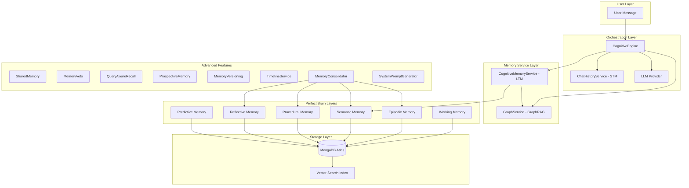
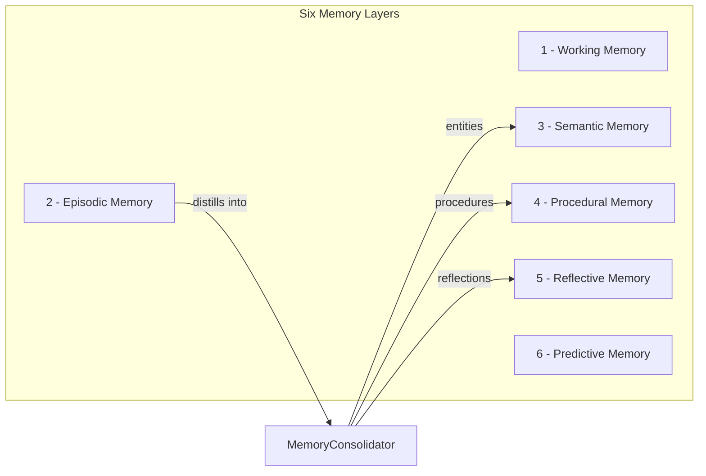
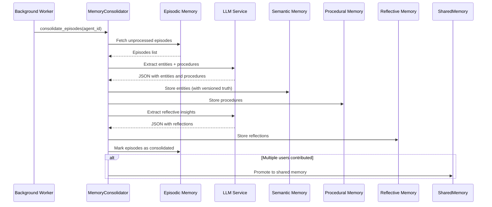
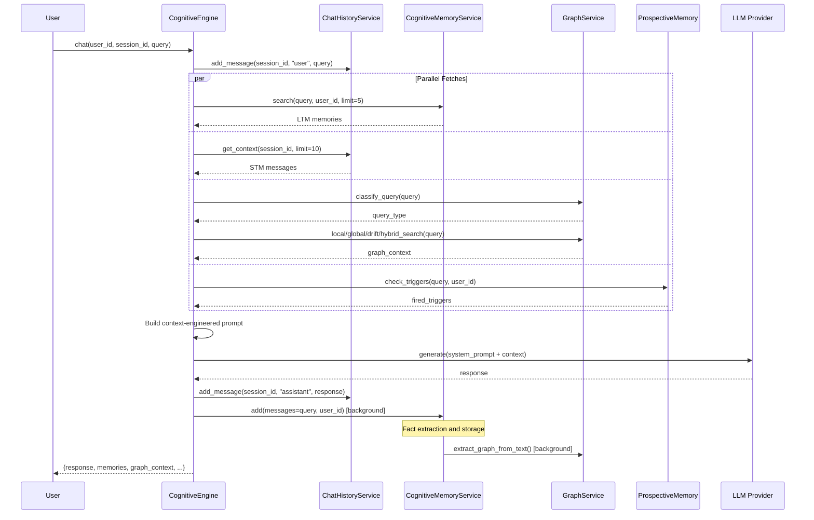
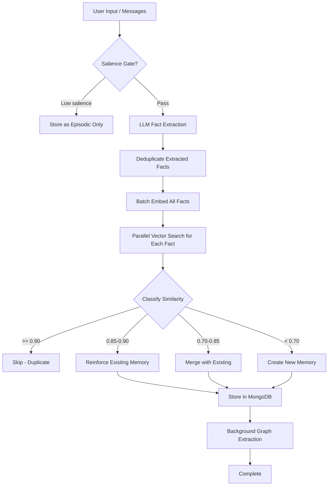
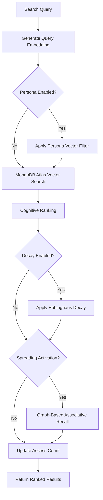
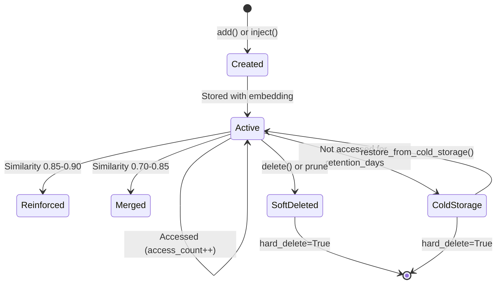
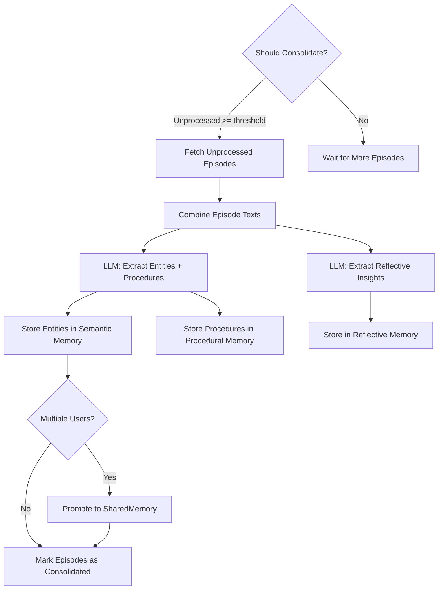

# MDB-Engine Memory System: Complete Reference

> **The definitive guide to the biologically-inspired, multi-tier cognitive memory architecture for AI agents.**

---

## Table of Contents

1. [Introduction](#1-introduction)
2. [Architecture Overview](#2-architecture-overview)
3. [Core Components](#3-core-components)
4. [Memory Layers](#4-memory-layers-the-six-tier-model)
5. [Memory Consolidation](#5-memory-consolidation)
6. [Advanced Features](#6-advanced-features)
7. [GraphRAG Integration](#7-graphrag-integration)
8. [Cognitive Features Deep Dive](#8-cognitive-features-deep-dive)
9. [Data Flows](#9-data-flows)
10. [Configuration Reference](#10-configuration-reference)
11. [API Reference](#11-api-reference)
12. [Usage Examples](#12-usage-examples)
13. [Use Cases](#13-use-cases)
14. [Appendices](#14-appendices)

---

## 1. Introduction

### What Is the MDB-Engine Memory System?

The MDB-Engine Memory System is a **biologically-inspired, multi-tier cognitive memory architecture** that gives AI agents persistent, evolving, and context-aware memory. It is built on top of **MongoDB Atlas** (vector search, document storage, aggregation pipelines) and uses **LLM-driven extraction** to automatically transform raw conversations into structured, ranked, and searchable knowledge.

Unlike simple "append-to-context-window" approaches, MDB-Engine implements a full cognitive memory pipeline inspired by human neuroscience:

| Human Brain Structure | MDB-Engine Equivalent | Function |
|---|---|---|
| Hippocampus | `ChatHistoryService` (STM) | Short-term session context |
| Neocortex | `CognitiveMemoryService` (LTM) | Long-term semantic facts |
| Prefrontal Cortex | Conflict Detection / Ranking | Decision-making, contradiction resolution |
| Cerebellum | `ProceduralMemory` | Learned skills and workflows |
| Amygdala | Emotion Weight / Flashbulb | Emotional salience scoring |
| Default Mode Network | `ReflectiveMemory` | Self-awareness and meta-cognition |

### Design Philosophy: Perfect Recall

The system follows a **Perfect Recall** philosophy. Unlike the human brain, which forgets most information, MDB-Engine **never deletes memories**. Instead, it uses a multi-factor ranking algorithm to surface the most relevant memories for any given context. This means:

- All memories are always searchable and retrievable.
- Relevance is determined by **similarity**, **importance**, **access frequency**, **recency**, and **emotion** -- not by deletion or forgetting.
- Cold storage and pruning are optional safety nets, not the default behavior.
- Conflicts are detected and resolved, not silently overwritten.

### Key Principles

1. **No Accidental Loss**: Memories are soft-deleted, never hard-deleted (unless explicitly requested for GDPR compliance).
2. **Scoped Isolation**: Every memory is scoped to an `app_id` and `user_id`. Multi-tenant by default.
3. **LLM-Driven Extraction**: Facts are extracted from conversations using LLMs, not keyword matching.
4. **Versioned Truth**: When facts change, old values are preserved in history, enabling "what I believed then vs. now" queries.
5. **Privacy by Design**: Memory vetoes, shared memory promotion rules, and CSFLE encryption ensure user data sovereignty.

---

## 2. Architecture Overview

### High-Level Architecture



### Two-Tier Model: STM + LTM

At the highest level, the memory system is a two-tier architecture:

| Tier | Component | Persistence | Scope | Purpose |
|---|---|---|---|---|
| **STM** (Short-Term Memory) | `ChatHistoryService` | Session-scoped | Per session | Recent messages, conversation context, cached summaries |
| **LTM** (Long-Term Memory) | `CognitiveMemoryService` | Permanent | Per user | Extracted facts, entities, preferences, biographical data |

**STM** holds the current conversation window. When the conversation grows long, older messages are summarized and the summary is cached. **LTM** holds extracted facts that persist across all sessions forever.

### Perfect Brain: Six-Layer Model

Beneath the two-tier model, LTM is further organized into six cognitive layers managed by the `CognitiveMemory` controller:



Each layer has a distinct purpose, storage format, and retrieval strategy. They are described in detail in [Section 4](#4-memory-layers-the-six-tier-model).

---

## 3. Core Components

### 3.1 BaseMemoryService

**File**: `mdb_engine/memory/base.py`

The abstract base class that defines the memory service contract. All memory implementations must implement these methods.

```python
class BaseMemoryService(ABC):
    """Abstract base class for memory service implementations."""

    @abstractmethod
    def add(self, messages, user_id=None, metadata=None, bucket_id=None, bucket_type=None, raw_content=None, **kwargs) -> list[dict]
    
    @abstractmethod
    def inject(self, memory, user_id=None, metadata=None, bucket_id=None, bucket_type=None, raw_content=None, **kwargs) -> dict
    
    @abstractmethod
    def get_all(self, user_id=None, limit=100, filters=None, **kwargs) -> list[dict]
    
    @abstractmethod
    async def search(self, query, user_id=None, limit=5, filters=None, **kwargs) -> list[dict]
    
    @abstractmethod
    def get(self, memory_id, user_id=None, **kwargs) -> dict | None
    
    @abstractmethod
    def delete(self, memory_id, user_id=None, **kwargs) -> bool
    
    @abstractmethod
    def delete_all(self, user_id=None, hard_delete=..., **kwargs) -> bool
    
    @abstractmethod
    def update(self, memory_id, user_id=None, memory=None, data=None, messages=None, metadata=None, **kwargs) -> dict | None
```

**Optional cognitive methods** (raise `NotImplementedError` by default):

- `get_memory_analytics(user_id)` -- Memory health metrics.
- `detect_knowledge_conflict(user_id, new_fact, similarity_threshold=0.85, llm_model=None)` -- Checks if new information contradicts existing knowledge.

### 3.2 CognitiveMemoryService

**File**: `mdb_engine/memory/cognitive.py`

The primary memory implementation. This is the class you get when you call `engine.get_memory_service(app_slug)`. It implements all abstract methods from `BaseMemoryService` and adds cognitive features:

- **Fact Extraction**: Automatically extracts structured facts from raw conversation text using LLMs.
- **Importance Scoring**: Each fact is scored 0.0-1.0 for importance by the LLM.
- **Similarity Detection**: New facts are compared against existing memories using vector similarity.
- **Reinforcement**: If a new fact matches an existing one (similarity >= 0.85), the existing memory's importance is boosted.
- **Merging**: If a new fact partially overlaps with an existing one (similarity 0.70-0.85), the memories are merged.
- **Deduplication**: Exact or near-exact duplicates (similarity >= 0.90) are detected and skipped.
- **Conflict Detection**: Contradictions between new and existing facts are identified using LLM analysis.
- **Decay & Cold Storage**: Optional Ebbinghaus-style decay and cold storage for aging memories.
- **Pruning**: Optional capacity limits with automatic pruning of low-value memories.
- **Graph Extraction**: Automatic entity/relationship extraction for the knowledge graph (if enabled).

**Key configuration options** (from manifest `memory_config`):

| Option | Type | Default | Description |
|---|---|---|---|
| `enable_cognitive` | bool | `true` | Enable cognitive features (extraction, scoring, merging) |
| `similarity_threshold` | float | `0.7` | Minimum similarity for reinforcement/merge |
| `duplicate_threshold` | float | `0.90` | Minimum similarity to consider a duplicate |
| `merge_threshold_low` | float | `0.70` | Lower bound of merge zone |
| `merge_threshold_high` | float | `0.85` | Upper bound of merge zone (above = reinforce) |
| `reinforcement_factor` | float | `1.1` | Multiplier when reinforcing importance |
| `emotion_weight` | float | `0.5` | Weight of emotion in ranking |
| `recency_weight` | float | `0.3` | Weight of recency in ranking |
| `salience_gate` | bool | `false` | Enable salience gating (skip low-value input) |
| `spreading_activation` | bool | `false` | Enable graph-based spreading activation |
| `infer` | bool | `true` | Enable LLM fact extraction in `add()` |

### 3.3 ChatHistoryService (STM)

**File**: `mdb_engine/memory/orchestrator.py`

Manages short-term conversation context on a per-session basis. Each session has its own message history, cached summary, and message count.

```python
class ChatHistoryService:
    def __init__(self, collection, collection_name="chat_history")
    
    def add_message(self, session_id, role, content, user_id=None, metadata=None)
    def get_context(self, session_id, limit=10, user_id=None) -> list[dict]
    def get_recent_messages(self, session_id, limit=10, user_id=None) -> list
    def get_message_count(self, session_id, user_id=None) -> int
    def get_cached_summary(self, session_id) -> tuple | None
    def store_cached_summary(self, session_id, summary_text, message_count, user_id=None)
    def clear_session(self, session_id, user_id=None)
    def delete_old_messages(self, session_id, keep_count=10, user_id=None) -> int
```

### 3.4 CognitiveEngine (Orchestrator)

**File**: `mdb_engine/memory/orchestrator.py`

The highest-level component. It orchestrates STM, LTM, and Graph for a complete chat experience. When you call `cognitive_engine.chat(...)`, the engine:

1. Saves the user message to STM.
2. Fetches relevant LTM memories via semantic search.
3. Fetches graph context via GraphRAG (if enabled).
4. Checks prospective memory triggers (if enabled).
5. Builds a context-engineered system prompt.
6. Calls the LLM.
7. Saves the assistant response to STM.
8. Extracts facts from the conversation and stores them in LTM (background).

```python
class CognitiveEngine:
    def __init__(
        self,
        app_slug,
        memory_service=None,
        chat_history_collection=None,
        memory_collection=None,
        stm_context_limit=10,
        ltm_search_limit=5,
        auto_summarize_threshold=20,
        llm_service=None,
        graph_service=None,
        enable_context_engineering=True,
        ...
    )

    async def chat(
        self,
        user_id,
        session_id,
        user_query,
        system_prompt=None,
        extract_facts=True,
        bucket_id=None,
        bucket_type=None,
        search_filters=None,
        **kwargs
    ) -> dict

    async def summarize_session(self, session_id, user_id, messages_to_summarize=10) -> str | None
    async def get_full_context(self, user_id, session_id, query=None) -> dict
    async def inject_thought(self, user_id, thought, session_id=None, visibility="private", metadata=None)
```

**Key configuration options**:

| Option | Type | Default | Description |
|---|---|---|---|
| `stm_context_limit` | int | `10` | Maximum messages in STM context window |
| `ltm_search_limit` | int | `5` | Maximum LTM memories to include in prompt |
| `auto_summarize_threshold` | int | `20` | Number of messages before auto-summarization |
| `stm_raw_window` | int | `5` | Raw messages to keep before summarizing older ones |
| `enable_context_engineering` | bool | `true` | Enable the full context engineering pipeline |
| `graph_min_hop_distance` | int | `2` | Minimum hops for graph context inclusion |
| `graph_min_edges` | int | `1` | Minimum edges per node for graph context |
| `graph_deduplication_threshold` | float | `0.70` | Similarity threshold for graph dedup |
| `graph_min_nodes` | int | `2` | Minimum nodes required to include graph context |
| `summary_staleness_threshold` | int | `10` | New messages before re-summarizing |

---

## 4. Memory Layers: The Six-Tier Model

The Perfect Brain architecture organizes memory into six distinct layers, each modeled after a different aspect of human cognition.

### 4.1 Working Memory

**Human Analogy**: The "scratchpad" of conscious thought -- what you are currently holding in mind.

**File**: `mdb_engine/memory/system.py` (class `CognitiveMemory`)

**Purpose**: Session-scoped, ephemeral context. Working memory holds the agent's active reasoning state for the current task: what step it is on, what tools it is using, what the immediate goal is. It automatically expires after 24 hours via a MongoDB TTL index.

**Storage**: MongoDB collection `working_memory` with TTL index on `last_accessed` (24 hours).

**Methods**:

```python
# Set working context for a session (upsert)
memory.set_working_context(
    session_id="session123",
    data={
        "current_task": "debugging",
        "focus": "memory system",
        "step": 3,
        "variables": {"error_type": "NullPointerException"}
    }
)

# Retrieve working context
context = memory.get_working_context(session_id="session123")
# Returns: {"session_id": "session123", "current_task": "debugging", ...}
```

**When to Use**:
- Tracking multi-step reasoning within a single session.
- Storing intermediate computation results.
- Maintaining "scratchpad" state that should not persist long-term.

**Key Characteristics**:
- Automatically evicted after 24 hours (TTL index).
- No vector embedding -- purely key-value storage.
- Session-scoped: each session gets its own working memory.

---

### 4.2 Episodic Memory

**Human Analogy**: Autobiographical memory -- the chronological record of "what happened."

**File**: `mdb_engine/memory/system.py` (class `CognitiveMemory`)

**Purpose**: Raw interaction logs with timestamps, vector embeddings, and consolidation status. Episodic memory is the **input** to the consolidation process. It records every meaningful interaction as-is, forming a temporal stream of experience.

**Storage**: MongoDB collection `episodic` with indexes on `(session_id, timestamp)` and `(consolidated, timestamp)`.

**Methods**:

```python
# Record an episode
memory.record_episode(
    session_id="session123",
    role="user",
    content="I'm working on a Python project using FastAPI",
    metadata={"tokens_used": 15},
    scope="user",
    user_id="user123",
    bucket_id="category:CODE:user123",
    bucket_type="category"
)

# Retrieve episodes
episodes = memory.get_episodes(
    session_id="session123",
    limit=10,
    consolidated=False  # Only unprocessed episodes
)
```

**Episode Document Schema**:

```json
{
    "session_id": "session123",
    "role": "user",
    "content": "I'm working on a Python project using FastAPI",
    "timestamp": "2025-01-15T10:30:00Z",
    "vector": [0.012, -0.034, ...],
    "consolidated": false,
    "scope": "user",
    "user_id": "user123",
    "shareable": false,
    "metadata": {
        "tokens_used": 15,
        "bucket_id": "category:CODE:user123",
        "bucket_type": "category"
    }
}
```

**When to Use**:
- Logging raw interactions for later consolidation.
- Building a temporal record for pattern detection.
- Providing source material for the `MemoryConsolidator`.

**Key Characteristics**:
- Vector embeddings for semantic search.
- `consolidated` flag tracks whether the episode has been processed.
- Supports scope (`user`, `shared`, `system`) and bucket filtering.

---

### 4.3 Semantic Memory

**Human Analogy**: General knowledge and facts -- "Paris is the capital of France."

**Files**: `mdb_engine/memory/cognitive.py` (class `CognitiveMemoryService`) and `mdb_engine/memory/system.py` (class `CognitiveMemory`)

**Purpose**: Structured, entity-based facts with importance scores, confidence levels, categories, and version history. This is the **primary output** of fact extraction and the **primary source** for LTM search.

Semantic memory has two access patterns:

1. **Via `CognitiveMemoryService`**: The high-level memory service that handles extraction, scoring, reinforcement, and merging. This is used by `CognitiveEngine.chat()` and the REST API.
2. **Via `CognitiveMemory.update_entity()`**: The low-level entity-based API for directly managing structured facts. This is used by `MemoryConsolidator` and advanced applications.

**Memory Categories**:

| Category | Description | Examples |
|---|---|---|
| `biographical` | Personal identity facts | Name, age, occupation, relationships |
| `preferences` | Likes, dislikes, choices | Favorite color, preferred language, dietary restrictions |
| `temporal` | Time-bound facts | "Meeting at 3pm Friday", "Started job in 2023" |
| `relational` | Relationships between entities | "Works with Alice", "Dog named Rex" |

**Memory Types**:

| Type | Description | Storage |
|---|---|---|
| `semantic` | General knowledge facts | Permanent, high-priority |
| `entity` | Structured entity attributes | Permanent, versioned |
| `episodic` | Raw interaction records | Temporary until consolidated |
| `working` | Active session context | TTL-based, auto-evicted |

**Entity-Level Methods** (via `CognitiveMemory`):

```python
# Update an entity (versioned truth)
memory.update_entity(
    entity_name="user_preferences",
    attributes={"theme": "dark", "language": "Python"},
    confidence=0.9,
    scope="user",
    user_id="user123"
)

# Get entity with full history
entity = memory.get_entity("user_preferences")
# Returns: {"entity": "user_preferences", "attr": {"theme": "dark", ...}, "history": [...]}

# Search entities
results = memory.search_entities(
    query="What programming language does the user prefer?",
    limit=5,
    scope="user",
    user_id="user123"
)
```

**Service-Level Methods** (via `CognitiveMemoryService`):

```python
# Add memories with LLM extraction
memories = memory_service.add(
    messages="I love Python and prefer dark mode in my IDE",
    user_id="user123",
    metadata={"source": "chat"},
    bucket_id="category:CODE:user123",
    bucket_type="category"
)

# Inject a memory without LLM extraction
memory_service.inject(
    memory="User prefers dark mode themes",
    user_id="user123",
    metadata={"category": "preferences", "importance": 0.8}
)

# Search memories
results = await memory_service.search(
    query="What are the user's coding preferences?",
    user_id="user123",
    limit=5,
    filters={"metadata": {"bucket_id": "category:CODE:user123"}}
)
```

**Key Characteristics**:
- Vector embeddings for semantic search via MongoDB Atlas Vector Search.
- Importance scoring (0.0-1.0) by LLM.
- Access count tracking for Perfect Recall ranking.
- Version history for entity attributes.
- Soft-delete support (`is_active` flag).
- Bucket filtering for category/session/file isolation.

---

### 4.4 Procedural Memory

**Human Analogy**: "How to ride a bicycle" -- learned skills and habits.

**File**: `mdb_engine/memory/procedural.py`

**Purpose**: Stores executable knowledge -- tool definitions, successful code snippets, task workflows, and "golden examples" of operations that worked. Procedural memory enables the agent to **get faster and more reliable over time** by reusing proven procedures rather than re-reasoning every problem from scratch.

**Methods**:

```python
from mdb_engine.memory.procedural import ProceduralMemory

proc_memory = ProceduralMemory(collection=procedural_collection)

# Store a successful procedure
await proc_memory.store_procedure(
    name="Docker Deployment Workflow",
    task_type="deployment",
    steps=["docker build -t app .", "docker push app", "docker deploy app"],
    code_snippet="docker build -t app . && docker push app && docker deploy app",
    success_rate=1.0,
    metadata={"environment": "production"},
    is_successful_procedure=True
)

# Search for relevant procedures
procedures = await proc_memory.search_procedures(
    task_description="Deploy a containerized application",
    task_type="deployment",
    min_success_rate=0.7,
    limit=5
)

# Mark a procedure as used (updates success rate)
await proc_memory.mark_procedure_used("Docker Deployment Workflow", success=True)

# Retrieve by name
procedure = await proc_memory.get_procedure("Docker Deployment Workflow")
```

**Procedure Document Schema**:

```json
{
    "name": "Docker Deployment Workflow",
    "task_type": "deployment",
    "steps": ["docker build -t app .", "docker push app", "docker deploy app"],
    "code_snippet": "docker build -t app . && ...",
    "tool_schema": null,
    "vector": [0.012, -0.034, ...],
    "success_rate": 0.95,
    "is_active": true,
    "is_successful_procedure": true,
    "created_at": "2025-01-15T10:30:00Z",
    "last_used": "2025-01-20T14:00:00Z",
    "usage_count": 12,
    "metadata": {"environment": "production"}
}
```

**Key Characteristics**:
- Vector embeddings for similarity-based retrieval.
- Success rate tracking (moving average across uses).
- `is_active` flag for soft deactivation.
- Automatically populated by `MemoryConsolidator` from episodic memory.
- Supports JSON Schema tool definitions via `tool_schema`.

---

### 4.5 Reflective Memory

**Human Analogy**: Meta-cognition -- "thinking about thinking."

**File**: `mdb_engine/memory/reflective.py`

**Purpose**: Stores meta-cognitive beliefs about the agent's own behavior, biases, and patterns. This is where **actual intelligence emerges** -- the system becomes self-aware. Reflective memory enables the agent to:

- Recognize its own biases ("I tend to over-weight recent conversations").
- Learn from past mistakes ("This belief caused errors before").
- Adapt behavior based on self-awareness ("This user changes preferences often").
- Build trust through transparency.

**Methods**:

```python
from mdb_engine.memory.reflective import ReflectiveMemory

reflective = ReflectiveMemory(collection=reflective_collection)

# Store a reflection
reflective.store_reflection(
    reflection="I tend to over-weight recent conversations when summarizing",
    trigger="performance_review",
    confidence=0.75,
    scope="user",
    user_id="user123",
    metadata={"category": "bias_detection"}
)

# Retrieve reflections
reflections = reflective.get_reflections(
    scope="user",
    user_id="user123",
    min_confidence=0.6,
    limit=10,
    trigger="performance_review"
)

# Update confidence (new evidence confirms the reflection)
reflective.update_confidence(
    reflection_id="abc123",
    new_confidence=0.85,
    reason="Confirmed by multiple sessions showing recency bias"
)

# Get statistics
stats = reflective.get_reflection_stats(scope="user", user_id="user123")
# Returns: {"total_reflections": 15, "high_confidence_count": 8, ...}
```

**Reflection Document Schema**:

```json
{
    "reflection": "I tend to over-weight recent conversations",
    "trigger": "performance_review",
    "confidence": 0.75,
    "scope": "user",
    "user_id": "user123",
    "created_at": "2025-01-15T10:30:00Z",
    "metadata": {"category": "bias_detection"},
    "confidence_history": [
        {"confidence": 0.75, "reason": "Initial detection", "timestamp": "2025-01-15T10:30:00Z"},
        {"confidence": 0.85, "reason": "Confirmed by analysis", "timestamp": "2025-01-20T14:00:00Z"}
    ]
}
```

**Trigger Types**:
- `performance_review` -- Periodic self-assessment.
- `error_analysis` -- Post-error reflection.
- `pattern_detection` -- Automatic pattern recognition during consolidation.
- `llm_pattern_detection` -- LLM-extracted patterns.
- `user_feedback` -- Explicit user correction.

---

### 4.6 Predictive Memory

**Human Analogy**: Imagination and foresight -- "What would happen if..."

**File**: `mdb_engine/memory/predictive.py`

**Purpose**: Stores predictions, hypotheses, counterfactual scenarios, and simulations. Predictive memory enables the agent to:

- **Learn from what didn't happen** (counterfactuals).
- **Validate predictions** against reality over time.
- **Build predictive models** from accumulated experience.
- **Reason about alternative futures** to make better decisions.

**Methods**:

```python
from mdb_engine.memory.predictive import PredictiveMemory

predictive = PredictiveMemory(collection=predictive_collection)

# Store a prediction
result = predictive.store_prediction(
    scenario="If I explain visually, user engagement increases by 30%",
    origin="simulation",
    confidence=0.65,
    scope="user",
    user_id="user123"
)
prediction_id = str(result["_id"])

# Validate the prediction later
predictive.validate_prediction(
    prediction_id=prediction_id,
    was_correct=True,
    notes="User engagement increased by 35% when using visual explanations"
)

# Retrieve predictions
predictions = predictive.get_predictions(
    scope="user",
    user_id="user123",
    validated=False,  # Unvalidated predictions
    min_confidence=0.5,
    origin="simulation"
)

# Get accuracy statistics
accuracy = predictive.get_prediction_accuracy(
    scope="user",
    user_id="user123",
    origin="simulation"
)
# Returns: {"total_validated": 20, "correct": 15, "incorrect": 5, "accuracy_percentage": 75.0}
```

**Prediction Origins**:
- `simulation` -- Model-generated "what if" scenarios.
- `counterfactual` -- Reasoning about alternative past actions.
- `hypothesis` -- Testable predictions from observed patterns.
- `pattern` -- Statistically derived predictions.

---

## 5. Memory Consolidation

### Overview

Memory consolidation is the critical process that transforms raw episodic logs into structured knowledge. Without consolidation, episodic memory becomes a dumping ground of chat logs. With consolidation, the agent **learns** and **improves over time**.

### MemoryConsolidator

**File**: `mdb_engine/memory/consolidator.py`

The `MemoryConsolidator` implements the "reflection loop" that distills episodic memories into:
1. **Semantic entities** -- Structured facts about people, projects, concepts.
2. **Procedural lessons** -- Executable skills and workflows.
3. **Reflective insights** -- Meta-cognitive patterns about behavior.

**How Consolidation Works**:



**Usage**:

```python
from mdb_engine.memory.consolidator import MemoryConsolidator

consolidator = MemoryConsolidator(
    db_client=scoped_db,
    db_name="cognitive_agent",
    model="gpt-4o",
    memory_veto=veto_service  # Optional: respect privacy vetoes
)

# Check if consolidation should run
should_run, reason = consolidator.should_consolidate(
    agent_id="user123",
    message_threshold=10  # Minimum unprocessed episodes
)

if should_run:
    result = consolidator.consolidate_episodes(
        agent_id="user123",
        limit=20,
        force=False
    )
    print(f"Entities: {result['entities_extracted']}")
    print(f"Procedures: {result['procedures_created']}")
    print(f"Reflections: {result['reflections_extracted']}")
    print(f"Episodes processed: {result['episodes_processed']}")
```

### ReflectionService

**File**: `mdb_engine/memory/reflection.py`

A higher-level periodic consolidation service that wraps `MemoryConsolidator` with time-based and count-based triggers.

```python
from mdb_engine.memory.reflection import create_reflection_service

reflection_service = create_reflection_service(
    app_slug="my_app",
    memories_collection=memories_collection,
    reflections_collection=reflections_collection,
    config={
        "enabled": True,
        "interval_hours": 24,
        "message_threshold": 50,
        "min_salience_to_keep": 0.4,
        "store_reflections": True,
    }
)

# Check and run
should, reason = reflection_service.should_reflect(user_id="user123")
if should:
    result = reflection_service.run_reflection(user_id="user123")

# Get recent reflections
reflections = reflection_service.get_recent_reflections(user_id="user123", limit=5)

# Get statistics
stats = reflection_service.get_stats(user_id="user123")
```

### Daily Hygiene

**File**: `mdb_engine/memory/hygiene.py`

A convenience function for running daily maintenance:

```python
from mdb_engine.memory.hygiene import run_daily_hygiene

result = await run_daily_hygiene(
    agent_id="user123",
    db_client=mongo_client,
    db_name="cognitive_agent"
)
```

---

## 6. Advanced Features

### 6.1 SharedMemory

**File**: `mdb_engine/memory/shared.py`

Enables group-level memory where distilled, anonymized facts can be shared across users. This is a **generic grouping mechanism** -- `group_id` can represent teams, families, organizations, communities, or any collection of users.

**Key Principle**: "Nothing is shared by accident. Everything shared is intentional."

**Promotion Rules**:
1. Pattern must appear across **multiple users** (default: 2+).
2. Confidence must exceed a **minimum threshold** (default: 0.7).
3. Sensitivity must be **"low"** -- no private emotions, no personal details.
4. Content must not contain **sensitive keywords** (health, trauma, etc.).
5. Fact must be a **complete thought** (>= 3 words).

```python
from mdb_engine.memory.shared import SharedMemory

shared = SharedMemory(
    semantic_collection=semantic_collection,
    shared_collection=shared_collection
)

# Check if a fact can be promoted
if shared.check_promotion_rules(
    fact="The team prefers async communication",
    source_user_ids=["user1", "user2", "user3"],
    sensitivity="low",
    min_confidence=0.7,
    min_users=2
):
    # Promote to shared memory
    shared.promote_to_shared(
        fact="The team prefers async communication",
        source_user_ids=["user1", "user2", "user3"],
        confidence=0.85,
        group_id="team-engineering",
        anonymize=True,  # Remove user-specific references
        bucket_id="category:WORK:team-engineering"
    )

# Query shared memory
team_memories = shared.get_shared_memory(
    group_id="team-engineering",
    query="What communication preferences does the team have?",
    min_confidence=0.7,
    bucket_id="category:WORK:team-engineering"
)

# Statistics
stats = shared.get_shared_stats(group_id="team-engineering")
```

### 6.2 MemoryVeto

**File**: `mdb_engine/memory/veto.py`

Explicit privacy controls that let users mark specific memories as "never share, even abstractly." Vetoed memories are excluded from shared memory promotion and can be filtered from recall results.

**Key Principle**: "Users control their privacy boundaries."

```python
from mdb_engine.memory.veto import MemoryVeto

veto = MemoryVeto(collection=veto_collection)

# Add a veto (mark as never share)
veto.add_veto(
    memory_id="memory_abc123",
    user_id="user123",
    reason="Contains sensitive medical information",
    scope="all"  # "all", "family", or "system"
)

# Check if a memory is vetoed
is_vetoed = veto.check_veto(
    memory_id="memory_abc123",
    user_id="user123",
    target_scope="family"
)
# Returns: True

# Remove a veto
veto.remove_veto(
    memory_id="memory_abc123",
    user_id="user123",
    scope="family"  # Remove only the family-scope veto
)

# List user vetoes
user_vetoes = veto.get_user_vetoes(user_id="user123", limit=100)

# Statistics
stats = veto.get_veto_stats(user_id="user123")
# Returns: {"total_vetoes": 5, "all_scope_count": 2, "family_scope_count": 2, "system_scope_count": 1}
```

**Veto Scopes**:
- `"all"` -- Never share in any context (blocks everything).
- `"family"` / `"shared"` -- Don't promote to shared/group memory.
- `"system"` -- Don't promote to system-wide memory.

### 6.3 QueryAwareRecall

**File**: `mdb_engine/memory/recall.py`

Policy-driven memory retrieval that adapts based on the current task type, risk tolerance, and latency budget. Instead of always returning the same number of results with the same confidence threshold, `QueryAwareRecall` dynamically adjusts retrieval parameters.

```python
from mdb_engine.memory.recall import QueryAwareRecall

recall = QueryAwareRecall()

# Fast answer (shallow recall, few results)
result = recall.recall(
    query="What's the user's favorite color?",
    user_id="user123",
    collection=semantic_collection,
    task_type="fast_answer",
    risk_tolerance="low",
    latency_budget="fast",
    scope="user"
)

# Critical decision (deep recall + cross-checks)
result = recall.recall(
    query="Should I recommend this medication?",
    user_id="user123",
    collection=semantic_collection,
    task_type="critical_decision",
    risk_tolerance="low",
    latency_budget="deep",
    scope="user",
    memory_veto=veto_service  # Respect vetoes
)

# Multi-scope recall (user + shared + system)
result = recall.recall_multi_scope(
    query="How is our team doing?",
    user_id="user123",
    collections={
        "user": user_collection,
        "shared": shared_collection,
    },
    allowed_scopes=["user", "shared"],
    task_type="general",
    group_id="team-engineering"
)
```

**Recall Policies**:

| Task Type | Max Results | Cross-Check | Exhaustive |
|---|---|---|---|
| `fast_answer` | 3 | No | No |
| `general` | 10 | No | No |
| `exploration` | 15 | No | No |
| `critical_decision` | 20 | Yes | Yes |

| Risk Tolerance | Effect |
|---|---|
| `low` | Enables cross-checking for contradictions |
| `medium` | Default behavior |
| `high` | Includes lower-confidence memories |

| Latency Budget | Effect |
|---|---|
| `fast` | Caps at 5 results, no exhaustive search |
| `normal` | Default behavior |
| `deep` | Up to 50 results, exhaustive search |

### 6.4 ProspectiveMemory

**File**: `mdb_engine/memory/prospective.py`

"Remember to do X when Y happens" -- intention-based triggers. Unlike retrospective memory (remembering past events), prospective memory is about **remembering future intentions**.

Triggers are stored with condition embeddings and checked against every incoming query via vector similarity. When a trigger fires, the action is surfaced to the orchestrator for inclusion in the system prompt.

```python
from mdb_engine.memory.prospective import ProspectiveMemory

prospective = ProspectiveMemory(
    collection=prospective_collection,
    embedding_model="text-embedding-3-small"
)

# Set a trigger
trigger_id = await prospective.set_trigger(
    condition="user mentions project deadline or timeline",
    action="Remind the user about the pending risk assessment for Project Alpha",
    user_id="user123",
    one_shot=True  # Fires once and deactivates
)

# Check triggers (called automatically by CognitiveEngine)
fired = await prospective.check_triggers(
    current_context="When is the project deadline?",
    user_id="user123",
    threshold=0.85
)
# Returns: [{"trigger_id": "...", "action": "Remind the user about...", "similarity": 0.91}]

# Mark trigger as fired (for one-shot triggers, this deactivates them)
await prospective.mark_triggered(trigger_id)

# Get all active triggers
active = await prospective.get_active_triggers(user_id="user123")

# Manually deactivate a trigger
await prospective.deactivate_trigger(trigger_id)
```

### 6.5 MemoryVersioning

**File**: `mdb_engine/memory/versioning.py`

Tracks how beliefs evolve over time, enabling "what I believed then vs. now" queries and audit trails for memory changes.

```python
from mdb_engine.memory.versioning import MemoryVersioning
from datetime import datetime

versioning = MemoryVersioning(collection=entity_collection)

# Get full version history
history = await versioning.get_version_history(
    entity_name="user_preferences",
    start_date=datetime(2024, 1, 1),
    end_date=datetime(2024, 12, 31),
    scope="user",
    user_id="user123"
)

# Get belief at a specific point in time
belief = await versioning.get_belief_at_time(
    entity_name="user_preferences",
    timestamp=datetime(2024, 6, 15),
    scope="user",
    user_id="user123"
)
# Returns: {"attributes": {"theme": "light"}, "confidence": 0.8, "timestamp": ...}

# Track confidence evolution
timeline = await versioning.get_confidence_timeline(
    entity_name="user_preferences",
    scope="user",
    user_id="user123"
)
# Returns: [{"confidence": 0.8, "timestamp": "..."}, {"confidence": 0.75, "timestamp": "..."}, ...]

# Compare two points in time
comparison = await versioning.compare_versions(
    entity_name="user_preferences",
    timestamp1=datetime(2024, 1, 1),
    timestamp2=datetime(2024, 12, 31),
    scope="user",
    user_id="user123"
)
# Returns: {"changed_attributes": ["theme"], "confidence_change": -0.1, "then": {...}, "now": {...}}
```

### 6.6 TimelineService

**File**: `mdb_engine/memory/timeline.py`

Manages timeline/multiverse branching for counterfactual reasoning. Memories can exist in parallel timelines, enabling hypothetical scenario exploration and self-debugging.

```python
from mdb_engine.memory.timeline import TimelineService

timeline_service = TimelineService(collection=timelines_collection)
# Root timeline ("Objective Reality") is auto-created

# Fork a new timeline for "what if" reasoning
branch_id = await timeline_service.fork_timeline_async(
    current_timeline="root",
    new_name="What if I quit my job?",
    user_id="user123"
)
# Returns: "branch_a1b2c3d4"

# Get timeline ancestry (child -> root)
ancestry = await timeline_service.get_timeline_ancestry_async(branch_id)
# Returns: ["branch_a1b2c3d4", "root"]

# List all timelines for a user
timelines = await timeline_service.list_timelines_async(user_id="user123")

# Get a specific timeline
timeline = await timeline_service.get_timeline_async(branch_id)
```

**Timeline Schema**:

```json
{
    "_id": "branch_a1b2c3d4",
    "name": "What if I quit my job?",
    "parent": "root",
    "created_at": "2025-01-15T10:30:00Z",
    "app_slug": "my_app",
    "user_id": "user123"
}
```

### 6.7 SystemPromptGenerator

**File**: `mdb_engine/memory/prompt.py`

Assembles the "Perfect Brain" system prompt by pulling from all memory layers: reflective insights, semantic recall, timeline context, predictive scenarios, procedural knowledge, and vetoed exclusions.

```python
from mdb_engine.memory.prompt import SystemPromptGenerator

generator = SystemPromptGenerator(
    db=scoped_db,
    recall_service=query_aware_recall,
    timeline_service=timeline_service,
    veto_service=memory_veto
)

system_prompt = generator.generate_prompt(
    user_id="user123",
    timeline_id="root",
    task_description="Help user with Python debugging",
    persona_definition="You are a senior Python developer..."
)
```

### 6.8 PersonaEngine

**File**: `mdb_engine/memory/cognitive.py` (inner class)

Manages the agent's personality/persona as a stored entity with a vector embedding, enabling persona-aware memory retrieval.

```python
# PersonaEngine is initialized internally by CognitiveMemoryService
# when persona.enabled is true in the manifest.

# Get persona
persona = await persona_engine.get_persona()
# Returns: {"role": "Python Expert", "description": "...", "traits": ["patient", "detail-oriented"]}

# Update persona
await persona_engine.update_persona(
    role="Senior Developer",
    description="Expert in Python, FastAPI, and MongoDB",
    traits=["patient", "thorough", "pragmatic"]
)

# Get persona vector (for persona-aware search)
vector = await persona_engine.get_persona_vector()
```

---

## 7. GraphRAG Integration

### Overview

The memory system integrates with MDB-Engine's `GraphService` to provide **graph-augmented retrieval** (GraphRAG). When a memory is stored, entities and relationships are automatically extracted and added to a knowledge graph. During retrieval, the graph provides additional context through traversal, neighborhood lookup, and community summaries.

### How It Works

1. **Extraction**: When `CognitiveMemoryService.add()` stores a new memory, it fires a background task that calls `GraphService.extract_graph_from_text()` to identify entities and relationships.

2. **Storage**: Entities become graph nodes; relationships become graph edges. Both are stored in MongoDB with vector embeddings.

3. **Retrieval**: During `CognitiveEngine.chat()`, the engine:
   - Classifies the user query (local, global, drift, or hybrid).
   - Routes to the appropriate graph search strategy.
   - Formats graph context for the system prompt.

4. **Spreading Activation**: During `CognitiveMemoryService.search()`, if `spreading_activation` is enabled, the graph is used for associative recall -- finding memories connected to the search results through graph edges.

### Query Classification and Routing

| Query Type | Strategy | Use Case |
|---|---|---|
| `local` | Entity-focused search with graph traversal | "Tell me about Project Alpha" |
| `global` | Community summaries + map-reduce | "What are the main themes across all projects?" |
| `drift` | Exploratory search across communities | "What interesting connections exist?" |
| `hybrid` | Vector search + graph traversal | Default fallback |

### Configuration

In the manifest `memory_config.graph`:

```json
{
    "graph": {
        "enabled": true,
        "auto_extract": true,
        "llm_model": "gpt-4o",
        "default_max_depth": 2,
        "vector_index_name": "graph_vector_index",
        "node_types": ["person", "project", "concept", "event", "location"]
    }
}
```

---

## 8. Cognitive Features Deep Dive

### 8.1 Fact Extraction Pipeline

When `memory_service.add()` is called, facts are extracted from the input text using one of three strategies:

| Strategy | Condition | Output |
|---|---|---|
| **Plain Extraction** | `enable_cognitive=false` | `list[str]` -- flat list of fact strings |
| **Categorized Extraction** | `categories.enabled=true`, `enable_cognitive=false` | `list[dict]` with `text` and `category` |
| **Cognitive Extraction** | `enable_cognitive=true` | `list[dict]` with `text`, `category`, `emotion`, `importance`, `memory_type` |

The extraction uses structured output (Pydantic models) with the LLM to ensure consistent JSON responses.

### 8.2 Importance Scoring

Each extracted fact is scored 0.0 to 1.0 by the LLM based on:

| Score Range | Description | Examples |
|---|---|---|
| 0.1 - 0.3 | Low importance, transient | "It's sunny today", "I had coffee" |
| 0.4 - 0.6 | Moderate importance | "I'm working on a project", "Meeting at 3pm" |
| 0.7 - 0.8 | High importance | "I'm allergic to shellfish", "I got promoted" |
| 0.9 - 1.0 | Critical importance | "Medical condition", "Emergency contact" |

### 8.3 Similarity Bands

When a new fact is about to be stored, it is compared against existing memories using vector cosine similarity. The similarity score determines what happens:

| Similarity | Classification | Action |
|---|---|---|
| >= 0.90 | **Duplicate** | Skip -- memory already exists |
| 0.85 - 0.90 | **Reinforcement** | Boost existing memory's importance by `reinforcement_factor` (default 1.1x) |
| 0.70 - 0.85 | **Merge** | Merge the new fact with the existing memory using LLM |
| < 0.70 | **New** | Create a new memory document |

### 8.4 Ebbinghaus Decay Model

When decay is enabled (`cognitive.decay.enabled=true`), memories lose strength over time following the Ebbinghaus forgetting curve:

```
S = R * exp(-t / H)
```

Where:
- `S` = current strength (0.0 to 1.0)
- `R` = initial strength at last reinforcement
- `t` = time elapsed since last access (in hours)
- `H` = half-life (stability) in hours

**Spacing Effect** (memory gets stronger with repeated access):

```
H_new = H_old * (1.2 + similarity + emotion * 1.5)
```

**Flashbulb Memory** (emotionally charged events are more durable):

```
H_initial = default_stability_hours + (emotion_score * max_multiplier)
```

### 8.5 Ranking Formula (Perfect Recall)

The ranking formula determines which memories appear first in search results:

```
score = (similarity * 0.6) + (importance * 0.3) + (log(access_count + 1) * 0.1)
```

Where:
- `similarity` = cosine similarity between query embedding and memory embedding (0.0-1.0).
- `importance` = LLM-assigned importance score (0.0-1.0).
- `access_count` = number of times this memory has been retrieved.
- The `log(access_count + 1)` term ensures frequently-accessed memories are boosted without runaway growth.

When additional weights are configured:

```
effective_importance = importance * (1 + ln(access_count + 1))
final_score = (similarity * sim_weight) 
            + (effective_importance * importance_weight) 
            + (emotion_score * emotion_weight) 
            + (recency_score * recency_weight)
```

### 8.6 Conflict Detection

When `cognitive.conflict_resolution.enabled=true`, new facts are checked against existing memories for logical contradictions using an LLM call:

```python
conflict = await memory_service.detect_knowledge_conflict(
    user_id="user123",
    new_fact="User is allergic to shellfish",
    similarity_threshold=0.85
)
# Returns: "Contradicts existing fact: 'User loves shrimp dishes'"
# Or returns None if no conflict
```

The system finds existing memories with high similarity to the new fact and asks the LLM whether they are logically consistent.

### 8.7 Salience Gating

When `salience_gate=true`, low-value input is filtered before fact extraction. Greetings, small talk, and other non-informational messages are detected heuristically and routed to episodic-only storage (no LTM extraction).

### 8.8 Cold Storage and Pruning

**Cold Storage** (`cognitive.cold_storage.enabled=true`):
Memories that haven't been accessed for `retention_days` (default: 365) are moved to cold storage. They remain searchable but are excluded from the primary ranking pipeline.

**Pruning** (`cognitive.pruning`):
When memory count exceeds `max_capacity`, the lowest-scoring `prune_percentage` of memories are soft-deleted.

```python
# Prune memories
await memory_service.prune_memories(
    user_id="user123",
    max_capacity=500,
    reason="Capacity limit reached"
)

# Access cold storage
cold_memories = await memory_service.get_cold_storage(user_id="user123", limit=20)

# Restore from cold storage
restored = await memory_service.restore_from_cold_storage(
    memory_id="memory_abc123",
    user_id="user123"
)
```

---

## 9. Data Flows

### 9.1 CognitiveEngine Chat Flow



### 9.2 Memory Creation Flow (add)



### 9.3 Memory Search Flow



### 9.4 Memory Lifecycle



### 9.5 Consolidation Flow



---

## 10. Configuration Reference

### 10.1 Manifest memory_config Schema

The memory system is configured through the `memory_config` section of the application manifest (`manifest.json`).

```json
{
    "memory_config": {
        "enabled": true,
        "encrypted": false,
        "provider": "cognitive",
        "collection_name": "user_memories",
        "index_name": "user_memories_vector_index",
        "embedding_model": "text-embedding-3-small",
        "embedding_model_dims": 1536,
        "chat_model": "gpt-4o",
        "memory_llm_model": "gpt-4o",
        "extraction_provider": "extraction",
        "temperature": 0.0,
        "infer": true,
        "async_mode": true,
        "enable_cognitive": true,
        "max_depth": 100,
        "similarity_threshold": 0.7,
        "reinforcement_factor": 1.1,
        "merge_threshold_low": 0.70,
        "merge_threshold_high": 0.85,
        "emotion_weight": 0.5,
        "recency_weight": 0.3,
        "recency_half_life_hours": 168,
        "spreading_activation": false,
        "activation_discount": 0.5,
        "salience_gate": false,
        "salience_threshold": 0.3,

        "cognitive": {
            "enabled": true,
            "decay": {
                "enabled": true,
                "default_stability_hours": 48,
                "min_stability_hours": 1,
                "max_stability_hours": 8760
            },
            "emotion": {
                "enabled": true,
                "max_multiplier": 3.0,
                "neutral_baseline": 0.3
            },
            "conflict_resolution": {
                "enabled": true,
                "auto_resolve": false,
                "llm_model": "gpt-4o"
            },
            "pruning": {
                "max_capacity": 500,
                "prune_percentage": 0.1,
                "min_importance": 0.1
            },
            "cold_storage": {
                "enabled": true,
                "retention_days": 365
            }
        },

        "categories": {
            "enabled": true,
            "custom_categories": ["work", "health", "finance", "travel"]
        },

        "memory_types": {
            "enabled": true
        },

        "reflection": {
            "enabled": true,
            "interval_hours": 24,
            "message_threshold": 50,
            "min_salience_to_keep": 0.4,
            "store_reflections": true,
            "llm_model": "gpt-4o"
        },

        "consolidation": {
            "extract_entities": true,
            "route_by_type": true,
            "link_to_graph": true
        },

        "entities": {
            "enabled": true,
            "auto_extract": true
        },

        "graph": {
            "enabled": false,
            "auto_extract": true,
            "llm_model": "gpt-4o",
            "default_max_depth": 2,
            "vector_index_name": "graph_vector_index"
        },

        "persona": {
            "enabled": true,
            "role": "AI Assistant",
            "description": "A helpful assistant",
            "traits": ["friendly", "knowledgeable"]
        }
    }
}
```

### 10.2 Full Field Reference

| Field | Type | Default | Description |
|---|---|---|---|
| `enabled` | bool | `false` | Master switch for memory |
| `encrypted` | bool | `false` | Enable CSFLE encryption for PII |
| `provider` | string | `"cognitive"` | Memory provider type |
| `collection_name` | string | `"{slug}_memories"` | MongoDB collection name |
| `index_name` | string | `"{collection}_vector_index"` | Vector search index name |
| `embedding_model` | string | `"text-embedding-3-small"` | Embedding model |
| `embedding_model_dims` | int | `1536` | Embedding dimensions (128-4096) |
| `chat_model` | string | `"gpt-4o"` | Chat LLM model |
| `memory_llm_model` | string | (from `llm_config`) | LLM model for memory operations |
| `extraction_provider` | string | - | LLM provider key for extraction |
| `temperature` | float | `0.0` | LLM temperature (0.0-2.0) |
| `infer` | bool | `true` | Enable LLM fact extraction |
| `async_mode` | bool | `true` | Use async operations (always true; kept for backward compatibility) |
| `enable_cognitive` | bool | `true` | Enable cognitive features |
| `max_depth` | int | `100` | Max memories per user |
| `similarity_threshold` | float | `0.7` | Reinforcement/merge threshold |
| `reinforcement_factor` | float | `1.1` | Importance boost multiplier |
| `merge_threshold_low` | float | `0.70` | Lower merge boundary |
| `merge_threshold_high` | float | `0.85` | Upper merge boundary |
| `emotion_weight` | float | `0.5` | Emotion factor in ranking |
| `recency_weight` | float | `0.3` | Recency factor in ranking |
| `recency_half_life_hours` | int | `168` | Recency half-life (1 week) |
| `spreading_activation` | bool | `false` | Graph-based associative recall |
| `activation_discount` | float | `0.5` | Activation spread discount |
| `salience_gate` | bool | `false` | Filter low-value input |
| `salience_threshold` | float | `0.3` | Minimum salience to process |

### 10.3 Environment Variables

| Variable | Required | Description |
|---|---|---|
| `OPENAI_API_KEY` | For OpenAI | OpenAI API key |
| `AZURE_OPENAI_API_KEY` | For Azure | Azure OpenAI API key |
| `AZURE_OPENAI_ENDPOINT` | For Azure | Azure OpenAI endpoint URL |
| `AZURE_EMBEDDING_DEPLOYMENT` | For Azure | Azure embedding deployment name |
| `GOOGLE_API_KEY` | For Gemini | Google Gemini API key |
| `MONGODB_URI` | Yes | MongoDB Atlas connection string |

---

## 11. API Reference

### 11.1 BaseMemoryService Interface

| Method | Signature | Returns | Description |
|---|---|---|---|
| `add` | `async (messages, user_id, metadata, bucket_id, bucket_type, raw_content, progress_callback)` | `list[dict]` | Add memories with LLM extraction |
| `inject` | `async (memory, user_id, metadata, bucket_id, bucket_type, raw_content)` | `dict` | Direct memory insertion (no LLM) |
| `search` | `async (query, user_id, limit, filters, timeline_id, min_confidence)` | `list[dict]` | Semantic vector search |
| `get` | `async (memory_id, user_id)` | `dict \| None` | Get single memory by ID |
| `get_all` | `async (user_id, limit, filters)` | `list[dict]` | Get all memories with filtering |
| `update` | `async (memory_id, user_id, memory, data, messages, metadata)` | `dict \| None` | Update memory content/metadata |
| `delete` | `async (memory_id, user_id)` | `bool` | Delete single memory |
| `delete_all` | `async (user_id, hard_delete)` | `bool` | Delete all user memories |
| `get_memory_analytics` | `async (user_id)` | `dict` | Memory health analytics |
| `detect_knowledge_conflict` | `async (user_id, new_fact, similarity_threshold, llm_model)` | `str \| None` | Conflict detection |

### 11.2 CognitiveMemory (Multi-Tier)

| Method | Signature | Returns | Description |
|---|---|---|---|
| `set_working_context` | `(session_id, data)` | `None` | Set working memory |
| `get_working_context` | `(session_id)` | `dict \| None` | Get working memory |
| `record_episode` | `(session_id, role, content, metadata, scope, user_id, ...)` | `None` | Record episodic memory |
| `get_episodes` | `(session_id, limit, consolidated)` | `list[dict]` | Get episodes |
| `update_entity` | `(entity_name, attributes, confidence, scope, user_id, ...)` | `None` | Upsert entity fact |
| `get_entity` | `(entity_name)` | `dict \| None` | Get entity |
| `search_entities` | `(query, limit, scope, user_id, ...)` | `list[dict]` | Search entities |
| `store_reflection` | `(reflection, trigger, confidence, scope, user_id, ...)` | `dict` | Store reflective insight |
| `get_reflections` | `(scope, user_id, min_confidence, limit)` | `list[dict]` | Get reflections |
| `store_prediction` | `(scenario, origin, confidence, scope, user_id, ...)` | `dict` | Store prediction |
| `get_predictions` | `(scope, user_id, validated, min_confidence, limit)` | `list[dict]` | Get predictions |

### 11.3 CognitiveEngine

| Method | Signature | Returns | Description |
|---|---|---|---|
| `chat` | `async (user_id, session_id, user_query, system_prompt, extract_facts, bucket_id, ...)` | `dict` | Full chat with STM+LTM+Graph |
| `summarize_session` | `async (session_id, user_id, messages_to_summarize)` | `str \| None` | Summarize session |
| `get_full_context` | `async (user_id, session_id, query)` | `dict` | Get all context |
| `inject_thought` | `async (user_id, thought, session_id, visibility, metadata)` | `None` | Inject system thought |

### 11.4 Perfect Brain Components

| Component | Key Methods |
|---|---|
| `SharedMemory` | `check_promotion_rules()`, `promote_to_shared()`, `get_shared_memory()`, `get_shared_stats()` |
| `MemoryVeto` | `add_veto()`, `check_veto()`, `remove_veto()`, `get_user_vetoes()`, `get_veto_stats()` |
| `QueryAwareRecall` | `recall()`, `recall_multi_scope()` |
| `ProspectiveMemory` | `set_trigger()`, `check_triggers()`, `mark_triggered()`, `get_active_triggers()`, `deactivate_trigger()` |
| `MemoryVersioning` | `get_version_history()`, `get_belief_at_time()`, `get_confidence_timeline()`, `compare_versions()` |
| `TimelineService` | `create_timeline()`, `fork_timeline()`, `get_timeline_ancestry()`, `get_timeline()`, `list_timelines()` |
| `MemoryConsolidator` | `consolidate_episodes()`, `should_consolidate()` |
| `ReflectionService` | `should_reflect()`, `run_reflection()`, `get_recent_reflections()`, `get_stats()` |
| `ProceduralMemory` | `store_procedure()`, `get_procedure()`, `search_procedures()`, `mark_procedure_used()` |
| `ReflectiveMemory` | `store_reflection()`, `get_reflections()`, `update_confidence()`, `get_reflection_stats()` |
| `PredictiveMemory` | `store_prediction()`, `validate_prediction()`, `get_predictions()`, `get_prediction_accuracy()` |
| `SystemPromptGenerator` | `generate_prompt()` |
| `PersonaEngine` | `get_persona()`, `update_persona()`, `get_persona_vector()` |

---

## 12. Usage Examples

### Example 1: Basic Memory-Enabled Chat App

The simplest way to use the memory system: configure it in the manifest and use `CognitiveEngine.chat()`.

**manifest.json**:

```json
{
    "slug": "my_chat_app",
    "name": "My Chat App",
    "memory_config": {
        "enabled": true,
        "provider": "cognitive",
        "collection_name": "user_memories",
        "embedding_model": "text-embedding-3-small",
        "embedding_model_dims": 1536,
        "infer": true,
        "enable_cognitive": true
    },
    "llm_config": {
        "default_model": "gpt-4o"
    }
}
```

**app.py**:

```python
from mdb_engine import MongoDBEngine
from mdb_engine.memory import CognitiveEngine
from mdb_engine.llm import get_llm_service

engine = MongoDBEngine(mongo_uri="mongodb+srv://...", db_name="my_app_db")
app = engine.create_app(slug="my_chat_app", manifest=Path("manifest.json"))

# Get services
memory_service = engine.get_memory_service("my_chat_app")
scoped_db = engine.get_scoped_db("my_chat_app")

# Create orchestrator
cognitive_engine = CognitiveEngine(
    app_slug="my_chat_app",
    memory_service=memory_service,
    chat_history_collection=scoped_db.chat_history,
    stm_context_limit=10,
    ltm_search_limit=5,
    auto_summarize_threshold=20,
    llm_service=get_llm_service(config={"providers": {"chat": "openai/gpt-4o"}})
)

# Chat!
result = await cognitive_engine.chat(
    user_id="user123",
    session_id="session_abc",
    user_query="I love Python and prefer dark mode themes",
    system_prompt="You are a helpful assistant.",
    extract_facts=True
)

print(result["response"])
# The memory system automatically:
# 1. Saved the user message to STM
# 2. Searched LTM for relevant memories
# 3. Generated a response
# 4. Saved the response to STM
# 5. Extracted facts ("User loves Python", "User prefers dark mode") to LTM
```

### Example 2: Direct Memory Operations

Use the memory service directly for CRUD operations without the chat orchestrator.

```python
memory_service = engine.get_memory_service("my_app")

# Inject facts directly (no LLM extraction)
memory_service.inject(
    memory="User is allergic to shellfish",
    user_id="user123",
    metadata={
        "category": "biographical",
        "importance": 0.95,
        "source": "user_reported"
    }
)

# Search for relevant memories
results = await memory_service.search(
    query="What food allergies does the user have?",
    user_id="user123",
    limit=5
)

for mem in results:
    print(f"[{mem.get('score', 0):.2f}] {mem.get('memory', '')}")

# Update a memory
memory_service.update(
    memory_id="mem_abc123",
    user_id="user123",
    memory="User is allergic to shellfish and tree nuts",
    metadata={"updated_reason": "User added tree nut allergy"}
)

# Delete a memory
memory_service.delete(memory_id="mem_abc123", user_id="user123")

# Get analytics
analytics = await memory_service.get_memory_analytics(user_id="user123")
print(f"Total memories: {analytics['total_memories']}")
print(f"Average importance: {analytics['avg_importance']:.2f}")
```

### Example 3: Perfect Brain Multi-Tier Memory

Use all six memory layers for a complete cognitive system.

```python
from mdb_engine.memory import CognitiveMemory, MemoryConsolidator

scoped_db = engine.get_scoped_db("my_app")

# Initialize multi-tier memory
cognitive_memory = CognitiveMemory(
    collection=scoped_db.memories,
    model="gpt-4o",
    embed_model="text-embedding-3-small"
)

# 1. Working Memory (session scratchpad)
cognitive_memory.set_working_context(
    session_id="session_abc",
    data={"current_task": "code_review", "file": "engine.py", "focus_area": "error handling"}
)

# 2. Episodic Memory (record interactions)
cognitive_memory.record_episode(
    session_id="session_abc",
    role="user",
    content="Can you review the error handling in engine.py?",
    user_id="user123"
)

# 3. Semantic Memory (structured facts)
cognitive_memory.update_entity(
    entity_name="user_preferences",
    attributes={"code_style": "clean", "error_handling": "comprehensive"},
    confidence=0.85,
    user_id="user123"
)

# 4. Procedural Memory (learned skills) -- see consolidation below

# 5. Reflective Memory (meta-cognition)
cognitive_memory.store_reflection(
    reflection="This user prefers detailed code explanations with examples",
    trigger="pattern_detection",
    confidence=0.8,
    user_id="user123"
)

# 6. Predictive Memory (hypotheses)
cognitive_memory.store_prediction(
    scenario="User will ask about testing next based on code review pattern",
    origin="pattern",
    confidence=0.7,
    user_id="user123"
)

# Run consolidation (episodic -> semantic + procedural + reflective)
consolidator = MemoryConsolidator(
    db_client=scoped_db,
    model="gpt-4o"
)

result = consolidator.consolidate_episodes(agent_id="user123")
print(f"Entities: {result['entities_extracted']}, Procedures: {result['procedures_created']}")
```

### Example 4: Shared Team Memory

Set up shared memory for a team with privacy controls.

```python
from mdb_engine.memory import SharedMemory, MemoryVeto

scoped_db = engine.get_scoped_db("my_app")

shared = SharedMemory(
    semantic_collection=scoped_db.entity_memory,
    shared_collection=scoped_db.shared_memory
)

veto = MemoryVeto(collection=scoped_db.memory_vetoes)

# User vetoes a sensitive memory
veto.add_veto(
    memory_id="mem_therapy_notes",
    user_id="alice",
    reason="Personal therapy notes - never share",
    scope="all"
)

# Check promotion rules before sharing
fact = "The team uses async standup meetings on Slack"
source_users = ["alice", "bob", "charlie"]

if shared.check_promotion_rules(fact, source_users, sensitivity="low"):
    shared.promote_to_shared(
        fact=fact,
        source_user_ids=source_users,
        confidence=0.9,
        group_id="team-engineering",
        anonymize=True
    )

# Query team memory
team_patterns = shared.get_shared_memory(
    group_id="team-engineering",
    query="What communication tools does the team use?",
    min_confidence=0.7
)

for pattern in team_patterns:
    print(f"[{pattern['confidence']:.2f}] {pattern['fact']}")
```

### Example 5: Prospective Memory Triggers

Set up "remember to do X when Y happens" triggers.

```python
from mdb_engine.memory import ProspectiveMemory

prospective = ProspectiveMemory(
    collection=scoped_db.prospective_triggers,
    embedding_model="text-embedding-3-small"
)

# Set triggers
await prospective.set_trigger(
    condition="user mentions project deadline or timeline",
    action="Remind about the pending risk assessment for Project Alpha",
    user_id="user123",
    one_shot=True
)

await prospective.set_trigger(
    condition="user asks about pricing, costs, or budget",
    action="Mention the enterprise plan with volume discounts",
    user_id="user123",
    one_shot=False  # Recurring trigger
)

# Check triggers (done automatically in CognitiveEngine.chat())
fired = await prospective.check_triggers(
    current_context="What's the timeline for Project Alpha?",
    user_id="user123",
    threshold=0.85
)

for trigger in fired:
    print(f"TRIGGER FIRED: {trigger['action']} (similarity: {trigger['similarity']:.2f})")
    if trigger.get("one_shot", True):
        await prospective.mark_triggered(trigger["trigger_id"])
```

### Example 6: Memory Consolidation Background Worker

Set up a periodic background job for memory consolidation.

```python
import asyncio
from mdb_engine.memory import MemoryConsolidator
from mdb_engine.memory.hygiene import run_daily_hygiene

async def consolidation_worker(engine, app_slug: str):
    """Background worker that runs consolidation periodically."""
    scoped_db = engine.get_scoped_db(app_slug)
    
    consolidator = MemoryConsolidator(
        db_client=scoped_db,
        model="gpt-4o"
    )
    
    while True:
        # Get all active user IDs
        users = scoped_db.episodic.distinct("user_id", {"consolidated": {"$ne": True}})
        
        for user_id in users:
            should, reason = consolidator.should_consolidate(
                agent_id=user_id,
                message_threshold=10
            )
            
            if should:
                result = consolidator.consolidate_episodes(
                    agent_id=user_id,
                    limit=20
                )
                print(f"Consolidated for {user_id}: {result}")
        
        # Run daily hygiene
        await run_daily_hygiene(
            agent_id="system",
            db_client=scoped_db,
            db_name=engine.db_name
        )
        
        await asyncio.sleep(3600)  # Run every hour
```

### Example 7: Privacy with Memory Vetoes (GDPR)

Implement GDPR-compliant memory management.

```python
from mdb_engine.memory import MemoryVeto

veto = MemoryVeto(collection=scoped_db.memory_vetoes)
memory_service = engine.get_memory_service("my_app")

# User requests deletion of all their data (GDPR "right to erasure")
async def handle_gdpr_deletion(user_id: str):
    # 1. Soft-delete all memories
    await memory_service.delete_all(user_id=user_id, hard_delete=False)
    
    # 2. Or hard-delete for complete erasure
    memory_service.delete_all(user_id=user_id, hard_delete=True)

# User vetoes specific memory from sharing
def handle_veto_request(memory_id: str, user_id: str, reason: str):
    veto.add_veto(
        memory_id=memory_id,
        user_id=user_id,
        reason=reason,
        scope="all"  # Never share in any context
    )

# Check vetoes during retrieval
def safe_retrieve(memory_id: str, user_id: str, target_scope: str):
    if veto.check_veto(memory_id, user_id, target_scope):
        return None  # Memory is vetoed
    return memory_service.get(memory_id, user_id)
```

### Example 8: Timeline Branching (Counterfactual Reasoning)

Use timelines for "what if" scenarios.

```python
from mdb_engine.memory import TimelineService, CognitiveMemory

timeline_service = TimelineService(collection=scoped_db.timelines)
memory = CognitiveMemory(collection=scoped_db.memories)

# Fork a timeline for counterfactual reasoning
branch_id = await timeline_service.fork_timeline_async(
    current_timeline="root",
    new_name="What if I accepted the job offer?",
    user_id="user123"
)

# Add memories to the branch timeline
memory.update_entity(
    entity_name="career_status",
    attributes={"current_job": "Senior Engineer at TechCo", "salary": "180k"},
    confidence=0.9,
    user_id="user123"
)

# Get ancestry for inheritance resolution
ancestry = await timeline_service.get_timeline_ancestry_async(branch_id)
# Returns: ["branch_a1b2c3d4", "root"]
# Memories in the branch override root, but root memories are inherited

# Compare timelines
from mdb_engine.memory import MemoryVersioning
versioning = MemoryVersioning(collection=scoped_db.entity_memory)

comparison = await versioning.compare_versions(
    entity_name="career_status",
    timestamp1=datetime(2024, 1, 1),   # Before branch
    timestamp2=datetime(2024, 12, 31), # After branch
    user_id="user123"
)
```

### Example 9: Query-Aware Recall

Adapt retrieval strategy based on task context.

```python
from mdb_engine.memory import QueryAwareRecall, MemoryVeto

recall = QueryAwareRecall()
veto = MemoryVeto(collection=scoped_db.memory_vetoes)

# Casual conversation (fast, shallow)
casual_result = recall.recall(
    query="What's the weather like?",
    user_id="user123",
    collection=scoped_db.entity_memory,
    task_type="fast_answer",
    risk_tolerance="high",
    latency_budget="fast",
    scope="user"
)
# Returns max 3 results, no cross-checking

# Medical recommendation (deep, thorough)
medical_result = recall.recall(
    query="What medications is the patient taking?",
    user_id="user123",
    collection=scoped_db.entity_memory,
    task_type="critical_decision",
    risk_tolerance="low",
    latency_budget="deep",
    scope="user",
    memory_veto=veto  # Respect privacy vetoes
)
# Returns up to 50 results, cross-checks for contradictions, exhaustive search

# Multi-scope recall (user + team)
multi_result = recall.recall_multi_scope(
    query="What's our team's deployment process?",
    user_id="user123",
    collections={
        "user": scoped_db.entity_memory,
        "shared": scoped_db.shared_memory,
    },
    allowed_scopes=["user", "shared"],
    task_type="general",
    group_id="team-engineering"
)

user_memories = multi_result["memories_by_scope"]["user"]
shared_memories = multi_result["memories_by_scope"]["shared"]
```

---

## 13. Use Cases

### Personal AI Assistant

An always-on assistant that remembers everything about you: preferences, relationships, schedule, habits.

**Key features used**:
- `CognitiveEngine` for conversational memory
- `CognitiveMemoryService` for persistent fact storage
- Cognitive features (importance, reinforcement, conflict detection)
- `ProspectiveMemory` for reminders ("When I mention groceries, remind me about milk")

**Example manifest config**:

```json
{
    "memory_config": {
        "enabled": true,
        "enable_cognitive": true,
        "infer": true,
        "categories": {"custom_categories": ["personal", "work", "health", "finance"]},
        "cognitive": {
            "emotion": {"enabled": true},
            "conflict_resolution": {"enabled": true}
        }
    }
}
```

### Customer Support Bot

A support agent that remembers customer history, preferences, and past issues across sessions.

**Key features used**:
- `CognitiveEngine` for session management
- `CognitiveMemoryService` for customer profile building
- `ProceduralMemory` for known solutions and workflows
- Bucket filtering for per-ticket isolation

**Example**: Customer calls about a billing issue. The bot remembers their previous calls, known preferences, and automatically retrieves the relevant billing procedure.

### Healthcare Companion (GDPR)

A medical assistant that handles sensitive health information with full privacy controls.

**Key features used**:
- `CognitiveMemoryService` with CSFLE encryption (`encrypted: true`)
- `MemoryVeto` for sensitive data protection
- `QueryAwareRecall` with `task_type="critical_decision"` for thorough retrieval
- `delete_all(hard_delete=True)` for GDPR erasure
- `MemoryVersioning` for audit trails

**Example manifest config**:

```json
{
    "memory_config": {
        "enabled": true,
        "encrypted": true,
        "enable_cognitive": true,
        "cognitive": {
            "conflict_resolution": {"enabled": true, "auto_resolve": false}
        }
    }
}
```

### Learning Platform

An adaptive tutor that tracks student progress, identifies knowledge gaps, and adjusts teaching strategy.

**Key features used**:
- `CognitiveMemory` (all six layers)
- `PredictiveMemory` for learning outcome predictions
- `ReflectiveMemory` for teaching strategy optimization
- `MemoryConsolidator` for distilling learning patterns
- `MemoryVersioning` for tracking knowledge evolution

**Example**: The system predicts "Student struggles with recursion" (predictive), reflects "I should use more visual examples" (reflective), and stores "Student mastered binary search" (semantic).

### Multi-User Collaboration (Team/Family)

A shared assistant for teams or families with individual privacy and group knowledge.

**Key features used**:
- `SharedMemory` for group-level patterns
- `MemoryVeto` for individual privacy
- `QueryAwareRecall.recall_multi_scope()` for cross-scope retrieval
- Scope system (`user`, `shared`, `system`)
- `group_id` for flexible grouping

**Example**: A family assistant knows "The family prefers Italian food" (shared) but keeps "Mom is stressed about work" (vetoed, user-only) private.

### Enterprise Knowledge Management

A company-wide knowledge system that learns from all employee interactions.

**Key features used**:
- `SharedMemory` at the organization level
- `ProceduralMemory` for institutional knowledge and SOPs
- `TimelineService` for scenario planning
- `GraphService` for entity relationship mapping
- `ReflectionService` for periodic knowledge audits

**Example**: The system consolidates across departments: "Engineering uses Docker" + "DevOps uses Kubernetes" -> shared knowledge "The company uses containerized deployments."

---

## 14. Appendices

### Appendix A: Memory Document Schema

The canonical structure of a memory document in MongoDB:

```json
{
    "_id": "ObjectId('...')",
    "app_id": "my_app",
    "user_id": "user123",
    "memory": "User prefers dark mode themes in their IDE",
    "embedding": [0.012, -0.034, 0.056, ...],
    "importance": 0.7,
    "access_count": 5,
    "is_active": true,
    "category": "preferences",
    "memory_type": "semantic",
    "emotion": {
        "score": 0.3,
        "label": "neutral"
    },
    "metadata": {
        "source": "conversation",
        "bucket_id": "category:CODE:user123",
        "bucket_type": "category",
        "associated_bucket_id": "category:CODE:user123",
        "timeline_id": "root",
        "confidence": 0.85
    },
    "created_at": "2025-01-15T10:30:00Z",
    "updated_at": "2025-01-20T14:00:00Z",
    "last_accessed": "2025-01-25T09:00:00Z",
    "hash": "sha256:abc123...",
    "cognitive": {
        "stability_hours": 168,
        "last_reinforced": "2025-01-20T14:00:00Z",
        "reinforcement_count": 3
    }
}
```

### Appendix B: Mathematical Models

**Perfect Recall Ranking**:
```
score = (similarity * 0.6) + (importance * 0.3) + (log(access_count + 1) * 0.1)
```

**Effective Importance**:
```
effective_importance = importance * (1 + ln(access_count + 1))
```

**Ebbinghaus Decay**:
```
S(t) = R * exp(-t / H)
```
Where: S = strength, R = initial strength, t = hours since last access, H = half-life in hours.

**Spacing Effect (Reinforcement)**:
```
H_new = H_old * (1.2 + similarity + emotion * 1.5)
```

**Flashbulb Memory**:
```
H_initial = default_stability_hours + (emotion_score * max_multiplier)
```

**Recency Score**:
```
recency = exp(-hours_since_access / recency_half_life_hours)
```

**Full Ranking Formula (with all weights)**:
```
final_score = (similarity * sim_weight) 
            + (effective_importance * importance_weight) 
            + (emotion_score * emotion_weight) 
            + (recency_score * recency_weight)
```

### Appendix C: Memory Categories Reference

| Category | Description | Examples | When to Use |
|---|---|---|---|
| `biographical` | Identity facts about the user or entities | Name, age, occupation, location | User introduces themselves, mentions personal details |
| `preferences` | Likes, dislikes, choices, settings | Favorite food, theme preference, communication style | User expresses preference or makes a choice |
| `temporal` | Time-bound facts, events, deadlines | "Meeting Friday at 3pm", "Started new job in March" | User mentions dates, schedules, or time-bound events |
| `relational` | Relationships between entities | "Alice works with Bob", "Dog named Rex" | User mentions connections between people/things |

**Important**: `"general"` is NOT a valid memory category. Every memory should be classified into one of the four categories above.

### Appendix D: Similarity Bands and Thresholds

| Similarity Score | Classification | Action | Configurable Via |
|---|---|---|---|
| >= 0.90 | Duplicate | Skip (do not store) | `duplicate_threshold` |
| 0.85 - 0.90 | Reinforcement | Boost importance by `reinforcement_factor` | `merge_threshold_high` |
| 0.70 - 0.85 | Merge | LLM merges old + new into unified fact | `merge_threshold_low`, `merge_threshold_high` |
| < 0.70 | New | Create new memory document | `similarity_threshold` |

### Appendix E: Vector Index Configuration

The memory service automatically creates vector search indexes. The canonical index structure:

```json
{
    "name": "{collection_name}_vector_index",
    "type": "vectorSearch",
    "definition": {
        "fields": [
            {
                "type": "vector",
                "path": "embedding",
                "numDimensions": 1536,
                "similarity": "cosine"
            },
            {"type": "filter", "path": "app_id"},
            {"type": "filter", "path": "user_id"},
            {"type": "filter", "path": "is_active"},
            {"type": "filter", "path": "metadata.associated_bucket_id"},
            {"type": "filter", "path": "metadata.timeline_id"},
            {"type": "filter", "path": "metadata.confidence"}
        ]
    }
}
```

**Index names by collection**:

| Collection | Index Name | Vector Path |
|---|---|---|
| Memories | `{collection}_vector_index` | `embedding` |
| Entity Memory | `entity_vector_index` | `vector` |
| Procedural | `proc_vector_index` | `vector` |
| Shared | `shared_vector_index` | `vector` |
| Prospective | `prospective_vector_index` | `condition_embedding` |
| Graph Nodes | `graph_vector_index` | `vector` |

### Appendix F: Troubleshooting Guide

**Memory search returns no results**:
1. Check that `memory_config.enabled` is `true` in the manifest.
2. Verify the vector search index exists in MongoDB Atlas.
3. Confirm that `user_id` matches the stored memories.
4. Check `is_active` flag -- memories may be soft-deleted.
5. If using buckets, verify `bucket_id` / `associated_bucket_id` match.

**Fact extraction produces poor results**:
1. Use a high-quality model (`gpt-4o` recommended) for `memory_llm_model`.
2. Set `temperature` to `0.0` for consistent extraction.
3. Ensure input is meaningful -- salience gate may be filtering trivial input.
4. Check that `infer` is `true` (or use `inject()` for direct insertion).

**Memory duplicates appearing**:
1. Verify `enable_cognitive` is `true` (dedup requires cognitive features).
2. Check `duplicate_threshold` (default 0.90) -- may need adjustment.
3. Ensure embeddings are being generated correctly.

**Cold storage not working**:
1. Verify `cognitive.cold_storage.enabled` is `true`.
2. Check `retention_days` value.
3. Cold storage runs during pruning -- trigger manually if needed.

**Graph context not appearing in chat**:
1. Verify `graph.enabled` is `true` in the manifest.
2. Check that `graph_service` is injected into `CognitiveEngine`.
3. Verify graph has enough nodes (`graph_min_nodes` threshold).
4. Check `graph_min_hop_distance` and `graph_min_edges` thresholds.

### Appendix G: Performance Optimization

**Batch Operations**: Use `add()` with multiple messages rather than calling `inject()` in a loop.

**Embedding Caching**: The system batches embeddings internally. Avoid generating embeddings externally and then injecting.

**Index Optimization**: Ensure all vector search indexes and filter indexes are created. The service creates them automatically, but verify in MongoDB Atlas.

**STM Window Size**: Keep `stm_context_limit` reasonable (10-20). Larger windows increase LLM cost without proportional benefit.

**LTM Search Limit**: `ltm_search_limit` of 3-5 is usually sufficient. More results increase prompt size and cost.

**Consolidation Frequency**: Run consolidation every 10-50 episodes (configurable via `message_threshold`). Too frequent wastes LLM calls; too infrequent allows episodic buildup.

**Async Mode**: Always use `async_mode: true` for production. Sync mode blocks the event loop during embedding generation.

**Model Selection**: Use smaller/faster models for extraction (`gpt-4o-mini`, `gemini-flash`) and larger models for conflict detection and consolidation.

### Appendix H: Glossary

| Term | Definition |
|---|---|
| **STM** | Short-Term Memory -- session-scoped conversation context managed by `ChatHistoryService` |
| **LTM** | Long-Term Memory -- persistent facts managed by `CognitiveMemoryService` |
| **Perfect Recall** | Design philosophy where no memories are deleted; ranking handles relevance |
| **Cognitive Features** | LLM-driven memory operations: extraction, scoring, merging, conflict detection |
| **Salience Gate** | Heuristic filter that skips low-value input before extraction |
| **Spreading Activation** | Graph-based associative recall where activating one memory activates related memories |
| **Reinforcement** | Boosting an existing memory's importance when a matching fact is encountered again |
| **Consolidation** | Process of distilling episodic memories into semantic facts and procedural knowledge |
| **Cold Storage** | Archival state for memories not accessed within the retention period |
| **Bucket** | Organizational container for memories (by category, session, or file) |
| **Scope** | Access level for memories: `user` (private), `shared` (group), `system` (global) |
| **Veto** | Explicit "never share" flag on a memory for privacy control |
| **Timeline** | A branch of memory reality for counterfactual reasoning |
| **Persona** | The agent's stored personality/role, used for persona-aware retrieval |
| **Flashbulb Memory** | Emotionally charged memory with extended durability (higher stability) |
| **Versioned Truth** | When entity facts change, old values are preserved in history |
| **GraphRAG** | Graph-augmented Retrieval-Augmented Generation -- using knowledge graphs to enhance retrieval |
| **CSFLE** | Client-Side Field Level Encryption -- MongoDB encryption for sensitive fields |
| **ScopedCollectionWrapper** | MDB-Engine's auto-scoping collection wrapper that injects `app_id` filters |

---

*This document was generated from the MDB-Engine source code and covers the complete memory system architecture, implementation, and usage patterns.*
