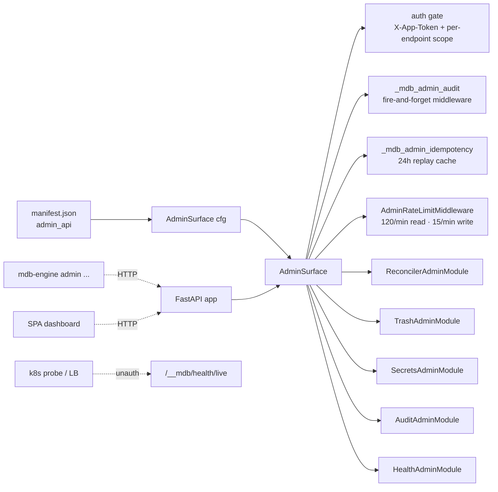
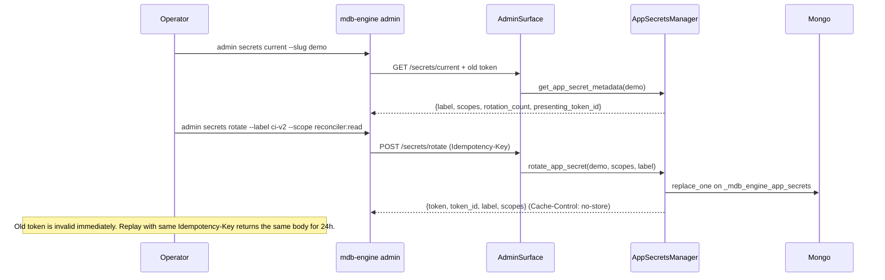
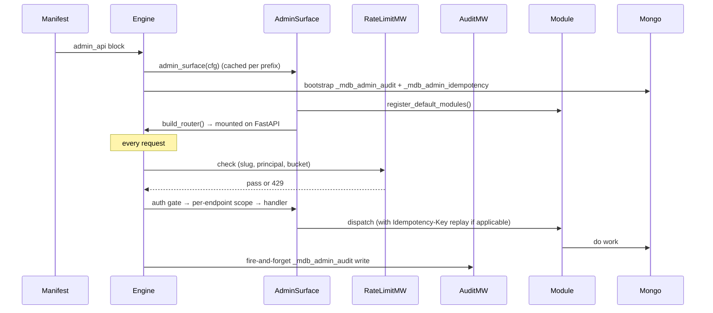

# Admin plane

The admin plane is a **first-class concern** of mdb-engine: enable it
with a top-level `admin_api` block in your `manifest.json` and the
engine mounts a single authenticated HTTP surface at
`admin_api.path_prefix` (default `/__mdb`). That surface composes
small **modules** — each a tiny object with its own router, scope
vocabulary, and introspection metadata — under shared auth, audit,
rate-limit, and idempotency middleware.



## TL;DR cheat sheet

| I want to...                         | Do this                                                                 |
| ------------------------------------ | ----------------------------------------------------------------------- |
| Probe liveness from k8s / a LB       | `GET /__mdb/health/live` (no auth, no slug, no rate limit)              |
| See every enabled module + scope     | `GET /__mdb/health/modules`                                             |
| Inspect my current token             | `GET /__mdb/secrets/current`                                            |
| Rotate *and* revoke                  | `POST /__mdb/secrets/rotate` (body: `{label, scopes}`)                  |
| Safely retry a destructive POST      | Send `Idempotency-Key: <opaque>`; response 2+ carries `X-Idempotent-Replay: true` |
| Tail recent admin activity           | `GET /__mdb/audit/recent?limit=50` or `mdb-engine admin audit tail`     |
| Paginate the full audit log          | `GET /__mdb/audit?cursor=<opaque>&limit=50`                             |
| Get per-module activity counters     | `GET /__mdb/audit/stats`                                                |

## Enabling it

Add the following to your manifest:

```json
{
  "admin_api": {
    "enabled": true,
    "path_prefix": "/__mdb",
    "auth":   { "mode": "app_token", "header": "X-App-Token" },
    "audit":  { "enabled": true, "collection": "_mdb_admin_audit" },
    "rate_limits": {
      "backend": "memory",
      "read":  { "max": 120, "window_seconds": 60 },
      "write": { "max":  15, "window_seconds": 60 }
    },
    "modules": {
      "reconciler": { "enabled": true,  "scopes": ["read", "apply"] },
      "trash":      { "enabled": true,  "scopes": ["read", "restore", "purge"] },
      "secrets":    { "enabled": true,  "scopes": ["read", "rotate"] },
      "audit":      { "enabled": true,  "scopes": ["read"] },
      "health":     { "enabled": true,  "public": false }
    }
  }
}
```

`enabled` defaults to **`false`** — the admin surface is opt-in so
existing apps never grow a new authenticated surface by accident.

## URL tree

| Module     | Endpoint                                     | Scope          | Mutates |
| ---------- | -------------------------------------------- | -------------- | ------- |
| (surface)  | `GET  /health/live`                          | *public*       | no      |
| health     | `GET  /health`                               | `*` / `read`   | no      |
| health     | `GET  /health/modules`                       | `read`         | no      |
| reconciler | `GET  /reconciler/plan?slug=`                | `read`         | no      |
| reconciler | `POST /reconciler/apply?slug=&dry_run=&yes=` | `apply`        | **yes** |
| reconciler | `GET  /reconciler/manifest/history?slug=`    | `read`         | no      |
| reconciler | `GET  /reconciler/manifest/diff?slug=`       | `read`         | no      |
| trash      | `GET  /trash?slug=`                          | `read`         | no      |
| trash      | `GET  /trash/summary?slug=`                  | `read`         | no      |
| trash      | `POST /trash/{id}/restore?slug=&dry_run=`    | `restore`      | **yes** |
| trash      | `POST /trash/{id}/purge?slug=`               | `purge`        | **yes** |
| secrets    | `GET  /secrets/current?slug=`                | `read`         | no      |
| secrets    | `POST /secrets/rotate?slug=`                 | `rotate`       | **yes** |
| audit      | `GET  /audit?slug=`                          | `read`         | no      |
| audit      | `GET  /audit/recent?slug=`                   | `read`         | no      |
| audit      | `GET  /audit/stats?slug=`                    | `read`         | no      |

Every endpoint except the two public ones (`/__mdb/health/live` and
`/__mdb/health` when `modules.health.public: true`) requires an
`X-App-Token` header.

## Auth + scopes (per-endpoint)

Tokens are issued per app and stored in `_mdb_engine_app_secrets`
(encrypted with envelope encryption). Each token carries three
fields:

- `scopes: list[str]` — which endpoints it can call.
- `label: str | None` — human-facing identifier for audit ("ci-gha").
- `rotation_count: int` — bumped on every rotation.

Scope values:

| Form               | Example               | Meaning                                |
| ------------------ | --------------------- | -------------------------------------- |
| `*`                | `*`                   | Unrestricted (legacy default).         |
| `<module>:*`       | `reconciler:*`        | Every endpoint in that module.         |
| `<module>:<verb>`  | `reconciler:read`     | One verb within one module.            |
| Bare `<verb>`      | `read`                | Legacy. Matches any endpoint whose declared scope equals the verb. |

**Scopes are enforced *per-endpoint*, not per-module.** A token with
`reconciler:read` can call `GET /reconciler/plan` and `GET
/reconciler/manifest/history` but is **rejected with 403** on `POST
/reconciler/apply`. See the matrix in
`tests/unit/test_admin_plane_polish.py::test_scope_enforcement_matrix`
for the exhaustive policy.

### Token lifecycle



Rotation invalidates the previous token by default — that's the
revocation path. For a fleet of callers that can't all roll at the
same instant, pass `overlap_seconds` (0–3600) in the body of
`POST /secrets/rotate` (or `--overlap-seconds` on the CLI): the
*previous* token stays valid for that many seconds after the
rotation completes. During the overlap window both tokens
authenticate and audit rows show the fingerprint of whichever token
the client actually presented — so dashboards can watch for the
"still using old cred" cohort.

The plaintext token is returned exactly once; the response always
carries `Cache-Control: no-store` and `Pragma: no-cache`. The
`token_id` field is a stable HMAC fingerprint that cross-references
audit log rows without exposing the plaintext.

**Bootstrap**: the first-ever token for an app has to come from
somewhere. Run `mdb-engine admin secrets bootstrap --slug <app>` on
the engine host — it talks to Mongo directly (no HTTP), refuses to
overwrite an existing secret without `--force`, and prints the
plaintext exactly once.

## Idempotency

Destructive POSTs (`reconciler/apply`, `trash/*/restore`,
`trash/*/purge`, `secrets/rotate`) accept an optional
`Idempotency-Key` header. When provided:

- First call runs the handler and caches the response body (scoped to
  `(slug, module, endpoint, sha256(key))`) for **24 hours**.
- Any repeat with the same key returns the cached body and sets
  `X-Idempotent-Replay: true` on the response.
- A repeat with the same key but a different request body is rejected
  with **409 Conflict** — that's almost always a bug in the caller.

The 24h TTL is enforced via a MongoDB `expireAfterSeconds` index on
the `at` field of `_mdb_admin_idempotency`; no sweeper is needed.

Handlers that return raw `Response` objects (e.g. `/secrets/rotate`)
opt into `never_cache=True` — the lookup still runs, but the response
is never stored. Consequence: rotation itself is *not* idempotent
across the 24h window; the CLI and SPA treat every rotation as a new
one.

## Rate limits

The admin plane is protected by a dedicated rate limiter keyed on
`(principal_token_id or client_ip, module, bucket)`. Principals are
SHA-256 hashed, so buckets are stable across worker restarts.
Defaults:

- `read` bucket: **120 / minute** (`GET` / `HEAD` / `OPTIONS`)
- `write` bucket: **15 / minute** (everything else)

Override per-bucket via `admin_api.rate_limits`. A 429 response
includes `Retry-After` and `retry_after_seconds`. The liveness probe
(`/__mdb/health/live`) is **never** rate-limited.

### Backend selection

```json
{
  "admin_api": {
    "rate_limits": {
      "backend": "memory",  // "memory" (default) | "mongo"
      "memory_max_keys": 10000
    }
  }
}
```

| backend    | correctness                   | cost / call          | when to pick                                                    |
| ---------- | ----------------------------- | -------------------- | --------------------------------------------------------------- |
| `"memory"` | **single-process** only       | in-process           | dev, tests, single uvicorn worker behind one pod                |
| `"mongo"`  | **correct across workers**    | one `findAndModify`  | ≥ 2 workers or ≥ 2 pods — anything horizontally scaled          |

The Mongo backend persists fixed-window counters in
`_mdb_admin_rate_limits` with a TTL index for automatic cleanup. It
fails **open** on Mongo errors (admin plane stays reachable during a
DB outage) and logs the first failure loudly.

## Audit log

Every authenticated call writes one row to `_mdb_admin_audit`,
fire-and-forget via `asyncio.create_task` so database latency never
blocks API latency. A bounded in-flight counter (128 concurrent
writes by default) means even a stalled Mongo can't leak tasks —
excess rows are dropped with a warning.

```json
{
  "slug": "demo",
  "module": "reconciler",
  "endpoint": "/__mdb/reconciler/plan",
  "method": "GET",
  "status": 200,
  "duration_ms": 42.7,
  "principal_label": "ci-gha",
  "principal_token_id": "hmac:79e2d8ad6f4c0b3a",
  "request_summary": "",
  "response_summary": "json body (183b)",
  "extra": null,
  "at": "2026-04-20T00:12:34.567Z"
}
```

Indexes: `(slug, at desc)`, `(module, at desc)`, TTL `at` (365d).

The `principal_token_id` is an **HMAC-SHA256** of the token, truncated
to 64 bits — enough to distinguish *which* CI key called an endpoint
without creating a verification oracle, and safe to share across
systems that don't share the engine's master key.

### Querying the audit log

```bash
mdb-engine admin audit tail --slug demo --limit 20
mdb-engine admin audit list --slug demo --module reconciler --status-gte 400
mdb-engine admin audit stats --slug demo
```

To tail live, pipe through `watch`:

```bash
watch -n 2 'mdb-engine admin audit tail --slug demo --limit 10'
```

## Events catalog

Structured events emitted via `mdb_engine.core.reconciler_events.emit_event`.
Subscribe to them the same way you would any reconciler event.

| Event name                   | When                                   | Payload keys (beyond `slug`, `at`)          |
| ---------------------------- | -------------------------------------- | ------------------------------------------- |
| `mdb.admin.call`             | After every authenticated admin call   | `module`, `endpoint`, `method`, `status`, `duration_ms`, `principal_label`, `principal_token_id` |
| `mdb.admin.auth_failed`      | 401/403 at the auth gate               | `reason` (`missing_token` / `bad_token`)    |
| `mdb.admin.scope_denied`     | 403 from per-endpoint scope check      | `module`, `endpoint`, `required_scope`, `presented_scopes` |
| `mdb.admin.rate_limited`     | 429 from the rate limiter              | `module`, `endpoint`                        |
| `mdb.admin.idempotency_replay` | Cached response served from replay   | `module`, `endpoint`, `key` (fingerprint)   |

## CLI parity

All endpoints are mirrored by the `mdb-engine admin` CLI group, which
calls the running HTTP server over the wire (so CLI and UI see
byte-identical responses — pinned by
`tests/integration/test_admin_cli_parity.py`).

Environment:

| Variable            | Purpose                                   | Default                   |
| ------------------- | ----------------------------------------- | ------------------------- |
| `MDB_ADMIN_TOKEN`   | App token (required).                     | —                         |
| `MDB_ADMIN_URL`     | Base URL of the running engine.           | `http://127.0.0.1:8000`   |
| `MDB_ADMIN_PREFIX`  | Admin plane prefix.                       | `/__mdb`                  |

Group-level flags (`--base-url`, `--prefix`, `--token-env`,
`--token-file`) override those envs when set. Every subcommand
supports `--output table|json` (default `table`).

```bash
# One-time bootstrap (talks to Mongo directly — no token needed).
mdb-engine admin secrets bootstrap --slug demo

export MDB_ADMIN_TOKEN=$(pass show mdb/app-tokens/demo)

mdb-engine admin health --slug demo
mdb-engine admin reconciler plan --slug demo
mdb-engine admin reconciler apply --slug demo --yes --idempotency-key "$(date +%s)"
mdb-engine admin trash list --slug demo
mdb-engine admin trash restore <id> --slug demo --dry-run
mdb-engine admin trash purge <id> --slug demo --yes       # IRREVERSIBLE
mdb-engine admin secrets current --slug demo
# Graceful rotation — previous token keeps working for 5 min.
mdb-engine admin secrets rotate --slug demo --label ci-gha \
    --scope reconciler:read --overlap-seconds 300
mdb-engine admin audit tail --slug demo --limit 20
mdb-engine admin audit stats --slug demo
```

**Destructive prompts** (kubectl-style): `reconciler apply --no-dry-run`
and `trash purge` refuse to run non-interactively unless you pass `--yes`
or set `MDB_CONFIRM=1` (same env var as the local `reconcile` CLI — one
bypass for both surfaces). On a TTY they prompt for the slug to confirm.

## Writing a third-party module

Admin plane modules are tiny. Use `ModuleRouter` — it wires scope
enforcement + route metadata in one call.

```python
from fastapi import APIRouter
from mdb_engine.admin import AdminModule, ModuleConfig, ModuleEndpoint
from mdb_engine.admin.routing import ModuleRouter


class TimersAdminModule(AdminModule):
    name = "timers"

    def build_router(self, engine, cfg: ModuleConfig) -> APIRouter:
        mr = ModuleRouter(self.name)

        async def running(slug: str) -> list[dict]:
            return await engine.list_running_timers(slug)

        async def cancel(slug: str, timer_id: str) -> dict:
            return await engine.cancel_timer(slug, timer_id)

        mr.add("GET", "/running", endpoint=running, scope="read",
               summary="List active scheduled actions.")
        mr.add("POST", "/{timer_id}/cancel", endpoint=cancel, scope="cancel",
               summary="Cancel a running timer.", destructive=True)
        return mr.router

    def describe(self, cfg: ModuleConfig) -> list[ModuleEndpoint]:
        return [
            ModuleEndpoint("GET",  "/timers/running",        "read",
                           "List active scheduled actions."),
            ModuleEndpoint("POST", "/timers/{id}/cancel",    "cancel",
                           "Cancel a running timer.", destructive=True),
        ]


# Register at app boot (after engine.initialize()):
engine.admin_surface({}).register(TimersAdminModule())
```

Then add the matching block to your manifest's `admin_api.modules`:

```json
"modules": {
  "timers": { "enabled": true, "scopes": ["read", "cancel"] }
}
```

The module is now:

- authenticated with the same `X-App-Token` flow,
- **per-endpoint** scope-gated against `read` vs `cancel`,
- audited into `_mdb_admin_audit` on every call,
- rate-limited in the `write` bucket for the `cancel` endpoint,
- idempotency-aware (opt in by wrapping with
  `mdb_engine.admin.idempotency.replay_or_record`),
- visible on `GET /__mdb/health/modules` — UIs render it automatically.

## Lifecycle + layering



## Breaking changes (vs. pre-refactor)

- `manifest_tracking.admin_api` is **removed**. Move the block to the
  top level `admin_api`.
- `admin_api.enabled` default is now **`false`**.
- URL prefix change: `/__mdb/reconcile/*` → `/__mdb/reconciler/*`;
  `/__mdb/manifest/*` → `/__mdb/reconciler/manifest/*`;
  `/__mdb/trash/*` unchanged.
- `mdb_engine.admin.build_reconciler_router` is **removed** — use
  `engine.admin_surface(cfg).build_router()` or
  `engine.admin_router(cfg)` instead.
- Scope enforcement is now **per-endpoint**, not per-module. Tokens
  scoped to `<module>:read` that previously could call mutating
  endpoints in the same module now receive 403.
- Audit row field `principal_token_fingerprint` (SHA-256 prefix) was
  renamed to `principal_token_id` (HMAC-SHA256 prefix). Pre-existing
  rows are unaffected; new rows use the new field.
- `--output yaml` was removed from the CLI — `--output json`
  covers every machine-consumable need and we weren't willing to
  maintain a custom YAML dumper.
