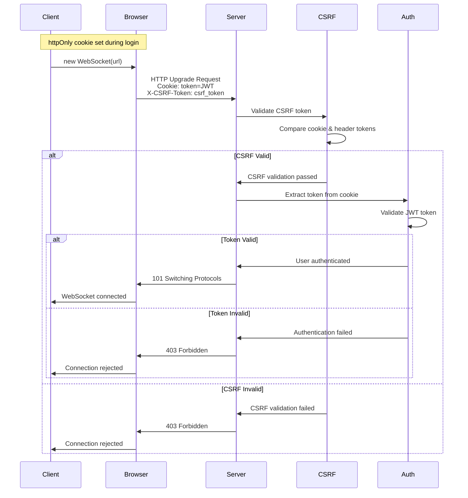

# WebSocket Security Guide: Multi-App SSO

Comprehensive security guide for WebSocket authentication in multi-app SSO deployments using MDB-Engine.

## Table of Contents

- [Security Overview](#security-overview)
- [Authentication Architecture](#authentication-architecture)
- [Implementation Guide](#implementation-guide)
- [Security Considerations](#security-considerations)
- [Common Security Pitfalls](#common-security-pitfalls)
- [Testing Security](#testing-security)
- [Production Deployment](#production-deployment)

---

## Security Overview

MDB-Engine uses **secure-by-default WebSocket authentication** with encrypted session keys stored in private collections, providing defense-in-depth security.

### Secure-by-Default Session Key Authentication

WebSocket authentication uses encrypted session keys generated on login, stored securely in the database using envelope encryption, and validated during WebSocket upgrade.

#### Security Benefits

1. **XSS Protection**
   - Session keys not accessible to JavaScript (sent via query param or header)
   - Prevents XSS attacks from stealing authentication credentials
   - Most secure option for WebSocket authentication

2. **CSRF Protection (Secure-by-Default)**
   - **Default**: CSRF required (`csrf_required: true`) using encrypted session keys
   - **Session keys**: Encrypted via envelope encryption, stored in private collection
   - **Origin validation**: Always required for WebSocket connections
   - **SameSite cookies**: Additional CSRF protection layer
   - Configurable per-endpoint in manifest.json (can disable if needed)

3. **Defense-in-Depth**
   - Multiple security layers: Origin validation + encrypted session keys + SameSite cookies
   - Session keys encrypted using same envelope encryption as app secrets
   - Automatic expiration (24-hour TTL) with cleanup
   - Parent app manages security validation

4. **Secure Session Management**
   - Session keys generated on authentication
   - Stored encrypted in `_mdb_engine_websocket_sessions` private collection
   - Validated during WebSocket upgrade
   - Can be revoked individually or per-user

5. **Backward Compatibility**
   - Falls back to cookie-based authentication if session key not present
   - Maintains compatibility with existing implementations

#### Comparison with Alternatives

| Method | XSS Protection | CSRF Safe | URL Logging | Browser Support | Security Rating |
|--------|---------------|----------|-------------|-----------------|-----------------|
| **Cookie (httpOnly)** ✅ | **Yes** | Yes (Origin + SameSite, optional CSRF cookie) | No risk | Native | ⭐⭐⭐⭐⭐ |
| Query Params ❌ | No | Yes | **High risk** | Native | ⭐⭐ |
| Cookies (non-httpOnly) ❌ | No | **No** (triggers CSRF) | No risk | Native | ⭐⭐⭐ |
| Custom Headers ❌ | No | Yes | No risk | **Not supported** | ⭐ |

### Threat Model

#### Attack Vectors Mitigated

1. **CSRF Attacks**
   - **Threat**: Malicious site triggers WebSocket connection with user's cookies
   - **Mitigation**: CSRF token validation via double-submit cookie pattern, origin validation

2. **Token Theft via URL Logging**
   - **Threat**: Tokens in query params logged in server logs, browser history
   - **Mitigation**: Tokens in headers, not URLs

3. **Man-in-the-Middle (MITM)**
   - **Threat**: Intercept tokens during transmission
   - **Mitigation**: Use WSS (WebSocket Secure) in production, TLS encryption

4. **Token Replay**
   - **Threat**: Stolen token used to connect
   - **Mitigation**: JWT expiration, token refresh, short-lived tokens

5. **Origin Spoofing**
   - **Threat**: Malicious origin connects to WebSocket
   - **Mitigation**: CORS validation, CSRF middleware origin checks

---

## Authentication Architecture

### Cookie-Based Authentication Flow




### Multi-App SSO Integration


### CSRF Protection Mechanism

1. **Parent App CSRF Middleware**
   - Validates WebSocket upgrade request origins
   - Uses merged CORS config from all child apps
   - Rejects connections from unauthorized origins

2. **Origin Validation**
   - Checks `Origin` header against `allow_origins` list
   - Validates before connection is established
   - Prevents cross-origin attacks

3. **Cookie-Based Authentication**
   - Token extracted from httpOnly cookie
   - CSRF protection via Origin validation + SameSite cookies (default)
   - Optional CSRF cookie validation if `auth.csrf_required: true`
   - Validated **before** `accept()` is called
   - Failed auth = no connection established

### CORS Configuration Requirements

For cookie-based authentication to work securely:

```json
{
  "cors": {
    "enabled": true,
    "allow_origins": [
      "https://yourdomain.com",
      "https://app.yourdomain.com"
    ],
    "allow_credentials": true,
    "allow_methods": ["*"],
    "allow_headers": ["*"]
  }
}
```

**Important:**
- `allow_credentials: true` **required** for cookie-based WebSocket authentication
- Use **specific origins** in production, not wildcards
- Include all frontend origins that need WebSocket access

---

## Implementation Guide

### Client-Side Implementation

#### JavaScript/TypeScript

```typescript
/**
 * Secure WebSocket connection with cookie-based authentication
 * 
 * Note: Authentication token is stored in httpOnly cookie and sent automatically.
 * CSRF token must be included in X-CSRF-Token header.
 */
class SecureWebSocket {
  private ws: WebSocket | null = null;
  private url: string;
  private reconnectAttempts = 0;
  private maxReconnectAttempts = 5;

  constructor(url: string) {
    this.url = url;
  }

  /**
   * Get CSRF token from cookie (if not httpOnly) or from page load
   */
  private getCsrfToken(): string | null {
    // Try to get from cookie (if not httpOnly)
    const cookies = document.cookie.split(';');
    for (const cookie of cookies) {
      const [name, value] = cookie.trim().split('=');
      if (name === 'csrf_token') {
        return value;
      }
    }
    
    // Fallback: Get from meta tag (if set by server)
    const metaTag = document.querySelector('meta[name="csrf-token"]');
    if (metaTag) {
      return metaTag.getAttribute('content');
    }
    
    return null;
  }

  connect(): Promise<void> {
    return new Promise((resolve, reject) => {
      try {
        // Create WebSocket connection
        // Browser automatically sends httpOnly cookies
        this.ws = new WebSocket(this.url);

        // Note: JavaScript WebSocket API cannot set custom headers.
        // CSRF protection relies on:
        // 1. Origin validation (browser automatically sends Origin header)
        // 2. SameSite cookies (prevents cross-site cookie sending)
        // 3. CSRF cookie presence (validates session exists)

        this.ws.onopen = () => {
          console.log('✅ WebSocket connected securely');
          this.reconnectAttempts = 0;
          resolve();
        };

        this.ws.onerror = (error) => {
          console.error('❌ WebSocket error:', error);
          reject(error);
        };

        this.ws.onclose = (event) => {
          if (event.code === 1008) {
            // Policy violation - likely auth failure
            console.error('Authentication failed - token may be invalid or expired');
          }
        };
      } catch (error) {
        reject(error);
      }
    });
  }

  send(data: any): void {
    if (this.ws && this.ws.readyState === WebSocket.OPEN) {
      this.ws.send(JSON.stringify(data));
    } else {
      throw new Error('WebSocket not connected');
    }
  }

  disconnect(): void {
    if (this.ws) {
      this.ws.close();
      this.ws = null;
    }
  }
}

// Usage - no token needed, cookie is sent automatically
const ws = new SecureWebSocket('wss://api.example.com/app1/ws');
await ws.connect();
```

#### React Hook

```typescript
import { useEffect, useRef, useState, useCallback } from 'react';

interface UseSecureWebSocketOptions {
  url: string;
  enabled?: boolean;
  onMessage?: (data: any) => void;
  onError?: (error: Event) => void;
}

export function useSecureWebSocket(options: UseSecureWebSocketOptions) {
  const { url, enabled = true, onMessage, onError } = options;
  const [connected, setConnected] = useState(false);
  const wsRef = useRef<WebSocket | null>(null);

  const connect = useCallback(() => {
    if (!enabled) {
      console.warn('WebSocket disabled');
      return;
    }

    try {
      // Create WebSocket - browser automatically sends httpOnly cookies
      const ws = new WebSocket(url);
      wsRef.current = ws;

      ws.onopen = () => {
        setConnected(true);
      };

      ws.onmessage = (event) => {
        try {
          const data = JSON.parse(event.data);
          onMessage?.(data);
        } catch (err) {
          console.error('Failed to parse message:', err);
        }
      };

      ws.onerror = (error) => {
        console.error('WebSocket error:', error);
        onError?.(error);
        setConnected(false);
      };

      ws.onclose = () => {
        setConnected(false);
      };
    } catch (error) {
      console.error('Failed to create WebSocket:', error);
    }
  }, [url, enabled, onMessage, onError]);

  useEffect(() => {
    if (enabled) {
      connect();
    }
    return () => {
      if (wsRef.current) {
        wsRef.current.close();
      }
    };
  }, [connect, enabled]);

  const send = useCallback((data: any) => {
    if (wsRef.current && wsRef.current.readyState === WebSocket.OPEN) {
      wsRef.current.send(JSON.stringify(data));
    }
  }, []);

  return { connected, send };
}
```

### Server-Side Configuration

#### Manifest Configuration

```json
{
  "schema_version": "2.0",
  "slug": "my-app",
  "name": "My App",
  "auth": {
    "mode": "shared",
    "roles": ["viewer", "editor", "admin"],
    "require_role": "viewer"
  },
  "websockets": {
    "realtime": {
      "path": "/ws",
      "auth": {
        "required": true
      },
      "ping_interval": 30
    }
  },
  "cors": {
    "enabled": true,
    "allow_origins": [
      "https://yourdomain.com",
      "https://app.yourdomain.com"
    ],
    "allow_credentials": true,
    "allow_methods": ["*"],
    "allow_headers": ["*"]
  }
}
```

#### Multi-App Setup

```python
from pathlib import Path
from mdb_engine import MongoDBEngine
import os

# Initialize engine
engine = MongoDBEngine(
    mongo_uri=os.getenv("MONGODB_URI"),
    db_name=os.getenv("MONGODB_DB")
)

# Create multi-app with WebSocket support
app = engine.create_multi_app(
    apps=[
        {
            "slug": "my-app",
            "manifest": Path("./apps/my-app/manifest.json"),
            "path_prefix": "/my-app",
        }
    ],
    title="My Platform",
)

# WebSocket authentication happens automatically via httpOnly cookies
# No additional code needed!
```

**Important for Multi-App Setups:**

Cookies are automatically set with `path="/"` to ensure they work across all mounted sub-apps. When you use `app.mount("/subapi", subapi)`, cookies set by the main app are automatically available to the sub-app because:

1. **Cookie Path**: Cookies are set with `path="/"` (root path), making them available to all routes
2. **Automatic Transmission**: Browser automatically sends httpOnly cookies on WebSocket upgrade requests
3. **Shared Domain**: All mounted apps share the same domain, so cookies work seamlessly

**Example Multi-App Setup:**

```python
from mdb_engine import MongoDBEngine

engine = MongoDBEngine(mongo_uri=..., db_name=...)

# Create multi-app with WebSocket support
app = engine.create_multi_app(
    apps=[
        {
            "slug": "app1",
            "manifest": Path("./apps/app1/manifest.json"),
            "path_prefix": "/app1",  # Mounted at /app1
        },
        {
            "slug": "app2", 
            "manifest": Path("./apps/app2/manifest.json"),
            "path_prefix": "/app2",  # Mounted at /app2
        }
    ]
)

# Cookies set during login are available to:
# - /app1/ws (WebSocket endpoint)
# - /app2/ws (WebSocket endpoint)
# - All other routes in both apps
```

**How It Works with FastAPI Mounted Apps:**

When using `app.mount("/subapi", subapi)`, cookies work seamlessly because:

1. **Cookie Path**: Cookies are set with `path="/"` (root path), making them available to all routes including mounted sub-apps
2. **Automatic Transmission**: Browser automatically sends httpOnly cookies on WebSocket upgrade requests to any path
3. **Shared Domain**: All mounted apps share the same domain, so cookies work across all sub-apps
4. **Request Context**: FastAPI passes the full request context (including cookies) to mounted apps

**Example Flow:**

```python
# Main app sets cookie during login
@app.post("/login")
async def login(response: Response):
    response.set_cookie(
        key="token",
        value=jwt_token,
        httponly=True,
        secure=True,
        samesite="lax",
        path="/",  # Available to all mounted apps
    )

# Mounted sub-app can read the cookie
@subapp.websocket("/ws")
async def websocket_endpoint(websocket: WebSocket):
    # Cookie is automatically available via websocket.cookies
    token = websocket.cookies.get("mdb_auth_token")  # Use AUTH_COOKIE_NAME constant in production
    # Authentication works seamlessly!
```

**Key Points:**

- ✅ Cookies with `path="/"` are available to all mounted apps
- ✅ WebSocket connections automatically include cookies in the upgrade request
- ✅ No additional configuration needed - it "just works"
- ✅ CSRF protection works across all mounted apps via shared CSRF middleware

### Security Best Practices

#### Token Management

1. **Token Storage**
   ```typescript
   // ✅ GOOD: httpOnly cookies (handled server-side)
   // Tokens are stored in httpOnly cookies set by the server
   // JavaScript cannot access these cookies, preventing XSS attacks
   // Browser automatically sends cookies on WebSocket upgrade requests
   
   // ❌ BAD: Storing tokens in JavaScript-accessible storage
   sessionStorage.setItem('auth_token', token); // Vulnerable to XSS
   localStorage.setItem('auth_token', token);    // Vulnerable to XSS
   window.token = token;                        // Exposed in global scope
   ```

2. **Token Refresh**
   ```typescript
   // Token refresh handled server-side via cookie refresh
   // Client just needs to ensure cookies are sent with requests
   async function refreshTokenIfNeeded() {
     // Server handles token refresh and sets new httpOnly cookie
     const response = await fetch('/auth/refresh', {
       method: 'POST',
       credentials: 'include' // Important: sends cookies
     });
     
     if (response.ok) {
       // New token cookie set automatically by server
       return true;
     }
     
     return false;
   }
   ```

3. **CSRF Token Management**
   ```typescript
   // CSRF token is stored in cookie (may be readable by JS if not httpOnly)
   // For WebSocket connections, CSRF validation happens server-side
   // based on Origin header and cookie presence
   
   function getCsrfToken(): string | null {
     // Try to get from cookie (if not httpOnly)
     const cookies = document.cookie.split(';');
     for (const cookie of cookies) {
       const [name, value] = cookie.trim().split('=');
       if (name === 'csrf_token') {
         return value;
       }
     }
     return null;
   }
   ```

#### Connection Security

1. **Use WSS in Production**
   ```typescript
   // Always use secure WebSocket in production
   const protocol = window.location.protocol === 'https:' ? 'wss:' : 'ws:';
   const wsUrl = `${protocol}//${window.location.host}/app1/ws`;
   ```

2. **Validate Origins**
   - Server automatically validates origins via CORS
   - Client should verify connection is to expected domain
   ```typescript
   const expectedHost = 'api.yourdomain.com';
   const wsUrl = `wss://${expectedHost}/app1/ws`;
   // Browser will validate SSL certificate
   ```

3. **Handle Reconnection Securely**
   ```typescript
   ws.onclose = async (event) => {
     if (event.code === 1008) {
       // Auth failure - refresh token cookie and reconnect
       const refreshed = await refreshTokenIfNeeded();
       if (refreshed) {
         setTimeout(() => connect(), 2000);
       } else {
         // Redirect to login if refresh failed
         window.location.href = '/login';
       }
     }
   };
   ```

---

## Security Considerations

### Token Storage and Transmission

#### Client-Side Storage

**Options:**
1. **sessionStorage** (Recommended for WebSocket tokens)
   - Cleared when tab closes
   - Not accessible to other tabs
   - Survives page refreshes

2. **localStorage**
   - Persists across sessions
   - Accessible to all tabs
   - Use for long-lived tokens

3. **Memory** (React state, Vue data)
   - Cleared on page reload
   - Most secure but least convenient

**Recommendation:** Use `sessionStorage` for WebSocket tokens, `httpOnly` cookies for HTTP requests.

#### Token Transmission

- ✅ **httpOnly Cookie** - Secure, not accessible to JavaScript, CSRF protected
- ❌ **Query parameters** - Logged in URLs
- ❌ **Non-httpOnly cookies** - Accessible to JavaScript, XSS risk

### Origin Validation

#### Server-Side

MDB-Engine automatically validates origins:

1. **CORS Middleware** - Checks `Origin` header against `allow_origins`
2. **CSRF Middleware** - Validates WebSocket upgrade requests
3. **Merged CORS Config** - Uses parent app's merged config

#### Client-Side

```typescript
// Verify connection is to expected domain
const expectedDomain = 'api.yourdomain.com';
const wsUrl = `wss://${expectedDomain}/app1/ws`;

// Browser validates SSL certificate automatically
const ws = new WebSocket(wsUrl, [token]);
```

### CSRF Protection

#### How It Works

1. **Parent App CSRF Middleware**
   - Validates all WebSocket upgrade requests
   - Checks origin against merged CORS config
   - Rejects unauthorized origins

2. **Session Key Authentication (Secure-by-Default)**
   - Session key generated on login, encrypted via envelope encryption
   - Stored in `_mdb_engine_websocket_sessions` private collection
   - CSRF protection enforced by default (`csrf_required: true`)
   - Session key validated during WebSocket upgrade
   - Origin validation always required (primary defense)
   - SameSite cookies provide additional CSRF protection
   - **Secure-by-default**: CSRF required, configurable per-endpoint

#### Configuration

**Secure-by-Default (Recommended)**: CSRF required using encrypted session keys:

```json
{
  "websockets": {
    "realtime": {
      "path": "/ws",
      "auth": {
        "required": true,
        "csrf_required": true  // Default: secure-by-default with encrypted session keys
      }
    }
  },
  "cors": {
    "enabled": true,
    "allow_origins": [
      "https://yourdomain.com"
    ],
    "allow_credentials": true
  }
}
```

**Relaxed Mode**: Disable CSRF requirement (use Origin + SameSite only):

```json
{
  "websockets": {
    "realtime": {
      "path": "/ws",
      "auth": {
        "required": true,
        "csrf_required": false  // Relaxed: Origin + SameSite only
      }
    }
  }
}
```

**Session Key Generation**: Session keys are automatically generated on login. Access via:

```typescript
// After login, get session key
const response = await fetch('/auth/websocket-session', {
  method: 'GET',
  credentials: 'include',
});
const { session_key } = await response.json();

// Use session key for WebSocket connection
const ws = new WebSocket(`wss://api.example.com/app1/ws?session_key=${session_key}`);
```

### CORS Configuration

#### Development

```json
{
  "cors": {
    "enabled": true,
    "allow_origins": ["*"],
    "allow_credentials": true
  }
}
```

**Note:** Wildcard origins are OK for development but **NOT for production**.

#### Production

```json
{
  "cors": {
    "enabled": true,
    "allow_origins": [
      "https://yourdomain.com",
      "https://app.yourdomain.com",
      "https://admin.yourdomain.com"
    ],
    "allow_credentials": true,
    "allow_methods": ["GET", "POST", "PUT", "DELETE", "PATCH"],
    "allow_headers": ["Content-Type", "Authorization"],
    "max_age": 3600
  }
}
```

### Token Expiration Handling

#### Proactive Refresh

```typescript
// Refresh token before expiration
setInterval(async () => {
  const token = getAuthToken();
  const payload = JSON.parse(atob(token.split('.')[1]));
  const expiresAt = payload.exp * 1000;
  const now = Date.now();
  
  // Refresh if expiring within 10 minutes
  if (expiresAt - now < 10 * 60 * 1000) {
    await refreshToken();
    // Reconnect WebSocket with new token if connected
    if (ws && ws.readyState === WebSocket.OPEN) {
      ws.close(); // Triggers reconnection with new token
    }
  }
}, 60000); // Check every minute
```

#### Reactive Refresh

```typescript
ws.onclose = async (event) => {
  if (event.code === 1008) {
    // Authentication failure - likely expired token
    const newToken = await refreshToken();
    if (newToken) {
      setTimeout(() => connectWebSocket(newToken), 2000);
    }
  }
};
```

### Reconnection Security

#### Secure Reconnection Pattern

```typescript
class SecureWebSocketManager {
  private ws: WebSocket | null = null;
  private url: string;
  private getToken: () => string | null;
  private reconnectAttempts = 0;
  private maxAttempts = 5;

  constructor(url: string, getToken: () => string | null) {
    this.url = url;
    this.getToken = getToken;
  }

  async connect(): Promise<void> {
    const token = this.getToken();
    if (!token) {
      throw new Error('No token available');
    }

    // Validate token before connecting
    if (!this.isValidToken(token)) {
      // Try to refresh
      const newToken = await this.refreshToken();
      if (!newToken) {
        throw new Error('Failed to obtain valid token');
      }
      return this.connectWithToken(newToken);
    }

    return this.connectWithToken(token);
  }

  private async connectWithToken(token: string): Promise<void> {
    return new Promise((resolve, reject) => {
      try {
        this.ws = new WebSocket(this.url, [token]);

        this.ws.onopen = () => {
          this.reconnectAttempts = 0;
          resolve();
        };

        this.ws.onerror = reject;

        this.ws.onclose = async (event) => {
          if (event.code === 1008 && this.reconnectAttempts < this.maxAttempts) {
            // Auth failure - refresh and retry
            this.reconnectAttempts++;
            const newToken = await this.refreshToken();
            if (newToken) {
              setTimeout(() => this.connectWithToken(newToken), 2000);
            }
          }
        };
      } catch (error) {
        reject(error);
      }
    });
  }

  private isValidToken(token: string): boolean {
    // Implementation from earlier
    return true; // Simplified
  }

  private async refreshToken(): Promise<string | null> {
    // Implement token refresh
    return null; // Simplified
  }
}
```

---

## Common Security Pitfalls

### What NOT to Do

#### ❌ Pitfall 1: Tokens in URL Query Params

```javascript
// ❌ WRONG: Token in URL (logged everywhere)
const ws = new WebSocket(`wss://api.example.com/ws?token=${token}`);
```

**Why it's bad:**
- Tokens logged in server access logs
- Tokens in browser history
- Tokens in referrer headers
- Tokens exposed in error messages

**Fix:**
```javascript
// ✅ CORRECT: Token in httpOnly cookie (set server-side)
const ws = new WebSocket('wss://api.example.com/ws');
// Browser automatically sends httpOnly cookies
```

#### ❌ Pitfall 2: Not Including CSRF Token

```javascript
// ❌ WRONG: Missing CSRF token validation
const ws = new WebSocket('wss://api.example.com/ws');
// Cookie sent automatically, but CSRF validation may fail
```

**Why it's bad:**
- CSRF middleware requires CSRF token validation
- Can cause connection rejections
- Security vulnerability

**Fix:**
```javascript
// ✅ CORRECT: Cookie-based authentication with CSRF protection
// CSRF token is validated server-side based on cookie and Origin header
// Ensure httpOnly cookie is set during authentication
const ws = new WebSocket('wss://api.example.com/ws');
// Browser automatically sends httpOnly cookies
```

#### ❌ Pitfall 3: Accepting Connection Before Authentication

```python
# ❌ WRONG: Accept before validating
@websocket_endpoint("/ws")
async def handler(websocket: WebSocket):
    await websocket.accept()  # ❌ Too early!
    token = extract_token(websocket)
    if not validate_token(token):
        await websocket.close()  # Too late!
```

**Why it's bad:**
- Connection established before auth
- Security vulnerability
- Can't properly reject unauthenticated connections

**Fix:**
```python
# ✅ CORRECT: Authenticate before accepting
# MDB-Engine does this automatically!
# authenticate_websocket() is called BEFORE accept()
```

#### ❌ Pitfall 4: Wildcard CORS in Production

```json
{
  "cors": {
    "allow_origins": ["*"]  // ❌ WRONG for production
  }
}
```

**Why it's bad:**
- Allows any origin to connect
- Security risk
- Violates CORS best practices

**Fix:**
```json
{
  "cors": {
    "allow_origins": [
      "https://yourdomain.com",
      "https://app.yourdomain.com"
    ]  // ✅ CORRECT: Specific origins
  }
}
```

#### ❌ Pitfall 5: Not Validating Token Expiration

```javascript
// ❌ WRONG: No expiration check
const ws = new WebSocket(url, [token]);
// Token might be expired!
```

**Why it's bad:**
- Expired tokens cause connection failures
- Poor user experience
- Security risk if tokens are long-lived

**Fix:**
```javascript
// ✅ CORRECT: Validate before connecting
const token = getAuthToken();
if (isTokenExpired(token)) {
  await refreshToken();
}
const ws = new WebSocket(url, [getAuthToken()]);
```

### Common Mistakes and Fixes

#### Mistake: Token Not Available When Connecting

**Problem:**
```javascript
// Token might be null/undefined
const ws = new WebSocket(url, [token]);
```

**Fix:**
```javascript
const token = getAuthToken();
if (!token) {
  console.error('No token - redirect to login');
  redirectToLogin();
  return;
}
const ws = new WebSocket(url, [token]);
```

#### Mistake: Not Handling Authentication Failures

**Problem:**
```javascript
const ws = new WebSocket(url, [token]);
ws.onclose = () => {
  // No handling of auth failures
};
```

**Fix:**
```javascript
ws.onclose = async (event) => {
  if (event.code === 1008) {
    // Auth failure - refresh token and reconnect
    await refreshToken();
    setTimeout(() => connectWebSocket(), 2000);
  }
};
```

#### Mistake: Exposing Tokens in Client Code

**Problem:**
```javascript
// Token in global scope or console logs
console.log('Token:', token);  // ❌ Exposed!
window.token = token;  // ❌ Exposed!
```

**Fix:**
```javascript
// Keep tokens in secure storage
sessionStorage.setItem('auth_token', token);
// Never log or expose tokens
```

---

## Testing Security

### How to Test WebSocket Security

#### Unit Tests

Test authentication logic:

```python
import pytest
from mdb_engine.routing.websockets import authenticate_websocket

async def test_cookie_authentication_success():
    """Test successful authentication via httpOnly cookie."""
    mock_ws = create_mock_websocket()
    mock_ws.cookies = {"mdb_auth_token": valid_token}
    
    user_id, user_email = await authenticate_websocket(mock_ws, "app1", True)
    
    assert user_id is not None
    assert user_email is not None

async def test_cookie_authentication_failure():
    """Test authentication failure with invalid token."""
    mock_ws = create_mock_websocket()
    mock_ws.cookies = {"mdb_auth_token": "invalid-token"}
    
    with pytest.raises(jwt.InvalidTokenError):
        await authenticate_websocket(mock_ws, "app1", True)
```

#### Integration Tests

Test end-to-end security:

```python
async def test_websocket_origin_validation():
    """Test that unauthorized origins are rejected."""
    # Connect from unauthorized origin
    # Should be rejected by CSRF middleware
    pass

async def test_websocket_token_expiration():
    """Test that expired tokens are rejected."""
    expired_token = create_expired_token()
    # Connection should fail
    pass
```

### Security Test Checklist

- [ ] **Token Validation**
  - [ ] Valid tokens accepted
  - [ ] Invalid tokens rejected
  - [ ] Expired tokens rejected
  - [ ] Malformed tokens rejected

- [ ] **Origin Validation**
  - [ ] Authorized origins accepted
  - [ ] Unauthorized origins rejected
  - [ ] Wildcard origins handled correctly

- [ ] **CSRF Protection**
  - [ ] CSRF middleware active
  - [ ] Origin validation works
  - [ ] CSRF token validation for cookie-based auth

- [ ] **Token Security**
  - [ ] Tokens not in URLs
  - [ ] Tokens not logged
  - [ ] Tokens not exposed in errors

- [ ] **Connection Security**
  - [ ] WSS used in production
  - [ ] SSL certificates validated
  - [ ] Connection encrypted

### Penetration Testing Considerations

#### Test Scenarios

1. **Token Theft**
   - Attempt to extract tokens from network traffic
   - Verify tokens not in URLs or logs
   - Test token replay attacks

2. **Origin Spoofing**
   - Attempt connections from unauthorized origins
   - Verify CORS/CSRF protection works
   - Test with various origin headers

3. **Token Manipulation**
   - Attempt to modify token payload
   - Verify signature validation
   - Test with expired tokens

4. **Connection Hijacking**
   - Attempt MITM attacks
   - Verify WSS encryption
   - Test certificate validation

---

## Production Deployment

### Security Checklist

#### Pre-Deployment

- [ ] **CORS Configuration**
  - [ ] Specific origins (no wildcards)
  - [ ] `allow_credentials: true` set
  - [ ] Production domains included

- [ ] **SSL/TLS**
  - [ ] WSS (WebSocket Secure) enabled
  - [ ] Valid SSL certificates
  - [ ] Certificate chain complete

- [ ] **Token Management**
  - [ ] Short token expiration (1 hour or less)
  - [ ] Token refresh implemented
  - [ ] Secure token storage

- [ ] **Monitoring**
  - [ ] Authentication failures logged
  - [ ] Connection attempts monitored
  - [ ] Error alerts configured

#### Runtime Security

- [ ] **Logging**
  - [ ] No tokens in logs
  - [ ] Authentication events logged
  - [ ] Security events monitored

- [ ] **Rate Limiting**
  - [ ] Connection rate limits
  - [ ] Authentication attempt limits
  - [ ] DDoS protection

- [ ] **Error Handling**
  - [ ] Generic error messages (no token details)
  - [ ] Proper error codes
  - [ ] No stack traces exposed

### Monitoring and Alerting

#### Key Metrics

1. **Authentication Failures**
   - Track failed WebSocket authentications
   - Alert on spike in failures
   - Monitor for brute force attempts

2. **Connection Patterns**
   - Monitor connection rates
   - Track origin distribution
   - Alert on anomalies

3. **Token Expiration**
   - Track token refresh rates
   - Monitor expiration handling
   - Alert on refresh failures

#### Alert Configuration

```python
# Example: Alert on auth failure spike
if auth_failures_per_minute > threshold:
    send_alert("High WebSocket auth failure rate detected")
```

### Incident Response

#### If Token Compromised

1. **Immediate Actions**
   - Revoke compromised tokens
   - Force token refresh for all users
   - Monitor for unauthorized access

2. **Investigation**
   - Review access logs
   - Identify compromise vector
   - Assess impact

3. **Remediation**
   - Rotate JWT secret
   - Update security measures
   - Notify affected users

#### If Origin Spoofing Detected

1. **Immediate Actions**
   - Review CORS configuration
   - Verify origin validation
   - Block suspicious origins

2. **Investigation**
   - Analyze connection patterns
   - Identify attack source
   - Review CSRF middleware logs

3. **Remediation**
   - Tighten CORS rules
   - Update security policies
   - Implement additional validation

---

## Summary

### Key Security Principles

1. ✅ **Use httpOnly Cookies** - Secure, prevents XSS token theft
2. ✅ **Validate Before Accept** - Authenticate before establishing connection
3. ✅ **Protect Origins** - Use specific CORS origins, validate all connections
4. ✅ **CSRF Protection** - Double-submit cookie pattern for WebSocket upgrades
5. ✅ **Monitor and Alert** - Track security events, respond to incidents

### Quick Reference

**Client:**
```javascript
// No token needed - browser automatically sends httpOnly cookies
const ws = new WebSocket(url);
```

**Server:**
```json
{
  "websockets": {
    "endpoint": {
      "path": "/ws",
      "auth": {"required": true}
    }
  },
  "cors": {
    "enabled": true,
    "allow_origins": ["https://yourdomain.com"],
    "allow_credentials": true
  }
}
```

**Security:**
- ✅ Cookie-based authentication (httpOnly)
- ✅ Origin validation
- ✅ CSRF protection (double-submit cookie)
- ✅ Token expiration
- ✅ Secure transmission (WSS)

---

**Related Documentation:**
- [WebSocket + SSO Multi-App Guide](./WEBSOCKET_SSO_MULTI_APP.md)
- [WebSocket Troubleshooting Guide](./WEBSOCKET_TROUBLESHOOTING.md)
- [SSO Multi-App Setup Guide](./SSO_MULTI_APP_SETUP.md)
