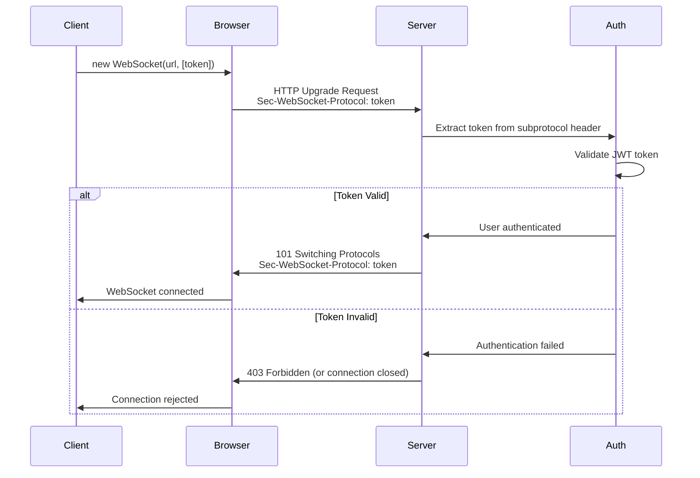
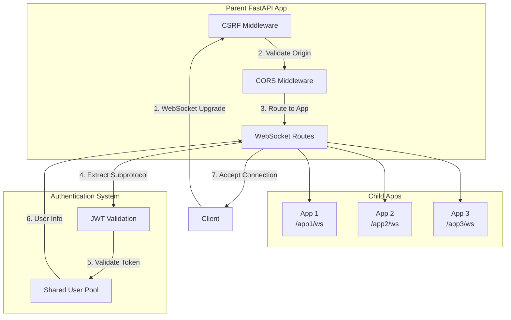

# WebSocket Security Guide: Multi-App SSO

Comprehensive security guide for WebSocket authentication in multi-app SSO deployments using MDB-Engine.

## Table of Contents

- [Security Overview](#security-overview)
- [Authentication Architecture](#authentication-architecture)
- [Implementation Guide](#implementation-guide)
- [Security Considerations](#security-considerations)
- [Common Security Pitfalls](#common-security-pitfalls)
- [Testing Security](#testing-security)
- [Production Deployment](#production-deployment)

---

## Security Overview

### Why Subprotocol Tunneling?

MDB-Engine uses **subprotocol tunneling** to securely pass JWT tokens via the `Sec-WebSocket-Protocol` header. This approach was chosen over alternatives for several security reasons:

#### Security Benefits

1. **Bypasses CSRF Issues**
   - Cookies trigger CSRF middleware validation
   - Subprotocol tokens don't rely on cookies
   - Reduces attack surface for CSRF attacks

2. **Avoids URL Logging Risks**
   - Query parameters (`?token=...`) get logged in:
     - Server access logs
     - Browser history
     - Referrer headers
     - Proxy logs
   - Subprotocol tokens are in headers, not URLs

3. **Browser-Native Support**
   - Uses standard WebSocket API
   - No custom headers needed (browsers don't allow custom headers)
   - Works with all modern browsers

4. **Secure Token Transmission**
   - Token sent via standard WebSocket protocol negotiation
   - Server validates **before** accepting connection
   - Failed authentication = no connection established

#### Comparison with Alternatives

| Method | CSRF Safe | URL Logging | Browser Support | Security Rating |
|--------|----------|-------------|-----------------|-----------------|
| **Subprotocol** ✅ | Yes | No risk | Native | ⭐⭐⭐⭐⭐ |
| Query Params ❌ | Yes | **High risk** | Native | ⭐⭐ |
| Cookies ❌ | **No** (triggers CSRF) | No risk | Native | ⭐⭐⭐ |
| Custom Headers ❌ | Yes | No risk | **Not supported** | ⭐ |

### Threat Model

#### Attack Vectors Mitigated

1. **CSRF Attacks**
   - **Threat**: Malicious site triggers WebSocket connection with user's cookies
   - **Mitigation**: Subprotocol tokens don't use cookies, CSRF middleware validates origins

2. **Token Theft via URL Logging**
   - **Threat**: Tokens in query params logged in server logs, browser history
   - **Mitigation**: Tokens in headers, not URLs

3. **Man-in-the-Middle (MITM)**
   - **Threat**: Intercept tokens during transmission
   - **Mitigation**: Use WSS (WebSocket Secure) in production, TLS encryption

4. **Token Replay**
   - **Threat**: Stolen token used to connect
   - **Mitigation**: JWT expiration, token refresh, short-lived tokens

5. **Origin Spoofing**
   - **Threat**: Malicious origin connects to WebSocket
   - **Mitigation**: CORS validation, CSRF middleware origin checks

---

## Authentication Architecture

### Subprotocol Tunneling Flow



### Multi-App SSO Integration



### CSRF Protection Mechanism

1. **Parent App CSRF Middleware**
   - Validates WebSocket upgrade request origins
   - Uses merged CORS config from all child apps
   - Rejects connections from unauthorized origins

2. **Origin Validation**
   - Checks `Origin` header against `allow_origins` list
   - Validates before connection is established
   - Prevents cross-origin attacks

3. **Subprotocol Authentication**
   - Token extracted from `Sec-WebSocket-Protocol` header
   - Validated **before** `accept()` is called
   - Failed auth = no connection established

### CORS Configuration Requirements

For subprotocol authentication to work securely:

```json
{
  "cors": {
    "enabled": true,
    "allow_origins": [
      "https://yourdomain.com",
      "https://app.yourdomain.com"
    ],
    "allow_credentials": true,
    "allow_methods": ["*"],
    "allow_headers": ["*"]
  }
}
```

**Important:**
- `allow_credentials: true` required for SSO (even though we don't use cookies for WebSocket auth)
- Use **specific origins** in production, not wildcards
- Include all frontend origins that need WebSocket access

---

## Implementation Guide

### Client-Side Implementation

#### JavaScript/TypeScript

```typescript
/**
 * Secure WebSocket connection with subprotocol authentication
 */
class SecureWebSocket {
  private ws: WebSocket | null = null;
  private url: string;
  private token: string;
  private reconnectAttempts = 0;
  private maxReconnectAttempts = 5;

  constructor(url: string, token: string) {
    this.url = url;
    this.token = token;
  }

  connect(): Promise<void> {
    return new Promise((resolve, reject) => {
      // Validate token before connecting
      if (!this.token || !this.isValidToken(this.token)) {
        reject(new Error('Invalid or missing token'));
        return;
      }

      try {
        // Pass token as subprotocol (second parameter)
        this.ws = new WebSocket(this.url, [this.token]);

        this.ws.onopen = () => {
          console.log('✅ WebSocket connected securely');
          this.reconnectAttempts = 0;
          resolve();
        };

        this.ws.onerror = (error) => {
          console.error('❌ WebSocket error:', error);
          reject(error);
        };

        this.ws.onclose = (event) => {
          if (event.code === 1008) {
            // Policy violation - likely auth failure
            console.error('Authentication failed - token may be invalid or expired');
          }
        };
      } catch (error) {
        reject(error);
      }
    });
  }

  private isValidToken(token: string): boolean {
    try {
      const parts = token.split('.');
      if (parts.length !== 3) return false;

      // Check expiration
      const payload = JSON.parse(atob(parts[1]));
      const expiresAt = payload.exp * 1000;
      return Date.now() < expiresAt;
    } catch {
      return false;
    }
  }

  send(data: any): void {
    if (this.ws && this.ws.readyState === WebSocket.OPEN) {
      this.ws.send(JSON.stringify(data));
    } else {
      throw new Error('WebSocket not connected');
    }
  }

  disconnect(): void {
    if (this.ws) {
      this.ws.close();
      this.ws = null;
    }
  }
}

// Usage
const token = getAuthToken(); // From your auth system
const ws = new SecureWebSocket('wss://api.example.com/app1/ws', token);
await ws.connect();
```

#### React Hook

```typescript
import { useEffect, useRef, useState, useCallback } from 'react';

interface UseSecureWebSocketOptions {
  url: string;
  token: string | null;
  enabled?: boolean;
  onMessage?: (data: any) => void;
  onError?: (error: Event) => void;
}

export function useSecureWebSocket(options: UseSecureWebSocketOptions) {
  const { url, token, enabled = true, onMessage, onError } = options;
  const [connected, setConnected] = useState(false);
  const wsRef = useRef<WebSocket | null>(null);

  const connect = useCallback(() => {
    if (!enabled || !token) {
      console.warn('WebSocket disabled or no token available');
      return;
    }

    // Validate token format
    const parts = token.split('.');
    if (parts.length !== 3) {
      console.error('Invalid token format');
      return;
    }

    try {
      // Pass token as subprotocol
      const ws = new WebSocket(url, [token]);
      wsRef.current = ws;

      ws.onopen = () => {
        setConnected(true);
      };

      ws.onmessage = (event) => {
        try {
          const data = JSON.parse(event.data);
          onMessage?.(data);
        } catch (err) {
          console.error('Failed to parse message:', err);
        }
      };

      ws.onerror = (error) => {
        console.error('WebSocket error:', error);
        onError?.(error);
        setConnected(false);
      };

      ws.onclose = () => {
        setConnected(false);
      };
    } catch (error) {
      console.error('Failed to create WebSocket:', error);
    }
  }, [url, token, enabled, onMessage, onError]);

  useEffect(() => {
    if (enabled && token) {
      connect();
    }
    return () => {
      if (wsRef.current) {
        wsRef.current.close();
      }
    };
  }, [connect, enabled, token]);

  const send = useCallback((data: any) => {
    if (wsRef.current && wsRef.current.readyState === WebSocket.OPEN) {
      wsRef.current.send(JSON.stringify(data));
    }
  }, []);

  return { connected, send };
}
```

### Server-Side Configuration

#### Manifest Configuration

```json
{
  "schema_version": "2.0",
  "slug": "my-app",
  "name": "My App",
  "auth": {
    "mode": "shared",
    "roles": ["viewer", "editor", "admin"],
    "require_role": "viewer"
  },
  "websockets": {
    "realtime": {
      "path": "/ws",
      "auth": {
        "required": true
      },
      "ping_interval": 30
    }
  },
  "cors": {
    "enabled": true,
    "allow_origins": [
      "https://yourdomain.com",
      "https://app.yourdomain.com"
    ],
    "allow_credentials": true,
    "allow_methods": ["*"],
    "allow_headers": ["*"]
  }
}
```

#### Multi-App Setup

```python
from pathlib import Path
from mdb_engine import MongoDBEngine
import os

# Initialize engine
engine = MongoDBEngine(
    mongo_uri=os.getenv("MONGODB_URI"),
    db_name=os.getenv("MONGODB_DB")
)

# Create multi-app with WebSocket support
app = engine.create_multi_app(
    apps=[
        {
            "slug": "my-app",
            "manifest": Path("./apps/my-app/manifest.json"),
            "path_prefix": "/my-app",
        }
    ],
    title="My Platform",
)

# WebSocket authentication happens automatically via subprotocol tunneling
# No additional code needed!
```

### Security Best Practices

#### Token Management

1. **Token Storage**
   ```typescript
   // ✅ GOOD: Secure storage
   // Use httpOnly cookies for HTTP requests
   // Use secure storage (sessionStorage/localStorage) for WebSocket tokens
   const token = sessionStorage.getItem('auth_token');
   
   // ❌ BAD: Exposed in global scope
   window.token = getToken();
   ```

2. **Token Refresh**
   ```typescript
   // Refresh token before expiration
   async function refreshTokenIfNeeded() {
     const token = getAuthToken();
     const payload = JSON.parse(atob(token.split('.')[1]));
     const expiresAt = payload.exp * 1000;
     const now = Date.now();
     
     // Refresh if expiring within 10 minutes
     if (expiresAt - now < 10 * 60 * 1000) {
       const newToken = await fetch('/auth/refresh', {
         method: 'POST',
         credentials: 'include'
       }).then(r => r.json());
       
       setAuthToken(newToken.token);
       return newToken.token;
     }
     
     return token;
   }
   ```

3. **Token Validation**
   ```typescript
   // Always validate token before connecting
   function isValidToken(token: string): boolean {
     try {
       const parts = token.split('.');
       if (parts.length !== 3) return false;
       
       const payload = JSON.parse(atob(parts[1]));
       
       // Check expiration
       if (payload.exp && Date.now() >= payload.exp * 1000) {
         return false;
       }
       
       return true;
     } catch {
       return false;
     }
   }
   ```

#### Connection Security

1. **Use WSS in Production**
   ```typescript
   // Always use secure WebSocket in production
   const protocol = window.location.protocol === 'https:' ? 'wss:' : 'ws:';
   const wsUrl = `${protocol}//${window.location.host}/app1/ws`;
   ```

2. **Validate Origins**
   - Server automatically validates origins via CORS
   - Client should verify connection is to expected domain
   ```typescript
   const expectedHost = 'api.yourdomain.com';
   const wsUrl = `wss://${expectedHost}/app1/ws`;
   // Browser will validate SSL certificate
   ```

3. **Handle Reconnection Securely**
   ```typescript
   ws.onclose = async (event) => {
     if (event.code === 1008) {
       // Auth failure - refresh token and reconnect
       const newToken = await refreshToken();
       if (newToken) {
         setTimeout(() => connect(newToken), 2000);
       }
     }
   };
   ```

---

## Security Considerations

### Token Storage and Transmission

#### Client-Side Storage

**Options:**
1. **sessionStorage** (Recommended for WebSocket tokens)
   - Cleared when tab closes
   - Not accessible to other tabs
   - Survives page refreshes

2. **localStorage**
   - Persists across sessions
   - Accessible to all tabs
   - Use for long-lived tokens

3. **Memory** (React state, Vue data)
   - Cleared on page reload
   - Most secure but least convenient

**Recommendation:** Use `sessionStorage` for WebSocket tokens, `httpOnly` cookies for HTTP requests.

#### Token Transmission

- ✅ **Subprotocol header** - Secure, not logged
- ❌ **Query parameters** - Logged in URLs
- ❌ **Cookies** - CSRF issues with WebSocket

### Origin Validation

#### Server-Side

MDB-Engine automatically validates origins:

1. **CORS Middleware** - Checks `Origin` header against `allow_origins`
2. **CSRF Middleware** - Validates WebSocket upgrade requests
3. **Merged CORS Config** - Uses parent app's merged config

#### Client-Side

```typescript
// Verify connection is to expected domain
const expectedDomain = 'api.yourdomain.com';
const wsUrl = `wss://${expectedDomain}/app1/ws`;

// Browser validates SSL certificate automatically
const ws = new WebSocket(wsUrl, [token]);
```

### CSRF Protection

#### How It Works

1. **Parent App CSRF Middleware**
   - Validates all WebSocket upgrade requests
   - Checks origin against merged CORS config
   - Rejects unauthorized origins

2. **Subprotocol Authentication**
   - Token in subprotocol header (not cookie)
   - Doesn't trigger cookie-based CSRF checks
   - Still protected by origin validation

#### Configuration

```json
{
  "cors": {
    "enabled": true,
    "allow_origins": [
      "https://yourdomain.com"
    ],
    "allow_credentials": true
  }
}
```

### CORS Configuration

#### Development

```json
{
  "cors": {
    "enabled": true,
    "allow_origins": ["*"],
    "allow_credentials": true
  }
}
```

**Note:** Wildcard origins are OK for development but **NOT for production**.

#### Production

```json
{
  "cors": {
    "enabled": true,
    "allow_origins": [
      "https://yourdomain.com",
      "https://app.yourdomain.com",
      "https://admin.yourdomain.com"
    ],
    "allow_credentials": true,
    "allow_methods": ["GET", "POST", "PUT", "DELETE", "PATCH"],
    "allow_headers": ["Content-Type", "Authorization"],
    "max_age": 3600
  }
}
```

### Token Expiration Handling

#### Proactive Refresh

```typescript
// Refresh token before expiration
setInterval(async () => {
  const token = getAuthToken();
  const payload = JSON.parse(atob(token.split('.')[1]));
  const expiresAt = payload.exp * 1000;
  const now = Date.now();
  
  // Refresh if expiring within 10 minutes
  if (expiresAt - now < 10 * 60 * 1000) {
    await refreshToken();
    // Reconnect WebSocket with new token if connected
    if (ws && ws.readyState === WebSocket.OPEN) {
      ws.close(); // Triggers reconnection with new token
    }
  }
}, 60000); // Check every minute
```

#### Reactive Refresh

```typescript
ws.onclose = async (event) => {
  if (event.code === 1008) {
    // Authentication failure - likely expired token
    const newToken = await refreshToken();
    if (newToken) {
      setTimeout(() => connectWebSocket(newToken), 2000);
    }
  }
};
```

### Reconnection Security

#### Secure Reconnection Pattern

```typescript
class SecureWebSocketManager {
  private ws: WebSocket | null = null;
  private url: string;
  private getToken: () => string | null;
  private reconnectAttempts = 0;
  private maxAttempts = 5;

  constructor(url: string, getToken: () => string | null) {
    this.url = url;
    this.getToken = getToken;
  }

  async connect(): Promise<void> {
    const token = this.getToken();
    if (!token) {
      throw new Error('No token available');
    }

    // Validate token before connecting
    if (!this.isValidToken(token)) {
      // Try to refresh
      const newToken = await this.refreshToken();
      if (!newToken) {
        throw new Error('Failed to obtain valid token');
      }
      return this.connectWithToken(newToken);
    }

    return this.connectWithToken(token);
  }

  private async connectWithToken(token: string): Promise<void> {
    return new Promise((resolve, reject) => {
      try {
        this.ws = new WebSocket(this.url, [token]);

        this.ws.onopen = () => {
          this.reconnectAttempts = 0;
          resolve();
        };

        this.ws.onerror = reject;

        this.ws.onclose = async (event) => {
          if (event.code === 1008 && this.reconnectAttempts < this.maxAttempts) {
            // Auth failure - refresh and retry
            this.reconnectAttempts++;
            const newToken = await this.refreshToken();
            if (newToken) {
              setTimeout(() => this.connectWithToken(newToken), 2000);
            }
          }
        };
      } catch (error) {
        reject(error);
      }
    });
  }

  private isValidToken(token: string): boolean {
    // Implementation from earlier
    return true; // Simplified
  }

  private async refreshToken(): Promise<string | null> {
    // Implement token refresh
    return null; // Simplified
  }
}
```

---

## Common Security Pitfalls

### What NOT to Do

#### ❌ Pitfall 1: Tokens in URL Query Params

```javascript
// ❌ WRONG: Token in URL (logged everywhere)
const ws = new WebSocket(`wss://api.example.com/ws?token=${token}`);
```

**Why it's bad:**
- Tokens logged in server access logs
- Tokens in browser history
- Tokens in referrer headers
- Tokens exposed in error messages

**Fix:**
```javascript
// ✅ CORRECT: Token as subprotocol
const ws = new WebSocket('wss://api.example.com/ws', [token]);
```

#### ❌ Pitfall 2: Relying on Cookies for WebSocket Auth

```javascript
// ❌ WRONG: Cookie-based auth triggers CSRF issues
const ws = new WebSocket('wss://api.example.com/ws');
// Cookie sent automatically, but CSRF middleware may reject
```

**Why it's bad:**
- CSRF middleware validates cookies
- Can cause connection rejections
- Less secure than subprotocol tunneling

**Fix:**
```javascript
// ✅ CORRECT: Subprotocol authentication
const token = getAuthToken();
const ws = new WebSocket('wss://api.example.com/ws', [token]);
```

#### ❌ Pitfall 3: Accepting Connection Before Authentication

```python
# ❌ WRONG: Accept before validating
@websocket_endpoint("/ws")
async def handler(websocket: WebSocket):
    await websocket.accept()  # ❌ Too early!
    token = extract_token(websocket)
    if not validate_token(token):
        await websocket.close()  # Too late!
```

**Why it's bad:**
- Connection established before auth
- Security vulnerability
- Can't properly reject unauthenticated connections

**Fix:**
```python
# ✅ CORRECT: Authenticate before accepting
# MDB-Engine does this automatically!
# authenticate_websocket() is called BEFORE accept()
```

#### ❌ Pitfall 4: Wildcard CORS in Production

```json
{
  "cors": {
    "allow_origins": ["*"]  // ❌ WRONG for production
  }
}
```

**Why it's bad:**
- Allows any origin to connect
- Security risk
- Violates CORS best practices

**Fix:**
```json
{
  "cors": {
    "allow_origins": [
      "https://yourdomain.com",
      "https://app.yourdomain.com"
    ]  // ✅ CORRECT: Specific origins
  }
}
```

#### ❌ Pitfall 5: Not Validating Token Expiration

```javascript
// ❌ WRONG: No expiration check
const ws = new WebSocket(url, [token]);
// Token might be expired!
```

**Why it's bad:**
- Expired tokens cause connection failures
- Poor user experience
- Security risk if tokens are long-lived

**Fix:**
```javascript
// ✅ CORRECT: Validate before connecting
const token = getAuthToken();
if (isTokenExpired(token)) {
  await refreshToken();
}
const ws = new WebSocket(url, [getAuthToken()]);
```

### Common Mistakes and Fixes

#### Mistake: Token Not Available When Connecting

**Problem:**
```javascript
// Token might be null/undefined
const ws = new WebSocket(url, [token]);
```

**Fix:**
```javascript
const token = getAuthToken();
if (!token) {
  console.error('No token - redirect to login');
  redirectToLogin();
  return;
}
const ws = new WebSocket(url, [token]);
```

#### Mistake: Not Handling Authentication Failures

**Problem:**
```javascript
const ws = new WebSocket(url, [token]);
ws.onclose = () => {
  // No handling of auth failures
};
```

**Fix:**
```javascript
ws.onclose = async (event) => {
  if (event.code === 1008) {
    // Auth failure - refresh token and reconnect
    await refreshToken();
    setTimeout(() => connectWebSocket(), 2000);
  }
};
```

#### Mistake: Exposing Tokens in Client Code

**Problem:**
```javascript
// Token in global scope or console logs
console.log('Token:', token);  // ❌ Exposed!
window.token = token;  // ❌ Exposed!
```

**Fix:**
```javascript
// Keep tokens in secure storage
sessionStorage.setItem('auth_token', token);
// Never log or expose tokens
```

---

## Testing Security

### How to Test WebSocket Security

#### Unit Tests

Test authentication logic:

```python
import pytest
from mdb_engine.routing.websockets import authenticate_websocket

async def test_subprotocol_authentication_success():
    """Test successful authentication via subprotocol."""
    mock_ws = create_mock_websocket()
    mock_ws.headers = {"sec-websocket-protocol": valid_token}
    
    user_id, user_email = await authenticate_websocket(mock_ws, "app1", True)
    
    assert user_id is not None
    assert user_email is not None

async def test_subprotocol_authentication_failure():
    """Test authentication failure with invalid token."""
    mock_ws = create_mock_websocket()
    mock_ws.headers = {"sec-websocket-protocol": "invalid-token"}
    
    with pytest.raises(jwt.InvalidTokenError):
        await authenticate_websocket(mock_ws, "app1", True)
```

#### Integration Tests

Test end-to-end security:

```python
async def test_websocket_origin_validation():
    """Test that unauthorized origins are rejected."""
    # Connect from unauthorized origin
    # Should be rejected by CSRF middleware
    pass

async def test_websocket_token_expiration():
    """Test that expired tokens are rejected."""
    expired_token = create_expired_token()
    # Connection should fail
    pass
```

### Security Test Checklist

- [ ] **Token Validation**
  - [ ] Valid tokens accepted
  - [ ] Invalid tokens rejected
  - [ ] Expired tokens rejected
  - [ ] Malformed tokens rejected

- [ ] **Origin Validation**
  - [ ] Authorized origins accepted
  - [ ] Unauthorized origins rejected
  - [ ] Wildcard origins handled correctly

- [ ] **CSRF Protection**
  - [ ] CSRF middleware active
  - [ ] Origin validation works
  - [ ] Subprotocol auth bypasses cookie CSRF

- [ ] **Token Security**
  - [ ] Tokens not in URLs
  - [ ] Tokens not logged
  - [ ] Tokens not exposed in errors

- [ ] **Connection Security**
  - [ ] WSS used in production
  - [ ] SSL certificates validated
  - [ ] Connection encrypted

### Penetration Testing Considerations

#### Test Scenarios

1. **Token Theft**
   - Attempt to extract tokens from network traffic
   - Verify tokens not in URLs or logs
   - Test token replay attacks

2. **Origin Spoofing**
   - Attempt connections from unauthorized origins
   - Verify CORS/CSRF protection works
   - Test with various origin headers

3. **Token Manipulation**
   - Attempt to modify token payload
   - Verify signature validation
   - Test with expired tokens

4. **Connection Hijacking**
   - Attempt MITM attacks
   - Verify WSS encryption
   - Test certificate validation

---

## Production Deployment

### Security Checklist

#### Pre-Deployment

- [ ] **CORS Configuration**
  - [ ] Specific origins (no wildcards)
  - [ ] `allow_credentials: true` set
  - [ ] Production domains included

- [ ] **SSL/TLS**
  - [ ] WSS (WebSocket Secure) enabled
  - [ ] Valid SSL certificates
  - [ ] Certificate chain complete

- [ ] **Token Management**
  - [ ] Short token expiration (1 hour or less)
  - [ ] Token refresh implemented
  - [ ] Secure token storage

- [ ] **Monitoring**
  - [ ] Authentication failures logged
  - [ ] Connection attempts monitored
  - [ ] Error alerts configured

#### Runtime Security

- [ ] **Logging**
  - [ ] No tokens in logs
  - [ ] Authentication events logged
  - [ ] Security events monitored

- [ ] **Rate Limiting**
  - [ ] Connection rate limits
  - [ ] Authentication attempt limits
  - [ ] DDoS protection

- [ ] **Error Handling**
  - [ ] Generic error messages (no token details)
  - [ ] Proper error codes
  - [ ] No stack traces exposed

### Monitoring and Alerting

#### Key Metrics

1. **Authentication Failures**
   - Track failed WebSocket authentications
   - Alert on spike in failures
   - Monitor for brute force attempts

2. **Connection Patterns**
   - Monitor connection rates
   - Track origin distribution
   - Alert on anomalies

3. **Token Expiration**
   - Track token refresh rates
   - Monitor expiration handling
   - Alert on refresh failures

#### Alert Configuration

```python
# Example: Alert on auth failure spike
if auth_failures_per_minute > threshold:
    send_alert("High WebSocket auth failure rate detected")
```

### Incident Response

#### If Token Compromised

1. **Immediate Actions**
   - Revoke compromised tokens
   - Force token refresh for all users
   - Monitor for unauthorized access

2. **Investigation**
   - Review access logs
   - Identify compromise vector
   - Assess impact

3. **Remediation**
   - Rotate JWT secret
   - Update security measures
   - Notify affected users

#### If Origin Spoofing Detected

1. **Immediate Actions**
   - Review CORS configuration
   - Verify origin validation
   - Block suspicious origins

2. **Investigation**
   - Analyze connection patterns
   - Identify attack source
   - Review CSRF middleware logs

3. **Remediation**
   - Tighten CORS rules
   - Update security policies
   - Implement additional validation

---

## Summary

### Key Security Principles

1. ✅ **Use Subprotocol Tunneling** - Secure, browser-native token transmission
2. ✅ **Validate Before Accept** - Authenticate before establishing connection
3. ✅ **Protect Origins** - Use specific CORS origins, validate all connections
4. ✅ **Manage Tokens Securely** - Short expiration, secure storage, proactive refresh
5. ✅ **Monitor and Alert** - Track security events, respond to incidents

### Quick Reference

**Client:**
```javascript
const token = getAuthToken();
const ws = new WebSocket(url, [token]);
```

**Server:**
```json
{
  "websockets": {
    "endpoint": {
      "path": "/ws",
      "auth": {"required": true}
    }
  },
  "cors": {
    "enabled": true,
    "allow_origins": ["https://yourdomain.com"],
    "allow_credentials": true
  }
}
```

**Security:**
- ✅ Subprotocol authentication
- ✅ Origin validation
- ✅ CSRF protection
- ✅ Token expiration
- ✅ Secure transmission (WSS)

---

**Related Documentation:**
- [WebSocket + SSO Multi-App Guide](./WEBSOCKET_SSO_MULTI_APP.md)
- [WebSocket Troubleshooting Guide](./WEBSOCKET_TROUBLESHOOTING.md)
- [SSO Multi-App Setup Guide](./SSO_MULTI_APP_SETUP.md)
