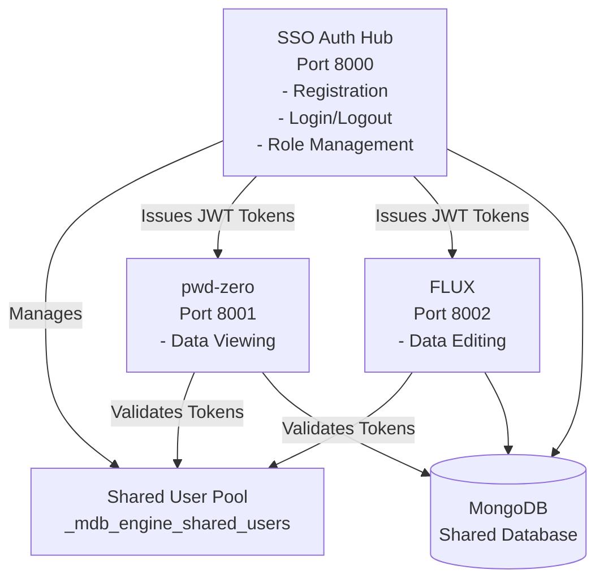

# SSO Multi-App: SSO Authentication Example

A complete working example demonstrating Single Sign-On (SSO) architecture where one central auth hub manages user authentication and two SSO-enabled apps validate tokens automatically.

**NEW**: This example now supports **multi-app mounting** - deploy all apps under a single FastAPI instance perfect for Render.com single-service deployments!

## Architecture Overview



## Features

- **Auth Hub**: Handles user registration, login, logout, and role management
- **SSO Apps**: Validate tokens automatically via SSO middleware
- **Shared Authentication**: All apps use the same JWT secret and user pool
- **Role-Based Access**: Different roles (viewer, editor, admin) control access
- **SSO**: Login once, access all apps automatically
- **Per-App Roles**: Users can have different roles in different apps

## Quick Start

### Prerequisites

- Docker and Docker Compose (for multi-container setup)
- Python 3.11+ (for local development)
- MongoDB (local or Atlas)

### Running with Multi-App Mounting (Recommended for Single Deployment) 🆕

For **single-service deployments** (Render.com, Railway, Heroku), use the new multi-app mounting:

```bash
cd examples/advanced/sso-multi-app/apps
uvicorn multi_app_main:app --host 0.0.0.0 --port 8000 --reload
```

**Access all apps on single port:**
- Auth Hub: http://localhost:8000/auth-hub
- pwd-zero: http://localhost:8000/pwd-zero
- FLUX: http://localhost:8000/flux
- Health: http://localhost:8000/health

**Benefits:**
- Single FastAPI instance
- Single port (perfect for Render.com)
- Shared engine and connection pool
- SSO works seamlessly

### Running with Docker Compose

1. **Clone and navigate to the example:**

```bash
cd examples/advanced/sso-multi-app
```

2. **Copy environment variables:**

```bash
cp .env.example .env
```

3. **Start all services:**

```bash
docker-compose up --build
```

4. **Access the apps:**

- **Auth Hub**: http://localhost:8000
- **pwd-zero**: http://localhost:8001
- **FLUX**: http://localhost:8002

### Running with Multi-App Mounting (Single FastAPI Instance) 🆕

For **single-deployment scenarios** (e.g., Render.com, Railway), use `create_multi_app()` to mount all apps under a single FastAPI instance:

1. **Using programmatic configuration:**

```python
# See apps/multi_app_main.py
from mdb_engine import MongoDBEngine
from pathlib import Path

engine = MongoDBEngine(mongo_uri=..., db_name=...)
app = engine.create_multi_app(
    apps=[
        {"slug": "auth-hub", "manifest": Path("./apps/auth-hub/manifest.json"), "path_prefix": "/auth-hub"},
        {"slug": "pwd-zero", "manifest": Path("./apps/sso-app-1/manifest.json"), "path_prefix": "/pwd-zero"},
        {"slug": "flux", "manifest": Path("./apps/sso-app-2/manifest.json"), "path_prefix": "/flux"}
    ]
)
```

2. **Using manifest-based configuration:**

```python
# See multi_app_manifest.json
app = engine.create_multi_app(
    multi_app_manifest=Path("./multi_app_manifest.json")
)
```

3. **Run the multi-app:**

```bash
cd apps
uvicorn multi_app_main:app --host 0.0.0.0 --port 8000
```

4. **Access all apps on single port:**

- **Auth Hub**: http://localhost:8000/auth-hub
- **pwd-zero**: http://localhost:8000/pwd-zero
- **FLUX**: http://localhost:8000/flux
- **Health Check**: http://localhost:8000/health

**Benefits of Multi-App Mounting:**
- ✅ Single FastAPI instance (perfect for Render.com single service)
- ✅ Single port (no need for multiple ports)
- ✅ Shared engine and connection pool (resource efficient)
- ✅ SSO works seamlessly across mounted apps
- ✅ Unified health check endpoint
- ✅ Easy deployment (single service, single URL)

**Perfect For:**
- Render.com deployments (single service)
- Railway deployments
- Heroku deployments
- Any platform requiring single-service deployment
- Development environments (simpler setup)

### Running with Bundled Dockerfile (Single Container)

For simplified deployment, you can run all apps in a single container:

1. **Start bundled services:**

```bash
docker-compose -f docker-compose.bundled.yml up --build
```

2. **Access the apps** (same URLs as above)

**Benefits of Bundled Approach:**
- Single container instead of 4 separate containers
- Reduced resource usage (~1GB vs ~2GB)
- Simplified deployment and monitoring
- Same functionality as multi-container setup

**When to Use:**
- Development and testing environments
- Small to medium deployments
- When resource efficiency is important
- When you don't need independent scaling of apps

**When to Use Multi-Container:**
- Production environments requiring independent scaling
- When apps need different resource limits
- When you need to update apps independently

## Usage Flow

### 1. Register a User

1. Visit http://localhost:8000/register
2. Enter email and password
3. Click "Register"
4. You'll be automatically logged in and redirected to the dashboard

### 2. Access SSO Apps

After logging in on the auth hub:

1. Visit any SSO app (e.g., http://localhost:8001)
2. You'll be automatically authenticated via SSO
3. No need to login again!

### 3. Manage Roles (Admin Only)

1. Login as admin on auth hub
2. Go to Dashboard
3. View all users and their roles
4. Grant/revoke access to SSO apps

## App Descriptions

### Auth Hub (Port 8000)

- **Registration**: Create new user accounts
- **Login/Logout**: Authenticate users and issue JWT tokens
- **Dashboard**: View users and manage roles
- **Role Management**: Grant/revoke access to SSO apps

### pwd-zero (Port 8001)

- **Functionality**: Data viewing/listing
- **Required Role**: `viewer` (default)
- **Features**: View data, read-only operations

### FLUX (Port 8002)

- **Functionality**: Data editing
- **Required Role**: `viewer` (to access), `editor` or `admin` (to edit)
- **Features**: Create, read, update data

## Configuration

### Environment Variables

All apps share these critical environment variables:

- `MONGODB_URI`: MongoDB connection string
- `MONGODB_DB`: Database name (must be same for all apps)
- `MDB_ENGINE_JWT_SECRET`: JWT secret (must be same for all apps for SSO to work)
  - **Development**: Default secret provided in docker-compose.yml for local testing
  - **Production**: **MUST** be set via environment variable (default is INSECURE for production!)
  - Generate a strong secret: `python -c 'import secrets; print(secrets.token_urlsafe(32))'`
  - **SECURITY**: Never use default values in production! Always set a unique, strong secret.
- `ENVIRONMENT`: Set to `"production"` for production deployments (enables secure cookies)
- `SECURE_COOKIES`: Set to `"true"` to force secure cookies even in development (requires HTTPS)

**Setting JWT Secret for Production:**

```bash
# Generate a secure secret
python -c 'import secrets; print(secrets.token_urlsafe(32))'

# Export before running docker-compose
export MDB_ENGINE_JWT_SECRET="your-generated-secret-here"

# Or create a .env file (DO NOT commit to git!)
echo "MDB_ENGINE_JWT_SECRET=your-generated-secret-here" > .env
```

See `.env.example` for all available options.

### Manifest Configuration

Each app has a `manifest.json` file that configures:

- **Auth mode**: `"mode": "shared"` enables SSO
- **Auth hub URL**: `"auth_hub_url": "http://localhost:8000"` - URL of the authentication hub for redirecting unauthenticated users. Can be overridden via `AUTH_HUB_URL` environment variable
- **Roles**: Available roles for the app
- **Required role**: Minimum role needed to access
- **Public routes**: Routes that don't require authentication

**Example manifest.json for SSO apps:**
```json
{
  "auth": {
    "mode": "shared",
    "auth_hub_url": "http://localhost:8000",
    "roles": ["viewer", "editor", "admin"],
    "require_role": "viewer",
    "public_routes": ["/health", "/auth/callback"]
  }
}
```

**Configuration Priority**:
1. `manifest.auth.auth_hub_url` (declarative, versioned)
2. `AUTH_HUB_URL` environment variable (runtime override)
3. Default: `http://localhost:8000` (fallback)

## Architecture Details

### SSO Authentication Flow

1. **User registers/logs in** on auth hub
2. **Auth hub authenticates** via `SharedUserPool`
3. **JWT token issued** and stored in cookie
4. **SSO apps validate token** automatically via `SharedAuthMiddleware`
5. **User can access** all authorized SSO apps

### Token Validation

- Tokens are validated on every request by `SharedAuthMiddleware`
- User info is available via `request.state.user`
- Roles are checked per-app from `user.app_roles[app_slug]`

### Role Management

- Roles are stored per-app in `app_roles` field
- Auth hub can update roles via API endpoints
- Roles are checked by each SSO app independently

## Security Considerations

1. **Shared JWT Secret**: All apps must use the same `MDB_ENGINE_JWT_SECRET`
2. **Secure Cookies**: Tokens stored in HttpOnly cookies
3. **Role Validation**: Each app validates roles independently
4. **Token Revocation**: Logout revokes tokens across all apps
5. **HTTPS**: Use HTTPS in production (set `secure=True` in cookies)

## Development

### Running with Multi-App Mounting (Recommended) 🆕

**Single FastAPI instance - perfect for Render.com:**

1. **Install dependencies:**

```bash
pip install -e ".[casbin]"
pip install uvicorn fastapi jinja2 python-multipart
```

2. **Set environment variables:**

```bash
export MONGODB_URI="mongodb://localhost:27017"
export MONGODB_DB="oblivio_apps"
export MDB_ENGINE_JWT_SECRET="your-secret-key"
```

3. **Start MongoDB:**

```bash
docker run -d -p 27017:27017 --name mongodb mongo:7
```

4. **Run multi-app (single instance):**

```bash
cd apps
uvicorn multi_app_main:app --host 0.0.0.0 --port 8000 --reload
```

**Access all apps:**
- Auth Hub: http://localhost:8000/auth-hub
- pwd-zero: http://localhost:8000/pwd-zero
- FLUX: http://localhost:8000/flux
- Health: http://localhost:8000/health

### Running Locally (without Docker) - Separate Instances

For development/testing with separate instances:

1. **Install dependencies:**

```bash
pip install -e ".[casbin]"
pip install uvicorn fastapi jinja2 python-multipart
```

2. **Set environment variables:**

```bash
export MONGODB_URI="mongodb://localhost:27017"
export MONGODB_DB="oblivio_apps"
export MDB_ENGINE_JWT_SECRET="your-secret-key"
```

3. **Start MongoDB:**

```bash
docker run -d -p 27017:27017 --name mongodb mongo:7
```

4. **Run each app separately:**

```bash
# Terminal 1 - Auth Hub
cd apps/auth-hub
python web.py

# Terminal 2 - pwd-zero
cd apps/sso-app-1
python web.py

# Terminal 3 - FLUX
cd apps/sso-app-2
python web.py
```

## Testing the Setup

1. **Start services**: `docker-compose up`
2. **Register user**: Visit http://localhost:8000/register
3. **Login**: Visit http://localhost:8000/login
4. **Access SSO apps**:
   - http://localhost:8001 (should auto-authenticate)
   - http://localhost:8002 (requires admin role)
5. **Manage roles**: Visit http://localhost:8000/dashboard (admin only)

## Troubleshooting

### SSO Not Working

- **Check JWT secret**: All apps must use the same `MDB_ENGINE_JWT_SECRET`
- **Check database**: All apps must use the same `MONGODB_DB`
- **Check cookies**: Ensure cookies are set with correct domain (localhost for local dev)

### Can't Access SSO Apps

- **Check roles**: User must have appropriate role for the app
- **Check manifest**: Verify `require_role` in manifest.json
- **Check logs**: Check container logs for authentication errors

### Role Management Not Working

- **Check admin access**: Only admins can manage roles
- **Check API endpoints**: Verify `/api/users/{email}/roles/{app_slug}` endpoint
- **Check database**: Verify user exists in `_mdb_engine_shared_users` collection

## Comparison with Other Auth Modes

| Feature | `mode: "app"` | `mode: "shared"` (This Example) |
|---------|---------------|----------------------------------|
| User Storage | Per-app collection | Shared collection |
| Login | Per-app | SSO across apps |
| Tokens | App-specific | Shared JWT |
| Roles | N/A | Per-app roles |
| Use Case | Isolated apps | Platform apps |

## Security Configuration

### Production Security Checklist

Before deploying to production, ensure the following security measures are in place:

#### Critical Security Requirements

- [ ] **JWT Secret**: Set `MDB_ENGINE_JWT_SECRET` to a strong, randomly generated secret (32+ bytes)
  - Generate: `python -c 'import secrets; print(secrets.token_urlsafe(32))'`
  - Never use default values or commit secrets to version control
- [ ] **Environment**: Set `ENVIRONMENT=production` to enable secure cookie settings
- [ ] **HTTPS**: Ensure all traffic uses HTTPS (required for secure cookies)
- [ ] **Secure Cookies**: Cookies automatically use `secure=True` and `samesite=strict` in production
- [ ] **CORS**: Verify CORS origins are restricted to your production domains
- [ ] **CSRF Protection**: Enabled by default in shared auth mode (verify in manifest.json)
- [ ] **Master Key**: Set `MDB_ENGINE_MASTER_KEY` for app secret encryption (if using app-level auth)

#### Security Features Enabled

✅ **Cookie Security**: HttpOnly, Secure (production), SameSite=Strict (production)  
✅ **CSRF Protection**: Double-submit cookie pattern (auto-enabled for shared auth)  
✅ **CORS Restrictions**: Specific methods and headers (not wildcards)  
✅ **Token Validation**: JWT format validation before processing  
✅ **Input Validation**: Token length and structure checks  
✅ **Error Sanitization**: Generic error messages prevent information leakage  
✅ **Per-User Encryption Salts**: Enhanced encryption security (sso-app-1)  

#### Development vs Production

| Setting | Development | Production |
|---------|-------------|------------|
| Cookie `secure` | `false` | `true` (auto) |
| Cookie `samesite` | `lax` | `strict` (auto) |
| JWT Secret | Can use default | **MUST** be set |
| HTTPS | Optional | **REQUIRED** |
| Error Messages | Detailed | Generic |

#### Security Configuration in Manifests

All apps have CSRF protection configured:

```json
{
  "auth": {
    "mode": "shared",
    "csrf_protection": {
      "enabled": true,
      "exempt_routes": ["/health", "/auth/callback"],
      "token_ttl": 3600
    }
  }
}
```

CORS is restricted to specific methods and headers:

```json
{
  "cors": {
    "allow_methods": ["GET", "POST", "PUT", "DELETE", "OPTIONS"],
    "allow_headers": ["Content-Type", "Authorization", "X-CSRF-Token"]
  }
}
```

### Generating Secure Secrets

**JWT Secret:**
```bash
python -c 'import secrets; print(secrets.token_urlsafe(32))'
```

**Master Key (for app-level authentication):**
```bash
python -c 'from mdb_engine.core.encryption import EnvelopeEncryptionService; print(EnvelopeEncryptionService.generate_master_key())'
```

## Render.com Deployment

For **single-service deployment on Render.com**, use the multi-app mounting approach:

1. **Set build command:**
   ```bash
   pip install -e ".[casbin]" && pip install uvicorn fastapi jinja2 python-multipart
   ```

2. **Set start command:**
   ```bash
   cd examples/advanced/sso-multi-app/apps && uvicorn multi_app_main:app --host 0.0.0.0 --port $PORT
   ```

3. **Set environment variables:**
   - `MONGODB_URI` - Your MongoDB connection string
   - `MONGODB_DB` - Database name
   - `MDB_ENGINE_JWT_SECRET` - JWT secret (same for all apps)
     - **Required for production**: Generate with `python -c 'import secrets; print(secrets.token_urlsafe(32))'`
     - Development uses insecure default (DO NOT use in production!)

4. **Deploy!** All apps accessible under one URL with path prefixes.

## AI Chat with Memory Encryption (CSFLE)

The **AI Chat** app (`sso-app-3`) demonstrates **Client-Side Field Level Encryption (CSFLE)** for memory content. This ensures sensitive user memories are encrypted at rest in MongoDB.

### Zero-Config Encryption (Docker)

When running with Docker Compose, CSFLE **just works**:

1. The encryption key is **auto-generated** on first startup
2. The key is **persisted** in the `csfle_keys` Docker volume
3. Data remains readable across container restarts

```bash
docker-compose up ai-chat
# That's it! Memory content is encrypted automatically.
```

### Enabling Memory Encryption

Memory encryption is enabled with a single line in `manifest.json`:

```json
{
  "memory_config": {
    "enabled": true,
    "encrypted": true
  }
}
```

### What Gets Encrypted

- **Encrypted fields**: `content`, `text` (memory content)
- **Queryable fields** (NOT encrypted): `user_id`, `session_id`, `created_at`, `importance`, `embedding`, `category`

### How Auto-Key Generation Works

The Docker entrypoint script (`docker-entrypoint.sh`) handles key management:

1. **First run**: Generates a 96-byte master key and saves it to `/data/csfle/.local_master_key`
2. **Subsequent runs**: Loads the existing key from the persisted volume
3. **Manual override**: Set `MDB_CSFLE_LOCAL_KEY` environment variable to use your own key

The key is stored in the `csfle_keys` Docker volume, which persists across container restarts.

### Viewing/Backing Up the Key

```bash
# View the auto-generated key
docker exec ai_chat cat /data/csfle/.local_master_key

# Back up the key (IMPORTANT for production!)
docker exec ai_chat cat /data/csfle/.local_master_key > csfle_backup.key
```

### Using a Custom Key

If you want to use your own key instead of auto-generation:

```bash
# Generate a key
python -c 'from mdb_engine.core.csfle import generate_local_master_key; print(generate_local_master_key())'

# Set in environment before starting
export MDB_CSFLE_LOCAL_KEY=<your-key>
docker-compose up ai-chat
```

### Production KMS Providers

For production, use cloud KMS instead of local keys:

```json
{
  "memory_config": {
    "encrypted": true,
    "encryption": {
      "kms_provider": "aws"
    }
  }
}
```

Environment variables for AWS KMS:
```bash
AWS_ACCESS_KEY_ID=...
AWS_SECRET_ACCESS_KEY=...
AWS_KMS_KEY_ARN=arn:aws:kms:us-east-1:...
```

See [CSFLE Setup Guide](../../../docs/guides/CSFLE_SETUP.md) for detailed documentation.

## AI Chat with Context Engineering

The **AI Chat** app (`sso-app-3`) also demonstrates **Context Engineering** - an advanced memory service feature that dynamically constructs optimal LLM context using multiple memory layers.

### What is Context Engineering?

Context Engineering is the architectural discipline of constructing the "present moment" for an LLM. It optimizes context assembly by combining:

- **Persona Layer**: System instructions from PersonaEngine (role, description, traits)
- **Entity Memory**: Extracted facts (Name, OS, Language, Expertise) from user memories
- **Dynamic Persona**: Adaptive instructions based on user expertise and emotion
- **Short-Term Memory (STM)**: Recent chat history with sliding window optimization
- **Long-Term Memory (LTM)**: Semantic vector search results
- **Graph Context**: Knowledge graph data (if enabled)

### Context Engineering Features

The AI Chat app uses Context Engineering to:

1. **Automatically build system prompts** from persona configuration in `manifest.json`
2. **Extract entity facts** (Name, OS, Language, Expertise) from biographical and preference memories
3. **Adapt persona dynamically** based on user expertise level and emotional context
4. **Optimize token usage** with sliding window + summary pattern for STM
5. **Display Context Engineering metadata** in the UI (persona, entity facts, dynamic instructions)

### Configuration

Context Engineering is enabled in `CognitiveEngine` initialization:

```python
cognitive_engine = CognitiveEngine(
    app_slug=APP_SLUG,
    memory_service=memory_service,
    chat_history_collection=chat_history_collection,
    # Context Engineering configuration
    enable_context_engineering=True,
    stm_raw_window=5,  # Keep last 5 messages raw, summarize older ones
    enable_entity_extraction=True,
    enable_dynamic_persona=True,
)
```

### Persona Configuration

The persona is configured in `manifest.json`:

```json
{
  "memory_config": {
    "persona": {
      "enabled": true,
      "default_role": "Orby - AI Assistant",
      "default_description": "Orby is an intelligent AI assistant...",
      "default_traits": {
        "technical_focus": 0.6,
        "humor": 0.3,
        "formality": 0.6,
        "empathy": 0.7,
        "creativity": 0.5
      }
    }
  }
}
```

### UI Features

The AI Chat UI displays Context Engineering metadata in a dedicated panel:

- **🎭 Persona**: Shows current persona role and description
- **📋 Entity Facts**: Displays extracted facts (Name, OS, Language, Expertise)
- **⚙️ Dynamic Instructions**: Shows persona adaptation instructions (collapsible)
- **📝 STM Summary**: Displays summary of older chat history (collapsible)

### Example Usage

1. **Start chatting** with the AI Chat app
2. **View Context Engineering panel** in the sidebar to see how context is being built
3. **Watch persona adapt** as you reveal expertise level or emotional state
4. **See entity facts** extracted from your conversations
5. **Observe STM optimization** as chat history grows

### Benefits

- **Better responses**: Context-engineered prompts provide more relevant, personalized responses
- **Token efficiency**: Sliding window + summary pattern optimizes token usage
- **Dynamic adaptation**: Persona adjusts based on user context
- **Transparency**: UI shows exactly how context is being constructed
- **Automatic**: No manual prompt engineering required

### See Also

- [Context Engineering Documentation](../../../docs/CONTEXT_ENGINEERING.md) - Comprehensive guide
- [Memory Service Documentation](../../../docs/MEMORY_SERVICE.md) - Memory service overview
- [Cognitive Architecture](../../../docs/COGNITIVE_ARCHITECTURE.md) - STM + LTM architecture

## Related Examples

- [Multi-App Shared](../multi_app_shared/README.md) - Similar SSO example
- [Multi-App](../multi_app/README.md) - Cross-app data access
- [Simple App](../simple_app/README.md) - Basic app setup

## File Structure

```
sso-multi-app/
├── README.md                    # This file
├── docker-compose.yml           # Multi-container orchestration
├── docker-compose.bundled.yml   # Single-container orchestration
├── Dockerfile                   # Multi-container build (with CSFLE support)
├── Dockerfile.bundled           # Single-container build
├── docker-entrypoint.sh         # Entrypoint for CSFLE key auto-generation
├── start-all-apps.py            # Bundled startup script
├── multi_app_manifest.json      # Multi-app manifest (NEW)
├── .env.example                 # Environment template
└── apps/
    ├── multi_app_main.py         # Multi-app main file (NEW)
    ├── shared_security.py        # Shared security utilities
    ├── auth-hub/                # Auth hub (central authentication)
    │   ├── manifest.json
    │   ├── web.py
    │   └── templates/
    ├── sso-app-1/               # pwd-zero
    │   ├── manifest.json
    │   ├── web.py
    │   └── templates/
    ├── sso-app-2/               # FLUX
    │   ├── manifest.json
    │   ├── web.py
    │   └── templates/
    └── sso-app-3/               # AI Chat (with CSFLE memory encryption)
        ├── manifest.json        # "encrypted": true for memory
        ├── web.py
        └── templates/
```

## Deployment Options Comparison

| Approach | Use Case | Ports | Complexity | Best For |
|----------|----------|-------|------------|----------|
| **Multi-App Mounting** | Single service deployment | 1 | Low | Render.com, Railway, Heroku |
| **Bundled Container** | Single container, multiple processes | Multiple | Medium | Docker deployments |
| **Multi-Container** | Independent scaling | Multiple | High | Production, microservices |

## License

This example is part of MDB-Engine and follows the same license.
