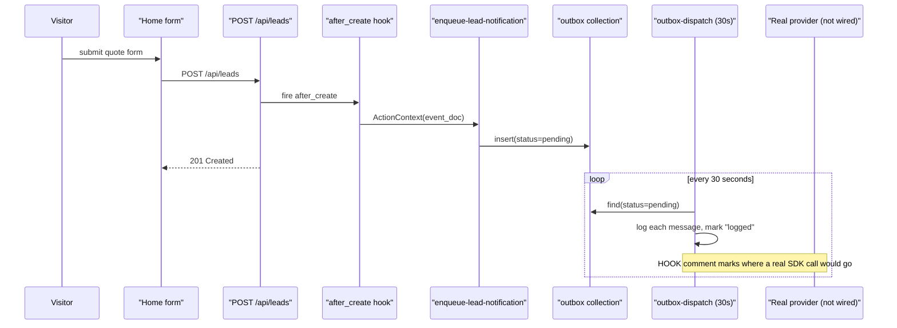
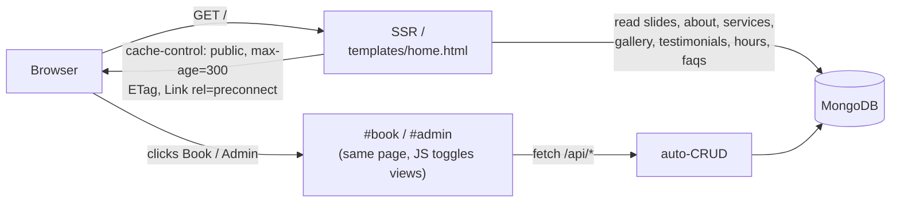

# Business SPA

A manifest-driven website for any small service business — mechanic, cleaning lady, lawyer, architect, tutor, photographer, anyone. One `manifest.json` defines the whole backend **and** the server-rendered home page; a single JS bundle hydrates the interactive views; three tiny actions wire the pipeline that would send email or WhatsApp to the owner and customer.

```
business_spa/
├── manifest.json                          # entire API + seed content + SSR config
├── templates/
│   └── home.html                          # Jinja2 SSR template for / (marketing home)
├── public/
│   ├── app.css                            # shared styles (SSR + SPA views)
│   └── app.js                             # hydrates Book & Admin views
├── actions/
│   ├── enqueue-lead-notification.py       # event: after_create on leads
│   ├── enqueue-booking-notification.py    # event: after_create on appointments
│   └── outbox-dispatch.py                 # schedule: every 30s, drains outbox
└── docker-compose.yml
```

`/` is **server-rendered**: hero slideshow, trust bar, alternating about blocks, service cards, gallery with lightbox, testimonial grid, business hours, an embedded location map with directions/phone/email actions, FAQ accordion, CTA quote form, and footer — all baked into the first byte with SEO metadata, JSON-LD, an ETag, and a 5-minute cache. Book and Admin are client-hydrated inside the same document so there's no second page load when interacting with them.

The entire design is **mobile-first**: every section uses fluid typography (`clamp()`), CSS-grid breakpoints progressive-enhance from phone to laptop, touch targets are ≥ 44 px everywhere, and the top nav collapses into an animated hamburger panel below 768 px. On top of that, sections fade up on scroll via IntersectionObserver, cards lift on hover, the form swap animates in, and every interactive element has focus-visible rings and active press states. All motion is opt-out via `prefers-reduced-motion`.

No `web.py`. No custom routes. The only Python is three short action handlers — and none of them make a network call.

## What this demonstrates

- **Manifest-driven SPA + SSR** — twelve collections, full RBAC, audit trail, TTL, and a server-rendered marketing home page, all in `manifest.json`.
- **SSR at `/` with SEO baked in** — manifest-driven data fetching, `LocalBusiness` JSON-LD, canonical URLs, `Cache-Control: public, max-age=300`, automatic `ETag` 304s, and `<link rel="preconnect">` hints for the image CDNs. Search engines and social crawlers see a complete page on first byte.
- **Anonymous-feeling intake** — visitors submit a quote or book a visit and get an inline "We'll be in touch" confirmation. No login prompt, no password to remember. `policy.read` on `leads`/`appointments` still scopes by `submitter_id` as defense-in-depth in case you later add a customer portal.
- **Embedded map with zero API keys** — a `locations` collection drives a "Find us" section that renders an OpenStreetMap iframe with a marker at `{lat, lng}`, plus tap-to-call, mailto, and a one-click Directions button that deep-links to Google Maps. No Google Maps API key, no billing, no script loads.
- **Mobile-first, motion-polished UI** — fluid `clamp()` typography, grid breakpoints at 480/640/768/1024, 44 px tap targets, animated hamburger nav, IntersectionObserver scroll reveals, hover lifts, focus-visible rings, a gradient-glow CTA section, and full `prefers-reduced-motion` support.
- **JSON-driven marketing site** — hero slideshow, about, testimonials, gallery, FAQ, and locations are all content collections. Every image (and every map marker) is a value in a JSON doc; swap the demo placeholders for your own CDN or address any time, from the admin UI or directly in the manifest.
- **One-shot seed** — `initial_data` in the manifest ships a complete, visually polished demo out of the box (seeded idempotently on first boot, empty-collection check).
- **Actions are the "external stuff" seam** — three trigger types (two event, one schedule) cooperate via an **outbox collection** so the write path is fast and resilient.
- **Role hierarchy** — `admin > staff > visitor` with one line in the manifest; visitors can create leads and book appointments, admin configures everything.
- **Zero-code per vertical** — the same manifest becomes a mechanic, cleaning service, law office, or architecture studio by editing two things: the app `name` and the `services` collection seed.
- **Production-grade manifest lifecycle** — every `register_app` call appends an immutable, HMAC-signed revision to a Merkle-chained history. Tag releases, diff any two revisions, blame any field by JSON Pointer, and export reviewable plan bundles for GitOps — all via the built-in `mdb-engine manifest` CLI. See [Ops lifecycle](#ops-lifecycle--deploy-observe-roll-back) below.
- **Atlas Search ready** — `faqs`, `services`, `gallery`, and `testimonials` declare managed full-text-search indexes that are automatically reconciled on Atlas, gracefully skipped on local community Mongo, and drift-detected on both. Wire an in-page search box by hitting `$search` / `$searchMeta` against those indexes whenever you're ready.

## Run it

```bash
docker compose up
# then open http://localhost:8000
```

Default admin: `admin@example.com` / `admin123`. Override with env vars:

```bash
ADMIN_EMAIL=owner@corp.com ADMIN_PASSWORD=<strong> docker compose up
```

Or run without Docker:

```bash
pip install mdb-engine uvicorn
ADMIN_EMAIL=admin@example.com ADMIN_PASSWORD=admin123 \
  mdb-engine serve manifest.json --reload
```

## The pipeline



The Admin page shows every stage of this flow in real time: leads appear instantly, outbox entries flip from `pending` to `logged` within 30 seconds, and the audit log shows every create/update.

## Re-skin for any vertical

Two files. Two minutes.

### 1. Change the app name

In `manifest.json`:

```json
{
  "name": "Mike's Mobile Mechanics",
  ...
}
```

The SSR template pulls its brand, headline, and description from the manifest — no HTML edits required for a re-skin. The values live under `ssr.site_name`, `ssr.site_description`, and `ssr.routes["/"].seo.*`. Slide text, CTA labels, and hero images come from the `slides` collection (editable in Admin → Site content or in `initial_data`).

If you need to tweak the template itself (say, to add a section that isn't manifest-driven), edit `templates/home.html` — it's ~400 lines of mostly-data Jinja2 with the SPA skeleton inlined below the marketing view.

### 2. Seed the services

Log in as admin and add the services your vertical needs. Some starting points:

| Vertical     | Example services                                                            |
|--------------|-----------------------------------------------------------------------------|
| Mechanic     | Oil change (60m, $59), Brake inspection (45m, $0), Mobile diagnostic (90m)  |
| Cleaning     | Standard clean (120m), Deep clean (240m), Move-out (300m)                   |
| Lawyer       | Initial consult (30m, free), Contract review (60m), Representation (hourly) |
| Architect    | Discovery call (30m, free), Site survey (120m), Concept sketch (block rate) |
| Tutor        | Trial lesson (30m, free), Weekly session (60m), Exam prep package           |
| Photographer | Mini session (30m), Event coverage (per-hour), Headshots (120m)             |

Nothing else needs to change. The entire app — intake form, booking, admin inbox, outbox, audit trail — works for every vertical because the shape of a "service business" is the same shape everywhere.

## What the manifest enables automatically

### Operations collections

| Collection       | Auth                                                              | Powers                                                                  |
|------------------|-------------------------------------------------------------------|-------------------------------------------------------------------------|
| `services`       | Public read, admin write                                          | Home services grid, Book service picker                                  |
| `business_hours` | Public read, admin write                                          | Weekly hours grid on Home                                                |
| `leads`          | Any role creates; `policy.read` = own rows; admin bypass sees all | Quote intake form, Admin leads inbox                                     |
| `appointments`   | Any role creates; `policy.read` = own rows; admin bypass sees all | Booking form, Admin queue                                                |
| `customers`      | Staff + admin only                                                | Future lead-to-customer conversion                                       |
| `outbox`         | Admin read, dispatcher writes                                     | Notification queue, TTL 30 days                                          |
| `audit_log`      | Admin read, hooks write                                           | Audit trail, TTL 90 days, hook-populated                                 |

### Marketing content collections (all `public_read`, admin-write)

| Collection       | Doc shape                                                   | Powers                                   |
|------------------|-------------------------------------------------------------|------------------------------------------|
| `slides`         | `{order, image_url, eyebrow, title, subtitle, cta_*, active}` | Fullscreen hero slideshow with auto-rotate + prev/next/dot nav |
| `about_sections` | `{order, icon, heading, body, image_url, flip}`             | Alternating image/text about blocks      |
| `testimonials`   | `{order, author, role, quote, avatar_url, rating}`          | Customer quote grid with star ratings    |
| `gallery`        | `{order, image_url, title, category, alt}`                  | Square portfolio grid with lightbox      |
| `faqs`           | `{order, question, answer, category}`                       | Accordion FAQ section                    |
| `locations`      | `{order, name, address_line1/2, city, region, postcode, country, lat, lng, phone, email, directions_url, is_primary}` | "Find us" section with OpenStreetMap embed, address card, and call/email/directions actions |

Every one of these is edited through the **Admin → Site content** tab in the SPA (which just POSTs/DELETEs to `/api/<collection>`) or by editing `initial_data` in `manifest.json` before first boot.

Plus every zero-code feature already shipping in the engine — `x-unique`, `owner_field`, `immutable_fields`, `writable_fields`, `scopes`, `defaults`, `hooks`, `ttl`, `role_hierarchy`, rate-limited login, and so on. See `examples/basic/zero_code_api/README.md` for the full inventory.

## Controlling the images via JSON

Every image on the site is **just a URL in a document**. The demo ships with free, deterministic placeholders so the app looks polished out of the box with zero assets to host:

| Role                         | Provider                          | Example                                               |
|------------------------------|-----------------------------------|-------------------------------------------------------|
| Hero / about / gallery photos | [picsum.photos](https://picsum.photos) — deterministic by seed | `https://picsum.photos/seed/business-hero-1/1600/900` |
| Testimonial avatars          | [pravatar.cc](https://pravatar.cc) — deterministic by `img=<id>` | `https://i.pravatar.cc/150?img=47`                    |

Both services are free, unauthenticated, and served over HTTPS. Swapping the seed changes the image deterministically — great for re-skinning a demo without re-seeding storage.

### Swapping in real photos

Three paths, any of which works:

1. **Admin UI** — sign in as admin, open **Admin → Site content**, pick the tab (Slides / About / Testimonials / Gallery / FAQ), and paste any public URL into the form. Delete the seeded demo entries you don't want.
2. **Edit the manifest before first boot** — change the URLs under `initial_data.slides`, `initial_data.gallery`, etc. Seeding is idempotent (it only runs if the collection is empty), so this only affects fresh databases.
3. **Point at your own CDN** — `image_url` is just a string. Use Cloudinary, S3 + CloudFront, imgix, Vercel Blob, Bunny, your WordPress media library — whatever you already have. The app has no opinion.

The images never pass through the backend. The SPA just emits ``, so swapping them is a pure data operation — no deploys, no file uploads, no build step.

## Wiring real email or WhatsApp

The whole point of this example is to show where external delivery **would** be wired without actually wiring it. The outbox is the boundary. Pick one of three paths when you productionize.

### Path A — Real send inside the scheduled action (simplest)

Edit `actions/outbox-dispatch.py`. Replace the block clearly marked `# HOOK:` with a real SDK call. Credentials come from environment variables — **never the manifest**.

Conceptual shape (not implemented here):

```python
import os, httpx

if channel == "email":
    await httpx.AsyncClient().post(
        "https://api.resend.com/emails",
        headers={"Authorization": f"Bearer {os.environ['RESEND_API_KEY']}"},
        json={"to": to, "from": ..., "subject": ..., "html": ...},
    )
elif channel == "whatsapp":
    # Twilio or Meta Cloud API
    ...
```

Trade-off: simple, runs inside the app process, retries via the same scheduler. If a provider is down for minutes, outbox grows — which is fine.

### Path B — HTTP action triggered from the SPA (direct)

Convert `outbox-dispatch.py` into an HTTP action (`__trigger__ = "http"`) and have the admin UI POST to `/actions/v1/dispatch-one/<id>` to send individual messages. Good for manual retries or "send now" buttons in the admin UI. Keep the scheduled action too for background draining.

### Path C — External worker reads the outbox (most scalable)

Leave the actions exactly as they are. Run a separate process (another Docker service, a serverless function, anything) that either:

- Polls `GET /api/outbox?scope=pending` every N seconds, or
- Opens a MongoDB **change stream** on the `outbox` collection for realtime delivery.

The worker then PATCHes `/api/outbox/{id}` to mark messages delivered or failed. This path is the cleanest separation of concerns and survives app restarts, multi-region deploys, and provider outages best.

### Environment variable conventions

| Purpose                       | Variable                                      |
|-------------------------------|-----------------------------------------------|
| Resend (transactional email)  | `RESEND_API_KEY`                              |
| Twilio (SMS + WhatsApp)       | `TWILIO_ACCOUNT_SID`, `TWILIO_AUTH_TOKEN`, `TWILIO_WHATSAPP_FROM` |
| Meta WhatsApp Cloud API       | `META_WHATSAPP_TOKEN`, `META_WHATSAPP_PHONE_ID` |
| SMTP fallback                 | `SMTP_HOST`, `SMTP_USER`, `SMTP_PASSWORD`     |

These belong in `docker-compose.yml`, `.env`, or your platform's secret manager — **never** in `manifest.json`.

### What this example ships

Nothing of the above. `outbox-dispatch.py` logs the payload and stamps the row `logged`. That's deliberate — it keeps the demo runnable with zero credentials and makes the pipeline observable in the admin UI. When you're ready, the code comment at the HOOK location tells you exactly where to paste your provider call.

## How SSR works here

`/` is a server-rendered page; `#book` and `#admin` are hash-routed SPA views hydrated by `public/app.js` inside the same document.



What the engine does for you, driven entirely by the `ssr` block in `manifest.json`:

- Fetches all seven content collections (slides, about, services, gallery, testimonials, hours, FAQs) once per request.
- Resolves them into the Jinja2 context for `templates/home.html`.
- Builds `<title>`, `<meta description>`, `<link rel="canonical">`, Open Graph / Twitter Card tags, and a `LocalBusiness` JSON-LD block from `seo.*`.
- Emits `Cache-Control: public, max-age=300`. A second request within 5 minutes that sends the right `If-None-Match` gets a `304 Not Modified`.
- Emits `<link rel="preconnect">` to `picsum.photos` and `<link rel="dns-prefetch">` to `i.pravatar.cc` so the hero images resolve in parallel with HTML streaming.

View-source on `/` shows every slide, service, review, and FAQ already in the HTML. Good for crawlers, good for first paint, good for privacy (no client-side rendering tax on low-end devices).

## Ops lifecycle — deploy, observe, roll back

Every time the engine boots against this manifest, `mdb-engine`'s history subsystem captures an immutable, HMAC-signed revision with a chained parent hash (Merkle-style tamper detection). That means the small stuff — "what exactly was live on Tuesday?", "who changed the FAQ copy?", "is prod's manifest the one we approved in PR #217?" — has concrete answers you can pull with a single command. The `manifest_tracking` block in `manifest.json` turns on retention (50 revisions / 90 days) and signed revisions, all stored in MongoDB — zero outbound network traffic, zero third-party services.

### CI/CD workflow with plan bundles

Treat `manifest.json` like Terraform. Plan in CI, apply in ops.

```bash
mdb-engine manifest plan business_spa manifest.json \
    --export artifacts/plan.json

mdb-engine manifest apply-plan business_spa artifacts/plan.json
```

The bundle is self-contained — it carries the manifest, the current HEAD revision id, the reconcile plan, a canonical `plan_hash`, and the manifest's `canonical_hash`. `apply-plan` verifies the bundle is untampered, that HEAD hasn't moved since the plan was cut, **and** re-plans against the live database to detect any drift that slipped in between plan and apply. If anything changes, it aborts — no surprises.

Attach `artifacts/plan.json` to the PR that changes the manifest. Reviewers can read exactly what will run; CI applies the same artifact once merged.

### Tag and roll back releases

```bash
mdb-engine manifest tag      business_spa v1.2.0 --message "Fall services & pricing refresh"
mdb-engine manifest log      business_spa                # inline HEAD + tag markers
mdb-engine manifest show     business_spa v1.2.0 --json  # resolve + inspect a tag
mdb-engine manifest checkout business_spa v1.2.0         # roll back live infra
```

`log` prints newest-first with inline HEAD and tag decorations. Any read
command that accepts a `<ref>` takes an integer revision, `HEAD` / `@`,
a tag name, or a full 64-char `manifest_hash` — keep it boring.

### Debug configuration changes

```bash
mdb-engine manifest diff  business_spa --revision 5 --to 8     # any two refs
mdb-engine manifest blame business_spa /collections/faqs/auth  # JSON Pointer
mdb-engine manifest show  business_spa v1.1.0                  # any ref
```

`blame` walks the revision chain for the pointer path and prints the exact revision where that sub-tree last changed — ideal for "who relaxed `write_roles` on `faqs`?".

### Verify history integrity

```bash
mdb-engine manifest verify         business_spa              # HMAC signatures
mdb-engine manifest verify-chain   business_spa              # Merkle chain
```

Useful in audit lanes and before any pipeline that trusts old revisions.

### React to deploys programmatically

Every revision lands in `_mdb_engine_manifest_revisions` as an immutable, ordered document. If an external process needs to act on deploys — cache purge, fan-out, audit ingestion — open a MongoDB change stream on that collection. Native, reliable, multi-consumer, language-agnostic, survives restarts via resume tokens:

```python
async for change in db["_mdb_engine_manifest_revisions"].watch():
    if change["operationType"] == "insert":
        rev = change["fullDocument"]
        # react to `rev["slug"]`, `rev["revision"]`, `rev["manifest_hash"]`...
```

No webhook subsystem, no outbox, no retry logic to operate — Mongo already guarantees ordered, durable delivery.

### Reconciliation & quarantine-to-trash

Every app startup now runs the **manifest reconciler** before any other service
boots. It compares the canonical hash of the manifest you just shipped against
the last-applied hash recorded in `_mdb_manifest_revisions` and, if they differ,
generates a structured plan that is either applied in place (the engine keeps
booting) or short-circuited as a no-op when nothing has changed.

This example's `manifest_tracking` block opts into the safest-useful mode:

```json
"manifest_tracking": {
  "enabled": true,
  "mode": "reconcile",
  "protect_collections": ["leads", "appointments", "customers", "audit_log"],
  "allow_immediate_drop": false,
  "retention": { "max_revisions": 50, "max_age_days": 90, "trash_ttl_days": 14 },
  "sweeper": { "enabled": true, "interval_seconds": 3600 },
  "confirm_if": {
    "destructive_ops": 2,
    "docs_at_risk": 500,
    "protect_on_match": ["*_audit*", "customers"]
  }
},
"admin_api": {
  "enabled": true,
  "path_prefix": "/__mdb",
  "modules": {
    "reconciler": { "enabled": true,  "scopes": ["read", "apply"] },
    "trash":      { "enabled": true,  "scopes": ["read", "restore", "purge"] },
    "secrets":    { "enabled": true,  "scopes": ["read", "rotate"] },
    "audit":      { "enabled": true,  "scopes": ["read"] },
    "health":     { "enabled": true,  "public": false }
  }
}
```

- **`mode: reconcile`** — additive changes (new collections, new indexes) are
  applied immediately; destructive changes (removed collections, removed
  indexes, disabled services) are **quarantined**, not dropped.
- **`protect_collections`** — a hard refusal list. Even if someone deletes
  `leads` from the manifest by mistake, the reconciler logs a skip and keeps
  the live collection untouched. You can still remove a protected collection,
  but it has to be done deliberately with the CLI (see below).
- **`trash_ttl_days: 14`** — quarantined collections and indexes live in the
  `_mdb_trash__*` namespace for two weeks before the background sweeper
  physically drops them. That gives you a full sprint's grace to roll back
  a bad deploy or restore a collection someone "temporarily" removed.
- **`confirm_if`** — the reconciler stops and returns
  `status="confirmation_required"` when a plan trips any threshold:
  more than 2 destructive ops, more than 500 docs at risk across drops, or
  any op that matches a protected glob. The CLI prompts on a TTY; the
  HTTP API surfaces the reasons. Bypass with `--yes` / `?yes=true` or by
  setting `MDB_CONFIRM=1`.
- **`admin_api`** (top-level) — opts this app into the engine's
  first-class admin plane. A composed router lands at `/__mdb/*` with
  the enabled modules (`reconciler`, `trash`, `health`) under shared
  `X-App-Token` auth + audit. The Admin view's **Ops** tab calls these
  endpoints directly, and renders its tabs from
  `GET /__mdb/health/modules` so disabled modules disappear from the
  UI automatically. See [docs/admin_plane.md](../../../docs/admin_plane.md)
  for the full model.

#### What happens to a removed collection

Remove `gallery` from `manifest.json`, restart the app, and the reconciler:

1. Plans a `drop_collection` op (not protected).
2. Renames `business_spa_gallery` → `_mdb_trash__business_spa__collection__gallery__r12__1744700000`.
3. Writes a tombstone into `_mdb_trash` with the original spec, revision id,
   and an `expires_at` set to 14 days from now.
4. Removes the `gallery` entry from the owned-artifact ledger in
   `_mdb_owned_artifacts` so it's no longer considered part of the desired
   state.
5. Records the full revision (hash, plan summary, duration, ops list) into
   `_mdb_manifest_revisions`.

On the next startup, if `gallery` is still absent from the manifest, the
reconciler is a no-op — the collection is already trashed and tracked. If you
decide a week later that you actually want it back, restore it with one
command (below). If you never restore it, the built-in trash sweeper (running
once an hour inside the engine lifespan) will hard-drop the trashed collection
after its TTL and delete the tombstone.

#### CLI: inspect, diff, restore, purge

```bash
mdb-engine manifest history business_spa
# r12  2026-04-19 14:02:11 UTC  mode=reconcile  [destructive]  drop_collection=1

mdb-engine manifest diff business_spa
# Mode:   reconcile
# Hash:   sha256:v2:ab12... -> sha256:v2:cd34...
# drop_collection: 1

mdb-engine reconcile business_spa                 # interactive; respects confirm_if
mdb-engine reconcile business_spa --yes           # bypass confirm_if gates
mdb-engine reconcile business_spa --output-format markdown   # PR-ready diff
mdb-engine reconcile business_spa --manifest-only --against=HEAD~1   # CI diff, no DB
mdb-engine reconcile business_spa --expected-head=sha256:v2:cd34...  # GitOps drift check

mdb-engine manifest show    business_spa          # full HEAD
mdb-engine manifest adopt   business_spa          # baseline an existing DB

mdb-engine trash ls business_spa
# 65f9a1... kind=collection orig=gallery  docs=42  expires=2026-05-03T14:02:11+00:00
mdb-engine trash ls --all                          # all slugs in one view
mdb-engine trash summary business_spa              # counts by kind + expiry

mdb-engine trash restore business_spa 65f9a1...             # real restore
mdb-engine trash restore business_spa 65f9a1... --dry-run   # conflict preview only

mdb-engine trash purge business_spa         # drop expired only (default)
mdb-engine trash purge business_spa --all   # drop everything for this slug
```

Exit codes are stable: `0` = ok/noop, `1` = error, `2` = drift
(`--expected-head` mismatch), `3` = lock contention, `4` = confirmation
required. Safe to key CI gates off of.

The same operations are available on the engine instance programmatically —
`engine.reconcile(slug, confirm=True)`, `engine.manifest_head(slug)`,
`engine.manifest_history(slug)`, `engine.trash_list(slug)`,
`engine.trash_restore_plan(slug, id)`, `engine.trash_restore(slug, id)`,
`engine.trash_purge(slug, expired_only=True)`, plus
`engine.watch_revisions(slug)` for a change-stream deploy bus — all used by
the Admin **Ops** tab.

#### Admin UI — Ops tab

Sign in as admin, open **Admin → Ops**. The tabs render dynamically
from `GET /__mdb/health/modules`, so whatever modules the manifest's
`admin_api.modules` block enables automatically show up in the UI —
no hard-coded endpoint strings for per-module routing in `app.js`.

With the default `admin_api` shown above, five sub-tabs appear, along
with a live badge strip showing each module's declared scopes:

| Tab             | Calls                                      | Shows                                                     |
|-----------------|--------------------------------------------|-----------------------------------------------------------|
| Pending Changes | `GET /__mdb/reconciler/plan`               | Manifest diff + per-op table for the next apply           |
| Trash           | `GET /__mdb/trash`                         | Tombstones with restore + purge buttons                   |
| History         | `GET /__mdb/reconciler/manifest/history`   | Revision log with timestamps, hashes, op counts           |
| Audit           | `GET /__mdb/audit/recent`                  | Live tail of every admin call, color-coded by status; filter by module; "Follow" button polls every 4s |
| Secrets         | `GET /__mdb/secrets/current` + `POST /__mdb/secrets/rotate` | Current token metadata (label, scopes, rotation count, HMAC fingerprint) + label/scope-aware rotation flow |

The first call prompts for the app's admin token (minted by
`AppSecretsManager`); the UI keeps it in `localStorage` under
`mdb_app_token` for future sessions. All writes re-send the same
`X-App-Token` and attach an `Idempotency-Key` header automatically,
so accidental double-clicks never produce duplicate applies. A `429`
rate-limit response surfaces as a non-intrusive toast with the
`Retry-After` hint; a `403` scope denial shows exactly which scope
was missing. Every authenticated call is audited into
`_mdb_admin_audit`.

The same endpoints are mirrored by the `mdb-engine admin` CLI group
(requires `MDB_ADMIN_TOKEN`), so CLI and UI see byte-identical
responses (pinned by `tests/integration/test_admin_cli_parity.py`):

```bash
export MDB_ADMIN_URL=http://127.0.0.1:8000
export MDB_ADMIN_TOKEN=$(pbpaste)   # from the UI's rotate flow

mdb-engine admin health                  --slug business_spa
mdb-engine admin reconciler plan         --slug business_spa
mdb-engine admin reconciler apply        --slug business_spa --yes
mdb-engine admin trash list              --slug business_spa
mdb-engine admin audit tail              --slug business_spa --limit 20
mdb-engine admin audit stats             --slug business_spa
mdb-engine admin secrets current         --slug business_spa
mdb-engine admin secrets rotate          --slug business_spa \
    --label ci-gha --scope reconciler:read
```

Infrastructure liveness probes (k8s, ALB, Nomad) should point at
`GET /__mdb/health/live` — it's unauthenticated, slug-free, and
exempt from rate limiting so probes can never cascade into restart
loops.

#### Renaming without data loss

Prefer a rename over a drop-and-add. Declare it explicitly in the manifest and
the reconciler will use `db.collection.rename` (preserving every document) instead
of trashing the old one:

```json
"collections": {
  "team_members": {
    "rename_from": ["employees"],
    "auto_crud": true,
    ...
  }
}
```

The same `rename_from` field is supported on managed index definitions, so you
can evolve index names without dropping+rebuilding a 10 GB index.

### Atlas Search indexes

Four content collections declare `type: "search"` managed indexes in `manifest.json`:

| Collection     | Index                | Searchable fields                             |
|----------------|----------------------|-----------------------------------------------|
| `services`     | `idx_services_fts`   | `name`, `description`                         |
| `faqs`         | `idx_faqs_fts`       | `question`, `answer`, `category` (keyword)    |
| `gallery`      | `idx_gallery_fts`    | `title`, `alt`, `category` (keyword)          |
| `testimonials` | `idx_testimonials_fts` | `quote`, `author`, `role`                   |

On Atlas the engine creates and reconciles these automatically. On local community Mongo they're skipped with a warning — the rest of the app is unaffected. The drift detector reports orphan search indexes the same way it reports orphan collections, so renaming an index in the manifest and restarting cleans up the old one.

When you're ready, wire an in-page search box to hit those indexes via the Atlas `$search` aggregation stage — no schema changes, no extra service.

## Demo notes & known simplifications

- **"Anonymous" intake is actually silent guest-registration.** `mdb-engine` is secure-by-default: with `auth.users.enabled: true`, every auto-CRUD write requires an authenticated user — there's no public-write escape hatch. When a visitor submits the quote or booking form, `app.js` silently posts to `/auth/register` with a throwaway password (stored in `localStorage` for return visits) and then creates the lead. The UI never surfaces this — the visitor types a message, clicks Send, and sees "We'll be in touch soon!". If you want a visible "create a real account" flow later, wire the same `submitLead` path to a proper registration form.
- **`policy.read` on `leads`/`appointments` is kept as defense-in-depth.** The frontend no longer exposes a customer portal, but the policy still prevents a visitor from listing other visitors' submissions via direct API calls. Admins bypass it automatically; if you promote `staff` users to manage leads, either grant them `admin` or replace the policy with a role-aware filter.
- **The scheduled dispatcher runs every 30 seconds**, which is fine for a demo but aggressive for a real inbox. Tune `__interval_seconds__` in `outbox-dispatch.py` to 60 or 300 in production.

## Further reading

- [docs/reconciler.md](../../../docs/reconciler.md) — full reconciler lifecycle, confirm_if gates, admin API, observability
- [FUNCTIONS.md](../../../FUNCTIONS.md) — full Actions reference
- [examples/basic/zero_code_api](../zero_code_api) — the zero-code blog this example is modeled on
- [examples/basic/task_board](../task_board) — all three action trigger types with a simpler manifest
